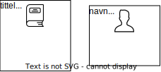

# Hva er en klasse?

## Datafelter og verdier

I forrige kapittel begynte vi å planlegge et ønsket bokprogram. Bøker og personer var objektene i den enkleste modellen. Nå kan vi fylle inn eksempeldata i modellen, for å vise hvilke egenskaper vi ønsker å ta med: 

Merk at vi fyller inn data på samme måte i alle bøker. Slik er det lett å se at objektene er av samme type. Hadde vi skrevet sideantallet på en bok, men antall kapitler på en annen bok, ville informasjonen kunne oppfattes som ustrukturert. Vi gjør det strukturert ved å ta utgangspunkt i en *mal*:

Figuren viser en mal for bokobjekter, og en mal for personobjekter. Malene forteller hvilke data som skal fylles inn når vi oppretter et objekt av en bestemt type. For eksempel sier den første malen at når vi oppretter et bokobjekt, så skal tittel, forfatter og antall sider fylles ut. Vi viser enda tydeligere hvordan dette skjer i neste figur. Under figuren forklarer vi hva som skjer. 

* For å sette data inn i et objekt, definerer vi variabler i objektet, og setter verdier inn i variablene. Vanligvis kaller vi disse variablene for *datafeltene* til objektet. 
* Malen bestemmer hvilke datafelter som skal settes inn i objektene.
	- Alle bokobjekter får tre datafelter, nemlig `tittel`, `forfatter` og `antall_sider`.
	- Alle personobjekter får to datafelter, nemlig `navn` og `alder`.
* Når vi oppretter objekter, kan vi også sette *verdier* inn i datafeltene. For eksempel kan vi sette verdien `"Sofies verden"` inn i datafeltet `tittel`.
* Datafeltene er vist som hvite bokser i objektene, og verdiene er innholdet i boksene. Dette er en forenklet versjon av et *objektdiagram*, som vi skal komme tilbake til senere. 

## Klasser

Vi fokuserer nå på malene for bøker og personer: 

Når vi bruker malene får vi altså objekter med visse datafelter. Men som nevnt i forrige kapittel skal objektene ikke bare ha datafelter, men også handlinger. For eksempel skal bøker kunne lånes ut og leveres inn. Derfor legger vi til handlinger i malene: 

Her skriver vi handlingene som funksjoner, for å vise at det nettopp er funksjoner vi skal programmere. Mer om det senere - nå skal vi se hva som skjer når vi oppretter objekter fra malene: 

Hvert objekt får altså handlingene fra malen. Dette er for å vise at når vi skal utføre en handling, må vi først "gå inn" på et spesifikt objekt, og deretter utføre handlingen på det objektet. Å gjøre handlingen `lån_ut()` på det første bokobjektet (*Sofies verden*) kan gi et annet resultat enn på det andre bokobjektet (*Beatles*). Her kan du se hvordan handlinger kan ha ulikt resultat på ulike objekter: 

Nå som malene både inneholder datafelter og handlinger, kan vi si at de er klasser! En *klasse* er nemlig akkurat det - en mal på objekter av samme type, der vi tar med både datafelter og handlinger. Vi skal senere se hvordan man programmerer en klasse, men vi bør alltid skissere klassene i et diagram først. I et slikt diagram må hver klasse også ha et navn med stor forbokstav: 

Vi har altså en `Bok`-klasse og en `Person`-klasse, og fra disse kan vi opprette `Bok`-objekter og `Person`-objekter. 

Diagrammet ovenfor kalles et *klassediagram*. Mer spesifikt har vi laget en enkel versjon av et *UML-klassediagram*. UML betyr *Unified Modeling Language* og gir regler for hvordan vi skal tegne, slik at alle kan forstå hverandres diagrammer. Man trenger ikke å pugge disse reglene, men lære gjennom eksempler. Ved å følge eksempelet over kan du allerede tegne enkle UML-klassediagrammer, og senere skal vi vise hvordan man legger til mer informasjon.

## Flere klasser i bokprogrammet

I planleggingen av bokprogrammet kom vi fram til følgende modell av objektene: 

Hvilke klasser kommer disse objektene fra? For eksempel har vi to bokhylleobjekter, og i forrige kapittel kom vi fram til relevante datafelter og handlinger for bokhyller. Dette kan vi bruke til å lage en klasse: 

Legg merke til at disse handlingene må ha en parameter, fordi vi må vite hvilken bok som skal legges til eller fjernes. 

Vi fortsetter å definere klassene for de andre objektene, og tegner dem i et felles diagram: 

Nå kan vi opprette objekter fra fem forskjellige klasser. Den øverste figuren viser at vi bare trenger å opprette ett `Boksamling`-objekt, mens fra de andre klassene kommer vi til å opprette flere objekter. Et bokobjekt kalles også en *instans* av `Bok`-klassen. Altså kommer vi til å opprette mange instanser av klassen `Bok`. 

## Oppsummering og aktiviteter

**Oppsummering**

* Et *datafelt* er en variabel som er inni et objekt. Et datafelt kan fylles med en *verdi*. 
* En klasse er en mal for å lage objekter av samme type. I klassen sier vi hvilke datafelter og handlinger objektene skal ha når de opprettes. 
* UML er en standardisert måte for hvordan vi tegner klasser.

**Aktivitet A.** Ta utgangspunkt i *Aktivitet B* fra forrige seksjon. Se på objektene i modellen. Hvilke klasser kommer objektene fra? Tegn et klassediagram etter eksemplet gitt i forrige seksjon. Få med alle relevante datafelter og handlinger.

**Prosjektoppgave 3.** Ta utgangspunkt i *Prosjektoppgave 2* fra forrige seksjon og tegn et klassediagram (som i aktiviteten over).
