# Mer om objekter og klasser

## Skrivemåte for objekter

Fra forrige kapittel har vi følgende klassediagram:

Dette er maler som vi bruker til å opprette objekter. Tenk deg at vi har *Sofies verden* i bokhylla, og ønsker å registrere boka i systemet. Da oppretter et `Bok`-objekt og setter inn riktige verdier. 

I bokhylla har vi altså en fysisk bok, og i datamaskinens minne har vi et objekt som representerer boka. I de neste seksjonene vil det være nyttig å skille mellom disse tingene. For å snakke om objektet som ligger i datamaskinens minne kan vi derfor bruke følgende skrivemåte: 

`Bok("Sofies verden")` 

Først sier vi hvilken klasse objektet kommer fra, deretter skriver vi de viktigste verdiene i parenteser. Dersom vi ønsket å ta med forfatternavnet, kunne vi ha skrevet `Bok("Sofies verden", "Jostein Gaarder")`. Nå kan vi opprette to andre `Bok`-objekter:

`Bok("Beatles")`    
`Bok("Når villdyret våkner")`   

Tilsvarende kan vi opprette tre `Person`-objekter: 

`Person("Per Hansen")`   
`Person("Hilde Bakken")`   
`Person("Siv Larsen")`  

## Metoder og meldinger

I de ulike klassene har vi definert datafelter og handlinger: 

Merk at datafeltene kommer øverst, deretter handlingene, og at vi skiller datafeltene og handlingene med en linje. 

Handlinger, altså ting vi kan gjøre med objekter, kalles vanligvis *metoder*. Vi kan si følgende om `Bok`-klassen: 

- Klassen har datafeltene `tittel`, `forfatter`og `sideantall`, og metodene `lån_ut(person)` og `lever_inn()`. 
- Vi kan bruke klassen til å opprette `Bok`-objekter. Hvert objekt får datafeltene og metodene som er definert i klassen. Deretter kan datafeltene fylles med verdier, og metodene behandler disse verdiene. 

Vi kan be et objekt om å utføre en av sine metoder. Det kalles å *sende en melding* til objektet.

- Hvis vi vil registrere innlevering av boka *Sofies verden*, må vi sende en melding til objektet`Bok("Sofies verden")`. Mer spesifikt må vi be objektet om å utføre metoden `lever_inn()`. 
- Hvis vi ønsker at Per Hansen skal få en anbefaling, må vi be objektet `Person("Per Hansen")` om å utføre metoden `få_anbefaling()`. Metoden behandler verdiene i objektet og gir et svar tilbake (*foreløpig finnes ingen relevante verdier å behandle, men senere kan vi legge til datafelter som `interesser` og `favorittkategori` i `Person`-klassen*).  

## Datatyper

Når vi skriver tekststrengen `"Sofies verden"` i Python, så opprettes et objekt fra klassen `str`, som er en innebygd klasse i Python. Denne klassen har derfor datafelter og metoder, akkurat som klassene vi lager selv. 

*Vi kan for eksempel be objektet `"Sofies verden"` om å utføre metoden `capitalize()` for å endre tekststrengen til `"SOFIES VERDEN"`. Hvis du er interessert i hvilke andre metoder `str`-klassen har, kan du se [her](https://docs.python.org/3/library/stdtypes.html#string-methods)*. 

Tilsvarende, når vi skriver tallet `512` i Python, så opprettes et objekt fra klassen `int`. 

I Python sier vi at *datatypen* til et objekt er det samme som klassen det er laget fra. Vi sier derfor at: 

* `"Sofies verden"`er et objekt av datatypen `str`.
* `512`er et objekt av datatypen `int`.
* `Bok("Sofies verden")` er et objekt av datatypen `Bok`. 

I klassediagrammet kan vi skrive hvilke datatyper de ulike datafeltene skal ha:

 

Datafeltene  må selvfølgelig ikke ha datatypen `str` eller `int` - vi kan bruke våre egne datatyper! For eksempel bør et `Bok`-objekt ha informasjon om lånestatus. Vi kan gjøre dette ved å legge til datafeltet `aktivt_utlån`: 

Her bruker vi datatypen `Utlån`.  Det betyr at datafeltet `aktivt_utlån` skal holde på et `Utlån`-objekt, der vi finner informasjon om utlånet, slik som lånetaker, startdato og leveringsfrist. 

I tillegg ønsker vi kanskje å lagre lånehistorikken til en bok. Da kan vi legge til et datafelt som heter `lånehistorikk`: 

Hvilken datatype skal dette datafeltet ha? Det vi ønsker er å ta vare på alle `Utlån`-objekter som har blitt opprettet for boka. Disse kan lagres i en liste! I Python har du kanskje laget lister av tall eller tekststrenger, som for eksempel:

`["Per Hansen", "Hilde Bakken", "Siv Larsen" ]`    
`[70, 63, 47]`

Hva er datatypen til disse listene? Når vi oppretter en liste i `Python`, bruker vi den innebygde klassen `list`. Derfor kan vi si at `[70, 63, 47]` er et objekt av datatypen `list`! Hvis vi vil presisere at listen inneholder `int`-objekter, kan vi si at datatypen er `list[int]`. Her er et eksempel på et objekt av typen `list[Bok]`: 

`[Bok("Beatles"), Bok("Når villdyret våkner")]`

Vi ønsket at datafeltet `lånehistorikk` skulle lagre tidligere utlån. Nå vet vi hvilken datatype vi trenger, nemlig `list[Utlån]`! Vi kan legge til dette i klassediagrammet:  

Vi kan også vise datatypen til parametre og returverdier: 

Her definerer vi at parameteren `person` skal ha datatypen `Person`, og at returverdien skal ha datatypen  `bool`. Altså er returverdien enten `True` eller `False` (dette kan fortelle om utlånet/innleveringen ble godkjent eller ikke). 

## Objektdiagram og pekere

Vi skal nå vise en nyttig måte å tegne objekter. Som eksempel oppretter vi et objekt fra hver av klassene `Bok`, `Utlån` og `Person`:

Den nederste delen av figuren kalles et objektdiagram, og er tegnet på følgende måte: 

- Det første objektet har overskriften `bok1: Bok`. Det betyr at variabelen med navn `bok1` holder på objektet, og at datatypen til objektet er `Bok`. Dersom vi ikke ønsker å ta med variabelnavn, kan vi skrive `: Bok` i stedet. Variabelnavn brukes egentlig bare når vi skal beskrive programkode:
	+ Når et program kjøres, kan variabelen `bok1` holde på `Bok("Sofies verden")` på et tidspunkt, men senere holde på et helt annet objekt. Et objektdiagram viser altså hva variablene inneholder på et *spesifikt tidspunkt* under kjøringen av programmet. 
- Vi tegner bokser for objektets verdier. Det første objektet har verdien `"Sofies verden"` på datafeltet `tittel`. Det er lov for et objekt å mangle noen verdier, og dette vises med en tom boks. 

Tenk deg at Per Hansen nettopp har lånt boka *Sofies verden*. Hvordan registrerer vi dette i systemet? Det er tre ting vi ønsker å gjøre: 

1. Opprette et `Utlån`-objekt som inneholder informasjon om utlånet. 
2. Registrere utlånet i objektet `Person("Per Hansen")`. 
3. Registrere utlånet i objektet `Bok("Sofies verden")` 

I diagrammet ovenfor har vi gjennomført det første steget, nemlig å opprette et `Utlån`-objekt, men foreløpig har objektet ingen verdier. Hvilken verdi skal fylles inn på datafeltet `bok`? For å spørre på en annen måte, hva ønsker du å få tilbake når du henter denne verdien senere? Det hadde ikke vært så nyttig å bare få tittelen `"Sofies verden"`! Det du antagelig ønsker å få tilbake er objektet `Bok("Sofies verden")`, som er til venstre i diagrammet over. Hvordan får vi tak i dette objektet?

Et sted i datamaskinens minne ligger objektet `Bok("Sofies verden")`. For å kunne gjøre operasjoner på objektet, må vi fortelle datamaskinen hvor i minnet det ligger. Hvordan vet vi det? Hver gang vi oppretter et objekt, får vi tildelt en *minneadresse*, som gjør at vi kan finne igjen objektet senere. Vi trenger selvfølgelig ikke å huske denne adressen når vi koder - faktisk er det slik at når vi legger objektet i en variabel, så er det minneadressen som lagres i variabelen! Hensikten med variabler er derfor å ta vare på minneadresser, slik at vi kan finne igjen objektene som vi skal gjøre operasjoner på!
 
Spørsmålet var altså hva vi skal sette inn i datafeltet `bok` på `Utlån`-objektet. Nå vet vi svaret - vi skal sette inn minneadressen til objektet `Bok("Sofies verden")`. Dette vises med en pil: 

Nå blir det feil å si at`Utlån`-objektet "inneholder" `Bok`-objektet. Vi sier heller at `Utlån`-objektet har en *peker* til `Bok`-objektet. Slik fungerer det alltid - vi setter aldri et objekt inn i et annet objekt, men bruker pekere slik at objekter kan finne hverandre. Nå kan vi sørge for at både`Bok`-objektet og `Person`-objektet kan finne utlånet de er en del av: 

 

Kan du se hvilken peker som mangler i diagrammet ovenfor? 

## Oppdeling av metoder

Vi bør navnsette metoder slik at det er lett å skjønne hva de gjør. For å registrere at en bok leveres inn, er altså `lever_inn()` et fornuftig valg av navn:
* Navnet starter med et verb som beskriver handlingen. 
* Det er unødvendig å bruke navnet`lever_inn_bok()`, fordi metoden er i `Bok`-klassen, så vi vet allerede at den bare brukes på `Bok`-objekter.  

Et viktig prinsipp er at **en metode bør kun ha én oppgave**. Dette må vi tenke på når vi skal legge til ny funksjonalitet i bokprogrammet vårt. Kanskje det skal være mulig å skrive en anmeldelse samtidig som man leverer en bok? Da bør vi dele opp denne prosessen i to metoder: 

- `lever_inn()` for å levere boka.
- `legg_til_anmeldelse(person, tekst)` for å legge til en anmeldelse av boka.

Det er kanskje fristende å legge begge handlingene i en metode, for det er jo bare lånetakeren som skal kunne skrive en anmeldelse av boka? Men dette problemet bør vi løse på en annen måte, for eksempel med en betingelse (`if`-setning) i den andre metoden. Det viktigste er alltid å følge prinsippet om én oppgave per metode. 

For å se på et mer interessant eksempel, skal vi begynne å tenke på hvordan vi kan rangere bøker. Vi legger til et datafelt og metode i klassediagrammet, markert i grønt: 

Metoden `regn_ut_gjennomsnittsvurdering()` skal gi boka en poengsum basert på anmeldelser fra ulike kilder. Merk at navnet bare inneholder ett verb, som er et godt tegn på at vi følger prinsippet om én oppgave. Men hva om metoden trenger flere steg for å komme fram til svaret? For eksempel kan den gjøre følgende steg:

1. Regne ut gjennomsnittet av lånetakernes vurderinger.
2. Regne ut gjennomsnittet av brukervurderinger på nett, fra sider som [*Bokelskere*](https://bokelskere.no/) og [*Goodreads*](https://www.goodreads.com/). 
3. Hvis boken er utgitt etter 2010; regne ut gjennomsnittet av litteraturanmeldelser på nett (nettaviser).
4. Regne ut et endelig gjennomsnitt basert på tallene i punkt 1-3. 

Metoden`regn_ut_gjennomsnittsvurdering()` skal kun ha én oppgave, nemlig å gjøre utregningen i det fjerde punktet. Men de tre første stegene må utføres først, så hvordan håndterer vi denne situasjonen?  Løsningen er å definere nye metoder for de tre første operasjonene:

1. `regn_ut_gjennomsnitt(anmeldelser)`
2. `hent_brukeranmeldelser_på_nett()`, deretter bruke metoden fra punkt 1 til å finne gjennomsnittet av anmeldelsene vi har hentet.
3. `hent_litteraturanmeldelser_på_nett()`, deretter bruke metoden fra punkt 1.

Vi legger til disse metodene i klassediagrammet: 

Metodene vi har lagt til kalles gjerne *delmetoder*, fordi de utfører delprosesser, og sørger for at`regn_ut_gjennomsnittsvurdering()` kun tar seg av selve utregningen. Fordelen med denne oppdelingen er at det blir enklere å modifisere og utvide programmet senere:

- Koden blir mye lettere å lese. Uten delmetoder ville koden til `regn_ut_gjennomsnittsvurdering()` antagelig blitt svært lang og vanskelig å få oversikt over. Ved å bruke delmetoder med gode navn, skjønner man på kort tid hvilke fire hovedsteg som utføres. Lesbar kode er svært viktig dersom vi ønsker å jobbe videre med programmet senere, og enda viktigere dersom vi ønsker at andre skal kunne utvide eller benytte deler av koden. 
- Når vi skal gjøre en bestemt endring i et program, bør det alltid være lett å finne de riktige kodelinjene! Å ha metoder som gjør flere ting vil gi mye hodepine, fordi det kan bli umulig å vite hvilke deler av programmet som må endres for å oppnå en bestemt funksjonalitet. Ved å følge prinsippet om én oppgave, vet vi alltid hvilken metode vi skal gå til. Tenk deg for eksempel at vi ønsker følgende endringer i bokprogrammet:
	- Vi kommer fram til at brukeranmeldelser på nett bør telle mest, og ønsker derfor å endre vektingen av de ulike kildene. Dette er en endring av utregningen, og det er `regn_ut_gjennomsnittsvurdering()` som har denne oppgaven. 
	- Vi ønsker å inkludere anmeldelser fra flere nettsider. Denne oppgaven ligger hos metoden `hent_brukeranmeldelser_på_nett()`. 
- Vi kan gjenbruke delmetodene til andre formål. For eksempel, å hente en oppdatert liste med nettanmeldelser kan være nyttig i andre deler av bokprogrammet vårt. Senere ønsker vi kanskje å presentere anmeldelsene, eller søke etter stikkord i anmeldelsene for å gi bedre bokanbefalinger. 

## Flytdiagram

Metoden `regn_ut_gjennomsnittsvurdering()` fra forrige seksjon utfører flere steg for å regne ut en gjennomsnittvurdering av en bok. Vi kan vise disse stegene i et *flytdiagram*: 

Dette ser kanskje komplisert ut, men vi trenger ikke å vite mye for å forstå et slikt diagram. Vi begynner med å forklare de ulike blokkene:

1. I den grønne delen finner vi gjennomsnittet av lånetakernes vurderinger.
2. I den blå delen finner vi gjennomsnittet av brukervurderinger på nett.
3. I den lilla delen finner vi gjennomsnittet fra litteraturanmeldelser på nett.
4. I den røde delen regner vi ut det endelige gjennomsnittet.

Slik fargelegging er ikke nødvendig, men gjør det lettere å forstå helheten. Merk også hvordan vi kan plassere boksene slik at diagrammet blir mer oversiktlig.  

Nå må vi vite hva de ulike boksene betyr. I vårt eksempel har vi fire typer bokser: 

- **Sirkel/ellipse** markerer start og slutt på metoden.
- **Rektangel** er en operasjon, for eksempel en metode.
- **Parallellogram** er data. I vårt eksempel kommer disse før og etter metoder, for å vise inndata og utdata til metodene. 
- **Diamant** er et valg. Basert på valget bestemmes videre rute i flytdiagrammet. 
	- I vårt flytdiagram har vi én valgboks. Merk at den lilla delen av flytdiagrammet bare utføres hvis vi svarer "Ja" på valgboksen. 
	- Vi kan velge selv hva som skal være alternativene i en valgboks. Det må ikke være "Ja" og "Nei", og det kan være flere enn to alternativer.
	
Det finnes andre typer bokser, men med disse boksene kan vi tegne flytdiagram for de fleste metoder. 

## Kommunikasjon mellom objekter

Objekter kan sende meldinger til hverandre. Det vil si at et objekt kan be et annet objekt om å utføre en av sine metoder, og få svar tilbake. Meldinger mellom objekter er viktig for å fullføre planen om å rangere bøker i bokprogrammet vårt. Vi skal nå definere metoden som rangerer bøker. I hvilken klasse bør metoden være? Siden vi gjør noe med alle bøkene, altså hele boksamlingen, bør vi legge metoden i `Boksamling`-klassen.

Vi tar nå utgangspunkt i følgende klassediagram, der relevante datafelter og metoder er skrevet i grønt:

Det er altså metoden`vis_rangert_liste()` som skal rangere bøkene. Hvilke steg trenger metoden? Først må hver bok ha en poengsum, og deretter kan vi sortere bøkene etter poeng. Stegene er altså:

1. Regne ut poengsummen til hver bok i listen `bøker`. Vi gjør dette ved å sende meldingen`regn_ut_gjennomsnittsvurdering()` til hvert `Bok`-objekt. Vi lagrer tallene vi får tilbake. 
2. Sortere listen `bøker` basert på tallene vi fant i punkt 1. 
3. Vise den sorterte listen. 

For at dette skal fungere, må `Bok`-objektene tilby metoden `regn_ut_gjennomsnittsvurdering()` til andre objekter. Hva betyr det?  Av metodene som finnes i et`Bok`-objekt, er noen *offentlige* og andre *private*. Hva er forskjellen? 

* Alle objekter kan be om at `Bok`-objektet utfører en av sine offentlige metoder.
* Ingen andre objekter kan be om at `Bok`-objektet utfører en av sine private metoder, ikke engang andre `Bok`-objekter. En privat metode kan kun brukes som byggeblokk til andre metoder i det samme objektet, altså som en delmetode. 

Vi bruker `Bok`-klassen, det vil si malen på en bok, til å definere hvilke metoder som skal være offentlige og private. La oss se hvordan vi kan sette alle metoder til å være private: 

Vi skriver altså et minustegn foran metodenavnet for å vise at den er privat. Nå skal vi gjøre noen av metodene offentlige. For eksempel ønsker vi å tilby metodene for utlån og innlevering til andre objekter. Og for å kunne rangere bøker, må metoden `regn_ut_gjennomsnittsvurdering()` også være offentlig. For å gjøre en metode offentlig, endrer vi minustegnet til et plusstegn:

Nå lurer du kanskje på hva som er poenget med private metoder? Hvorfor ikke bare gjøre alle metoder offentlige? For å forklare det tar vi utgangspunkt i eksempelet over, der vi har et`Boksamling`-objekt og flere `Bok`-objekter. Vi later som vi er `Boksamling`-objektet. Vi inneholder altså en metode for å rangere bøker, og vi utfører denne handlingen ved å sende meldinger til `Bok`-objekter og få svar tilbake. Vi aner ikke hvilke prosesser som skjer inni `Bok`-objektene, men vi stoler på at de alltid svarer oss på den måten vi forventer. 

Vi kan godta at noen `Bok`-objekter ikke klarer å finne anmeldelser, men vi må alltid få et svar som vi kan tolke. Det kan for eksempel fungere på følgende måte: 

* Hvis svaret er et tall mellom 0 og 10, så har `Bok`-objektet funnet anmeldelser og regnet ut en vurdering. 
* Hvis svaret er -1, betyr det at `Bok`-objektet ikke har funnet noen anmeldelser. 
 
En slik løsning kan vi være fornøyde med. Uansett hvor dårlig `Bok`-objektene er til å finne anmeldelser, så blir vi i hvert fall aldri overrasket - vi vet hvilke svar vi kan få, og hvordan de skal tolkes. Men hvis `Bok`-objektene på et senere tidspunkt slutter å gi svar eller gir et uventet svar, så har vi grunn til å være skuffet! Da vil hele rangeringsfunksjonen vår slutte å fungere. 

Hva kan vi lære av dette tankeeksperimentet? Når vi tilbyr en metode til andre objekter, må vi forplikte oss til følgende punkter: 

* At vi aldri endrer navnet eller parameterne til metoden. 
* At metoden gir svar i alle tilfeller, selv når den ikke fungerer slik vi ønsker. Vi bør gi en god beskrivelse av hva de ulike svarene betyr.
* At metoden for all fremtid gir et av de forventede svarene. 

Hvis vi bryter ett av disse punktene, kan vi ødelegge kommunikasjonen mellom mange objekter! Som en generell regel bør vi starte med å gjøre alle metoder private, og først når det oppstår behov for å tilby en metode, kan vi gjøre den offentlig. Da må vi huske å følge kravene listet ovenfor, som kort sagt sier at en offentlig metode må holdes stabil for all fremtid.

*Grensesnittet* til et objekt er listen av de offentlige metodene. Altså er grensesnittet til `Bok`-objekter følgende: 

For å skjønne hvorfor vi bruker ordet "grensesnitt", kan vi tenke på objekter som avgrensede områder. Inni objektet har vi alle de private metodene, mens langs grensen har vi de offentlige metodene. Det er altså langs grensen objektet tilbyr sin funksjonalitet til omverdenen:

Kommunikasjonen mellom objekter er vist med grønn pil, mens kommunikasjon innad i et objekt er vist med røde piler. Merk hvordan `Bok`-objektet bruker delmetoder til å bygge opp en offentlig metode, som deretter brukes til å rangere bøker i `Boksamling`-objektet.

De indre metodene er private, og vi kan endre og slette dem etter behov. Men metodene i grensesnittet må holdes stabilt, slik at kommunikasjonen på tvers av objekter alltid fungerer.

Vi avslutter denne seksjonen med to viktige punkter: 

* Her har vi snakket om objekter, men vi bestemmer grensesnittet når vi lager klasser. Vi kan derfor si at klassen `Bok` har et grensesnitt, og at alle`Bok`-objekter får dette grensesnittet. Det gir mening, for det ville vært rart om en metode var offentlig for et `Bok`-objekt, men privat for et annet `Bok`-objekt. Det ville gjort det å umulig å ha en løkke som går gjennom alle bøker og kaller på metoden.
* Vi har fokusert på hvilke *metoder* som er offentlige og private, men *datafelter* kan også være offentlige eller private. Men som grunnregel **bør vi gjøre alle datafelter private**. Hva ville skjedd dersom vi hadde gjort ett datafelt offentlig? Et objekt med et offentlig datafelt mister kontrollen over seg selv, fordi alle andre objekter har direkte tilgang til datafeltet, og kan endre verdien til hva som helst. Slik mangel på kontroll kan ha uforutsigbare konsekvenser. I stedet bruker vi metoder som deler verdier med omverdenen på en trygg måte: 
	- Vi kan opprette en metode som gir lesetilgang til et datafelt. Metoden vil returnere verdien som finnes på datafeltet, uten å gi tilgang til selve datafeltet. Dette kalles en *getter*-metode (fra engelsk "get value").
	- Vi kan opprette en metode som gir endringstilgang til et datafelt. En slik metode tar imot en parameterverdi og sjekker om denne verdien kan settes inn i datafeltet. Dette kalles en *setter*-metode (fra engelsk "set value"). Når et objekt har en setter-metode for et bestemt datafelt, betyr det at andre objekter kan  sende en "forespørsel" om å sette en ny verdi inn i datafeltet. Objektet som mottar forespørselen kan velge å godta eller avslå forespørselen, og har dermed full kontroll over seg selv. Slik unngår vi alle uforutsigbarheter. 

## Konstruktører

Når vi sier at vi "oppretter objekter fra en klasse", kan vi se for oss følgende diagram:

Men hvordan oppretter vi egentlig objekter når vi skriver kode? Svaret er at  alle klasser må ha en spesiell metode for å opprette objekter, som kalles en *konstruktør* (fordi den "konstruerer" objekter). 

Hvordan legger vi til en konstruktør i klassen? Vi definerer en metode med samme navn som klassen, og med noen ønskede parametre. En konstruktør for `Bok`-klassen kan derfor være `Bok(tittel, forfatter, antall_sider)`. Følgende figur viser hvordan vi bruker konstruktøren til å opprette objekter: 

En konstruktør uten kode vil bare opprette et tomt objekt. Hvis vi ønsker gjøre operasjoner på det nyopprettede objektet, må vi skrive kode i konstruktøren. I eksempelet over gjør konstruktøren følgende operasjon med det nye objektet: 

* Fyller datafeltene `tittel`, `forfatter` og `antall_sider` med verdiene som ble gitt i parametrene. 

Denne operasjonen skjer altså ikke automatisk - vi må skrive kode som "flytter" parametrene til datafeltene. Å fylle datafeltene med verdier er hovedoppgaven til en konstruktør. Det er tross alt ikke så interessant å opprette masse tomme objekter, for vi ønsker jo at de nye objektene skal representere spesifikke bøker. Det kan godt hende at konstruktøren gjør mer komplekse ting, som i følgende eksempel: 

Her har vi definert en annen konstruktør, med ISBN som parameter (alle utgitte bøker har et unikt nummer kalt ISBN). Vi ser at objektene blir fylt med riktige verdier. Det betyr at konstruktøren gjør følgende operasjoner: 

1. Bruker ISBN-nummeret til å hente informasjon om boka, for eksempel fra en nettdatabase. 
2. Fyller datafeltene `tittel`, `forfatter` og `antall_sider` med verdiene som ble funnet i forrige punkt. 

Igjen bør det nevnes at konstruktørens hovedoppgave er den andre operasjonen. For å følge prinsippet om én oppgave, bør vi derfor delegere det første steget til en annen metode, som for eksempel kan hete`hent_informasjon(isbn)`.

I programmeringsspråket Java kunne vi inkludert begge konstruktørene vi har definert. Klassediagrammet blir da:

Her har vi altså to forskjellige måter å opprette `Bok`-objekter på. Det ser kanskje rart ut å ha to metoder med samme navn, men siden de har forskjellige antall parametre,  regnes de som forskjellige metoder i Java. 

Dette fungerer derimot ikke i Python. Hvis vi definerer to metoder med samme navn, så vil Python regne den siste metoden som den mest oppdaterte versjonen, og den første metoden vil overskrives. Det betyr at vi bare kan ha én konstruktør i Python. Men som vi skal vise i implementasjonsdelen, kan vi sørge for at den ene konstruktøren kan brukes på forskjellige måter, slik at vi likevel oppnår funksjonaliteten som er gitt i klassediagrammet. 

## Dokumentasjon av klasser

Tenk deg at du har programmert alle klassene i bokprogrammet, og ett år senere skal du lage en nettside for rangering av bøker. Du husker at du var fornøyd med  `Bok`-klassen, og vil bygge det nye programmet rundt denne klassen.

Du finner igjen`Bok`-klassen i en programfil kalt *Bok.py*, og kopierer denne fila over til den nye prosjektmappa. Hva nå? Du har selvfølgelig glemt all koden, og det vil ta deg en god stund å forstå den. Men for å ta i bruk en klasse trenger du ikke forstå koden, bare å forstå grensesnittet til klassen! Alt vi trenger å vite er hvordan vi skal bruke de offentlig metodene som er relevante for oss. Mer spesifikt bør vi vite: 

* *Signaturen* til metoden, det vil si navnet og parametrene til metoden
* En beskrivelse av handlingen som utføres av metoden
* En beskrivelse av hver parameter, altså hva slags verdier metoden forventer å motta
* En beskrivelse av returverdien

En slik beskrivelse av de offentlige metodene kalles en *dokumentasjon* av klassen. Når vi programmerer `Bok`-klassen, bør vi altså skrive en slik dokumentasjon, slik at det blir lett å gjenbruke klassen senere. 

Følgende klassediagram viser grensesnittet til klassen `Bok`: 

Vi skal nå skrive en dokumentasjon for klassen, ved å følge punktene ovenfor. Merk at konstruktører alltid er offentlige metoder, og at de bør komme først i dokumentasjonen. Dette gir mening, for når vi skal ta i bruk en klasse, så er ofte det første vi vil gjøre å opprette objekter. 

**Dokumentasjon av `Bok`-klassen:**

#### `Bok(tittel, forfatter, antall_sider)`

> Oppretter et nytt `Bok`-objekt fra innskrevne verdier. 
> 
> **Parametre:**
> 
> * `tittel` (`str`): Den fulle tittelen på boka.
> * `forfatter` (`str`): Det fulle navnet til forfatteren, skrevet på formen "Fornavn Etternavn".
> * `antall_sider` (`int`): Antall sider i boka. 

#### `Bok(isbn)`

> Oppretter et nytt `Bok`-objekt fra ISBN. Informasjon om boka hentes ved å gjøre ISBN-søk i bokdatabaser på nett. Hvis denne informasjonen ikke blir funnet, opprettes et tomt `Bok`-objekt. 
> 
> **Parametre:**
> * isbn (str): Bokas ISBN. 

#### `lån_ut(person)`

> Registrerer utlån av boka hvis den er ledig. 
> 
> **Parametre:** 
> * `person` (`Person`): Personen som skal registreres som lånetaker. 
> **Returverdi (`bool`):** `True` dersom utlånet blir godkjent, `False` dersom boka ikke er ledig. 

#### `lever_inn()`

> Registrerer innlevering av boka hvis den er utlånt.
> 
> **Returverdi (`bool`):**  `True` dersom innleveringen blir godkjent, `False` dersom boka ikke kan leveres inn (fordi boka ikke er registrert som utlånt). 

#### `regn_ut_gjennomsnittsvurdering()`

> Returnerer en vurdering av boka, basert på anmeldelser fra følgende kilder: 
> 
> * Anmeldelser fra lånetakere
> * Brukeranmeldelser på nett
	> * *Bokelskere*
	> * *Goodreads*
> * Litteraturanmeldelser på nett
> 
> **Returverdi (`float`):** 
> * Dersom minst én anmeldelse blir funnet, returneres et gjennomsnittsverdi på en skala fra 0 til 10, der 10 er høyeste vurdering. 
> * Dersom ingen anmeldelser blir funnet, returneres -1.  

Nå har vi fullført dokumentasjonen. Vi gjentar at dokumentasjonen må inneholde følgende punkter for hver metode: 

1. Signaturen til metoden
2. Beskrivelse av hva metoden gjør
3. Parameterliste (dersom metoden har parametre)
4. Returverdi (dersom metoden har returverdi)
	
Merk også følgende detaljer:

* Når vi lister parametre og returverdi, skriver vi datatypen til disse i parentes. 

* En offentlig metode må alltid gi et resultat, og vi må beskrive alle de mulige returverdiene i dokumentasjonen. For eksempel har metoden`regn_ut_gjennomsnittsvurdering()`ett viktig spesialtilfelle, nemlig at ingen anmeldelser blir funnet, og da returneres -1. 

## Oppdeling av klasser

Vi har tidligere sett at en metode kun bør ha én oppgave, og at vi kan oppnå dette ved å dele opp metoder. Det finnes en tilsvarende regel for klasser. En klasse kan selvfølgelig ikke bare ha én oppgave, men den bør kun ha **ett ansvar**. Det betyr at `Bok`-klassen bare skal ha ansvar for datafelter og metoder som har å gjøre med en bok. La oss se på følgende klassediagram: 

Her har vi markert noen av  datafeltene og metodene i grønn skrift. Hva har disse til felles? Det er ikke feil å si at de har å gjøre med en bok, men kan vi være enda mer spesifikke? Ja, vi kan si at de har å gjøre med *anmeldelser av en bok*. `Bok`-klassen har altså to ansvar - både for selve boka, og for anmeldelser av boka. 

Vi kan også se dette i et spesifikt `Bok`-objekt:

Vi har igjen markert datafeltene som har med anmeldelser å gjøre. Vi kan trekke disse ut av `Bok`-objektet og legge dem i ett nytt objekt:

Det nye objektet har ansvar for anmeldelser av boka *Sofies verden*, mens det opprinnelige objektet har ansvar for mer generelle aspekter ved boka. Alt i bokobjektet som var relatert til anmeldelser har nå har blitt redusert til en peker til det nye objektet!

Du har kanskje merket at det nye objektet har fått datatypen `Bokanmeldelser`? Objektet kommer altså fra en klasse vi ikke har definert enda. Vi definerer den nye klassen ved å ta utgangspunkt i `Bok`-klassen, og trekke ut alt som har med anmeldelser å gjøre: 

Nå ser vi at `Bok`-klassen kun har ansvar for ting som handler om selve boka (grunnleggende informasjon om boka og håndtering av utlån). Vi har ikke mistet noe funksjonalitet knyttet til anmeldelser av boka, men delegert ansvaret til en ny klasse!

Vi kan vise relasjonen mellom de to klassene på følgende måte:

Vi leser dette klassediagrammet på følgende måte:

* Ett `Bok`-objekt har null eller ett  `Bokanmeldelser`-objekt.

Det er viktig å presisere at `Bok`-objekter ikke trenger å ha ett `Bokanmeldelser`-objekt. `Bok`-klassen fungerer helt fint på egen hånd, men har mulighet for utvidet funksjonalitet med `Bokanmeldelser`. Og når vi ønsker å registrere bokanmeldelser for to utgaver av den samme boken, trenger vi nå bare å gjøre det én gang:

For å oppsummere, så har vi delt opp `Bok`-klassen fordi vi ønsker at den kun skal ha ansvar for selve boka. Ansvaret for anmeldelser av boka har vi delegert til en ny klasse. Å følge prinsippet om ett ansvar per klasse har de samme fordelene som prinsippet om én oppgave per metode, nemlig at det blir lettere å modifisere og utvide programmet. 

- Egenskaper og metoder sorteres over flere klasser på en naturlig måte. Koden blir dermed bedre strukturert og lettere å lese. 
- Når vi senere vil endre noe som har med innhenting og prosessering av anmeldelser, kan vi jobbe med en klasse som kun har dette ansvaret, uten å bli forstyrret av alt annet som har å gjøre med bøker.
- Vi kan gjenbruke den nye klassen `Bokanmeldelser` i andre programmer. Hvis vi for eksempel skal lage en nettside som rangerer bøker, så ønsker vi kanskje ikke å bruke `Bok`-klassen (vi trenger ikke et system for utlån av bøker), men det er veldig aktuelt å gjenbruke måten vi håndterer bokanmeldelser. 

Som en ekstra fordel så vi at oppdeling av klasser kan redusere duplikasjoner av data. To utgaver av en bok vil ha de samme anmeldelsene, og oppdeling sørger for at vi bare trenger å registrere anmeldelsene én gang. 

## Oppsummering og aktiviteter

**Oppsummering**

* I objektorientert programmering brukes ofte begrepet *metode* i stedet for *funksjon*, og *melding* i stedet for *funksjonskall*. Å sende en melding til et objekt er å be objektet om å utføre en av sine metoder. 
* Datatypen til et objekt er det samme som navnet til klassen som objektet kommer fra. 
* Alle objekter ligger fritt i datamaskinens minne, og hvert objekt har en unik minneadresse.  Pekere sørger for at objekter kan finne hverandre.
* Vi bør følge prinsippet om at en metode bare skal ha én oppgave. En metode skal altså bare utføre én handling. Dersom flere steg er nødvendig, bør disse delegeres til delmetoder. 
* Et flytdiagram er en skisse av stegene i en metode. 
* Når et objekt benytter en metode som tilbys av et annet objekt, og får svar tilbake, har vi kommunikasjon mellom objekter. Vi sier også at objektene *samhandler*. Metodene som kan benyttes i objektsamhandling kalles offentlige metoder. Metodene som bare kan brukes innad i et objekt kalles private metoder. 
* Grensesnittet til en klasse er alle de offentlige metodene. De offentlige metodene må holdes stabile, slik at kommunikasjonen mellom objekter ikke ødelegges. For å gjøre dette lettere, bør vi holde grensesnittet så lite som mulig. 
* Hver klasse har minst én metode som brukes til å opprette objekter fra klassen. En slik metode kalles en konstruktør. 
* En klasse bør kun ha ett ansvar. Dersom noen egenskaper og metoder har et mer spesifikt ansvar, kan de trekkes ut og danne en ny klasse. Altså deler vi opp en klasse dersom den har mer enn ett ansvar.

**Prosjektoppgave 4.**

Ta utgangspunkt i *Prosjektoppgave 3* fra forrige kapittel og gjør følgende oppgaver:

1. Skriv opp noen objekter som kommer fra klassene i klassediagrammet ditt (følg eksemplene gitt i seksjonen *Skrivemåte for objekter*). 
2. Gjør klassediagrammet mer detaljert ved å skrive datatyper på alle datafelter og metoder (følg eksemplene gitt i seksjonen *Datatyper*). På metodene skal du skrive datatypen til returverdien.
3. Følg eksemplet i seksjonen *Objektdiagram og pekere* til å tegne objektene fra punkt 1. Sørg for å få med pekere mellom objekter!
4. Tenk over hvilke steg som må utføres for hver av metodene i klassediagrammet. Kan du finne en metode som krever flere steg? Forsøk i så fall å dele opp denne metoden i delmetoder (følg eksemplet gitt i seksjonen *Oppdeling av metoder*).
5. Tegn et flytdiagram for metoden i punkt 4 (følg eksemplet gitt i seksjonen *flytdiagram*).
6. Kan du lage en metode som fungerer ved å sende meldinger til alle objekter? Her er noen eksempler som kan være til hjelp.
    * Tenk at man har klassene `Butikk` og `Vare`, og den sistnevnte har metoden `antall_dager_til_utgått()`. Da kan `Butikk` ha en metode som lister alle varer som utgår om mindre enn én uke.
    * Tenk at man har klassene `Videobibliotek` og `Video`, og den sistnevnte har metoden `komprimer_video()`. Da kan `Videobibliotek` ha en metode som komprimerer alle videoene i biblioteket.
7. Vis hvordan objektene i oppgave 6 kommuniserer ved å følge tegningen i seksjonen *Kommunikasjon mellom objekter*. Hvilken metode må være offentlig for at kommunikasjonen skal være mulig? 
8. Følg eksemplene gitt i seksjonen *Konstruktører*, og definer minst én konstruktør i hver av klassene. Gjør klassediagrammet mer detaljert ved å legge til konstruktørene, samt å markere hvilke metoder som må være offentlige. Marker datafeltene og resten av metodene som private.
9. Vurder nå om flere av de private metodene bør gjøres offentlige. Du må tenke over om metoden bare skal brukes innad i et objekt, eller om andre objekter skal kunne bruke metodene.
10. Følg eksemplet gitt i seksjonen *Dokumentasjon av metoder*; skriv en dokumentasjon av alle metoder som du har valgt å gjøre offentlige. 
11. Finn ut om en av klassene dine har datafelter og metoder som kan legges i en ny klasse. Gi et passende navn til denne klassen og tegn den i diagrammet. Vis avhengigheten mellom de to klassene etter oppdelingen (følg figurene i seksjonen *Oppdeling av klasser*). 
