# Arv

## Klasser med felles datafelter og metoder

I de forrige kapitlene planla vi et program for en boksamling. Tenk deg nå at vi også har filmer i samlingen, og at vi ønsker å kunne låne ut filmene, samt å hente og lagre informasjon om filmene på nett. 

Filmobjekter bør være med i modellen vår, fordi:

*  Et filmobjekt har relevante datafelter, for eksempel "Tittel", "Diskformat" og datafelter knyttet til lånestatus. 
* Et filmobjekt har relevante metoder, for eksempel "Lån ut", "Levér inn" og "Hent informasjon på nett".

Vi kan nå opprette en `Film`-klasse, det vil si en mal for alle filmobjekter:

Du har kanskje lagt merke til at klassen `Film` har noen datafelter og metoder som også finnes i klassen `Bok`?

La oss se på hvordan et `Bok`-objekt og et `Film`-objekt opprettes fra sine klasser:

Ved å plassere de røde datafeltene og metodene øverst, ser vi enda tydeligere hva de to objektene har til felles, og hva som skiller dem: 

* Den øverste delen av objektene viser datafelter og metoder knyttet til utlån. Hvis vi kun ser på denne delen, er objektene av samme type - de er begge "utlånsobjekter". 
* Den nederste delen av objektene viser datafelter og metoder som er spesifikke for bøker og filmer, og som gjør at vi trenger to forskjellige klasser. 

Når vi har skissert `Film`-klassen, har vi altså gjentatt alle egenskaper og metoder knyttet til utlån, selv om `Bok`-klassen har akkurat de samme. Kan vi gjøre det bedre? Ja, her kan vi bruke *arv*! Måten vi gjør det på er å lage en basisklasse som inneholder de datafeltene og metodene som klassene har til felles:

De to øverste pilene viser at `Film` -og `Bok`-klassen får alle datafeltene og metodene som finnes i basisklassen. Derfor trenger vi bare å skrive de spesifikke delene som handler om filmer og bøker. Når vi oppretter objekter, får vi med både basisdelene og de spesifikke delene. 

## Superklasser

Hvordan kan vi si med én setning hva `Film`-objektet og `Bok`-objektet har til felles? Vi kan si at de begge er utlånsobjekter! Det kan være navnet på basisklassen: 

Nå kan vi opprette `Utlån`-objekter! Hva slags objekter er dette? Enhver ting som vi ønsker å låne ut og som har en tittel! Det kan for eksempel et spill eller en tegneserie:

Det er lett å tenke at vi her bør opprette nye klasser, for eksempel med navn "Spill" og "Tegneserie". Men foreløpig ønsker vi ikke å gjøre spesifikke handlinger med spill eller tegneserier. Alt vi ønsker å gjøre er å låne dem ut, og da bør vi betrakte dem som utlånsobjekter! Å være veldig spesifikke er altså noe vi prøver å unngå når vi planlegger et objektorientert program. 

På bøker og filmer ønsker vi derimot å gjøre spesifikke handlinger, som å hente informasjon og anmeldelser på nett. Derfor gir det mening å definere spesifikke klasser for bøker og filmer. Men siden bøker og filmer også er utlånsobjekter, så må vi sørge for at `Bok` og `Film` arver alle datafeltene og metodene til `Utlånsobjekt`. Dette viser vi med følgende piler: 

 
Måten vi leser diagrammet på er følgende: 

- Den første pilen forteller at `Bok` arver datafeltene og metodene i `Utlånsobjekt`. Tilsvarende sier den andre pilen at `Film` også arver datafeltene og metodene i `Utlånsobjekt`.
- Vi sier at`Utlånsobjekt` er *superklassen* til `Bok` og `Film`. 
- Vi sier  at `Bok` og `Film` er *subklassene* til `Utlånsobjekt`.

For å oppsummere, så har vi identifisert felles datafelter og metoder i klassene `Bok` og `Film`, og laget en superklasse som inneholder disse. Følgende figur viser hele prosessen:

Det er flere fordeler med å definere superklasser: 

- Vi unngår å repetere de samme metodene i flere klasser. I stedet definerer vi disse ett sted, nemlig i superklassen. Det betyr at vi også unngår duplisering av kode, og det blir lettere å gjøre endringer. Hvis vi for eksempel vil endre måten utlån registreres på, trenger vi kun å endre koden ett sted, nemlig i klassen `Utlånsobjekt`. 
- Vi kan gjenbruke superklassen til andre formål. For eksempel, dersom vi senere ønsker et utlånssystem for helt andre ting enn bøker og filmer, så kan vi gjenbruke klassen `Utlånsobjekt`. 

## Klasserelasjoner og UML

Vi har sett at det kan være aktuelt å trekke ut noen av datafeltene og metodene fra en klasse, og plassere dem i en ny klasse. Vi har sett to måter å gjøre dette på:

**1.**

**2.**

1. I forrige kapittel trakk vi ut datafelter og metoder som har et mer spesifikt ansvar enn for en bok, nemlig for anmeldelser av en bok. Vi fikk en "har"-relasjon mellom den opprinnelige klassen og den nye klassen - en bok har bokanmeldelser. 
2. I dette kapittelet trakk vi ut datafelter og metoder som to klasser har til felles. Vi fikk en "arver fra"-relasjon mellom de opprinnelige klassene og den nye klassen - bøker og filmer arver fra utlånsobjekter. Det betyr at bøker og filmer *er* utlånsobjekter, med noen ekstra datafelter og metoder.

Figurene ovenfor viser at når vi deler opp klasser, så ender vi opp med relaterte klasser. Hva med klassene vi hadde fra starten av? Kan vi finne relasjoner mellom dem? Er for eksempel `Bokhylle` og`Bok` relaterte? Hvis ja, er det en "har"-relasjon eller en "arver fra"-relasjon? Vi kan ikke si at en bok er en bokhylle (eller motsatt), så det er ikke en "arver fra"-relasjon!  Men vi kan si at en bokhylle har bøker! Vi kan altså legge til en "har"-relasjon mellom disse klassene: 

Måten vi leser dette diagrammet på er:

- Ett `Bokhylle`-objekt har null eller flere `Bok`-objekter.

Vi kan nå tegne et klassediagram der vi tar med alle relasjonene vi har funnet: 

Her har vi ikke skrevet "har" og "arver fra", siden denne informasjonen allerede finnes i diagrammet:

1. Diamantform betyr "har"-relasjon. 
	- Diamantform uten fyll er en svak "har"-relasjon.  En bok kan eksistere uten å være i en bokhylle, så denne "har"-relasjonen er svak. 
	- Diamantform med fyll er en sterk "har"-relasjon.  Bokanmeldelser eksisterer kun som en del av en bok, så denne "har"-relasjonen er sterk.  
2. Pil uten fyll betyr "arver fra"-relasjon.

Det kan være en god øvelse å komme tilbake til klassediagrammet over, og gjenta følgende konsepter:  

* Relasjoner mellom klasser
	* "Har"-relasjon
	* "Arver fra"-relasjon
* Tegne UML-klassediagram
	- Legge til konstruktører
	- Angi datatyper på datafelter, parametre og returverdier
	- Angi om metoder skal være private eller offentlige
	- Angi relasjoner mellom klasser

I klassediagrammet ovenfor vises eksempler på alle disse punktene.

## Oppsummering og aktiviteter

**Oppsummering**

- Når to klasser har felles datafelter og metoder, kan vi lage en superklasse som inneholder disse. 
- En klasse arver datafeltene og metodene til sin superklasse. 
- Å bruke arv har flere fordeler, blant annet at vi unngår repetisjon av kode og muliggjør gjenbruk.
- To klasser kan være relaterte på forskjellige måter. To viktige typer er "har"-relasjon og "arver fra"-relasjon. Vi kan vise relasjoner mellom klasser i et UML-klassediagram. 

**Prosjektoppgave 5.** Ta utgangspunkt i klassediagrammet du har fra *Prosjektoppgave 4*. Finnes det to klasser som har både datafelter og metoder til felles? Hvis ja, flytt disse egenskapene og metodene til en superklasse, og gi denne et passende navn. Tegn opp det nye klassediagrammet, der du også viser "arver fra"-relasjonene mellom klassene. 

