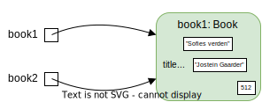

# Klasser og objekter i Python

## Opprette klasser og objekter

I planleggingen av bokprogrammet vår definerte vi klassen `Bok`, og viste hvordan objekter kan opprettes fra denne klassen: 


Hvordan kan vi opprette disse objektene i Python? Det er temaet for denne seksjonen! 

I dette kapitlet kommer vi til å vise mange kodeeksempler, og koden vil alltid være på engelsk! Å bruke engelsk som språk er viktig når vi skriver kode som skal leses av andre enn oss selv. Men også når vi programmerer for oss selv er det lurt å innarbeide denne vanen. Dessuten kan personlige prosjekter alltid bli til noe større senere!

- Bruk alltid engelsk som språk når du programmerer. Alle navn som du velger selv (for variabler, klasser og metoder) bør være på engelsk. 

Da vi planla og skisserte bokprogrammet brukte vi bare norske navn. Derfor er det første steget å oversette klassediagrammet til engelsk: 


Nå er vi klare til å programmere! I Python må vi definere en klasse først, og deretter kan vi opprette objekter fra klassen. Vi begynner med en svært enkel versjon av klassen:


```python
class Book:
    title = ""
    author = ""
    number_of_pages = 0
```

Vi følger alltid denne strukturen når vi oppretter en klasse: 

1. På den første linjen skriver vi `class Name:`, der `Name` skal være navnet til klassen.
2. Deretter følger en innrykket blokk, hvor vi skriver innholdet i klassen, det vil si alle datafelter og metoder.
3. Når vi slutter å bruke innrykk  er vi utenfor klassen. 

I klassen har vi definert de ønskede datafeltene (`title`, `author` og `number_of_pages`) og gitt dem noen standardverdier. Nå kan vi opprette vårt første objekt:


```python
Book()
```


    <__main__.Book at 0x7f3c6c460d90>


For å opprette et objekt skriver vi altså klassenavnet etterfulgt av parenteser. Når vi kjører dette programmet, så vil et objekt opprettes og plasseres i minnet. Men for at vi skal finne objektet senere må vi lagre minneadressen i en variabel. Derfor oppretter vi vanligvis objekter på følgende måte:


```python
book1 = Book()
```

Variabelen `book1` lagrer minneadressen for oss, slik at vi kan finne objektet og gjøre operasjoner på det, som for eksempel å endre et av datafeltene:


```python
book1.title = "Sofies verden"
```

Punktumet i `book1.title` er svært viktig, for det forteller at vi skal hente en variabel som ligger inni objektet. Vi bruker alltid punktum for å "gå inn" på et objekt: 

* For å hente datafelter eller metoder inni et objekt bruker vi følgende skrivemåte:
    * `object1.datafield1`
    * `object1.method1(p1, p2)`
* Forklaring av navn: 
    - `object1` er en variabel som inneholder minneadressen til objektet
    - `datafield1` er navnet på et datafelt i objektet
    - `method1` er navnet på en metode i objektet, og `p1` og `p2` er parametre

Følgende kode viser forskjellen på en variabel som "ligger fritt" og en variabel som ligger inni et objekt:


```python
title = "Når villdyret våkner"
print(title)
print(book1.title)
```

    Når villdyret våkner
    Sofies verden


Her har vi to variabler som begge heter `title`, men den ene variabelen ligger i et bokobjekt, mens den andre ligger fritt. Variabler som ligger i objekter kalles vanligvis *datafelter*. Vi har opprettet et bokobjekt som har tre datafelter:

- book1.title
- book1.author
- book1.number_of_pages

For å fullføre registreringen av boken *Sofies verden*, kan vi endre de resterende datafeltene:


```python
book1.author = "Jostein Gaarder"
book1.number_of_pages = 512
```

For å se at det har fungert, kan vi printe ut datafeltene:


```python
print(book1.author)
print(book1.number_of_pages)
```

    Jostein Gaarder
    512


Men hva skjer hvis vi forsøker å printe variabelen `book1`?


```python
print(book1)
```

    <__main__.Book object at 0x7f3c6d4f1190>


Denne utskriften var litt kryptisk! Som vi har nevnt, så inneholder ikke `book1` selve objektet, men *minneadressen* til objektet. Det er nettopp denne adressen (`0x10cbff970`) vi får vite når vi printer variabelen `book1`. Derfor sier vi at `book1` *peker til objektet* som ligger på adressen. Det er ingenting i veien for å ha flere variabler som peker til det samme objektet:


```python
book2 = book1
```

Her kopierer vi minneadressen `0x10cbff970` (som ligger i `book1`) til variabelen `book2`. Ved å printe variablene kan vi sjekke at de peker til det samme objektet:


```python
print(book1)
print(book2)
```

    <__main__.Book object at 0x7f3c6d4f1190>
    <__main__.Book object at 0x7f3c6d4f1190>


Vi kan også vise dette i en figur: 



I denne seksjonen har vi sett hvordan vi oppretter objekter og samtidig lagrer minneadressen, slik at vi senere kan finne objektene og gjøre operasjoner på dem.


## Sette inn metoder

I forrige seksjon programmerte vi klassen `Book` og opprettet et objekt fra klassen. Men vi definerte kun datafelter i klassen, så nå lurer du kanskje på hvordan vi definerer metoder? La oss først definere en vanlig funksjon utenfor klassen `Book`:


```python
def print_information(book):
        print(book.title, " has ", book.number_of_pages, " pages.")

print_information(book1)
```

    Sofies verden  has  512  pages.


Denne funksjonen tar et bokobjekt som parameter, og printer ut en setning om boka. Å definere vanlige funksjoner kan ofte være et fint sted å starte. Vi kan nå legge merke til at funksjonen kun brukes på én type data, nemlig data om en bok. Dette er et hint om at vi bør bruke objektorientert programmering, slik at vi kan knytte sammen data og funksjoner som hører sammen. Hvordan knytter vi funksjonen `print_information()` til data om en bok? Svaret er selvfølgelig at funksjonen bør legges i klassen `Book`! Hvordan gjør vi så dette? Kan vi bare kopiere funksjonen inn i klasseblokken? La oss prøve!


```python
class Book:
    title = ""
    author = ""
    number_of_pages = 0
    
    def print_information(book):
        print(book.title, " has ", book.number_of_pages, " pages.")
```

Nå kan vi opprette et nytt bokobjekt og be objektet om å utføre metoden:


```python
book3 = Book()
book3.title = "Når villdyret våkner"
book3.number_of_pages = 86
book3.print_information()
```

    Når villdyret våkner  has  86  pages.


Dette fungerte! Nå har vi to funksjoner som gjør det samme; den ene er definert inni klassen og den andre utenfor. Metodene har til og med helt lik kode! Forskjellen er måten de brukes på:


```python
print_information(book3)
book3.print_information()
```

    Når villdyret våkner  has  86  pages.
    Når villdyret våkner  has  86  pages.


Forklaring:

1. I funksjonen som er definert utenfor klassen må vi sette inn bokobjektet som parameter. 
2. I metoden som er definert i klassen, trenger vi ingen parametre - vi må i stedet "gå inn" på riktig objekt og deretter be objektet om å utføre metoden. Vi gjør dette ved å bruke punktum, som forklart i forrige seksjon.  Men hva er det som skjer bak kulissene når vi skriver `book3.print_information()`? Svaret er faktisk ganske enkelt; Python setter automatisk inn `book3` som den første parameteren! 

Når vi bruker metoder er det altså objektet selv som settes inn i den første parameteren. Her er et annet eksempel: 

- Tenk deg at vi definerer en ny metode i klassen `Book`, som har signaturen `my_method(p1, p2, p3)`. 
- Denne metoden må utføres av et spesifikt bokobjekt, for eksempel med kommandoen `book1.my_method(1, 2)`.  Her ser det ut som vi bare har gitt to parametre, men egentlig har vi gitt tre; den første parameteren blir `book1`, mens den andre og tredje parameteren blir tallene `1` og `2`.

Når vi definerer metoder er det vanlig å gi den første parameteren navnet `self`, siden det alltid er "objektet selv" som settes inn i denne parameteren. Derfor kunne vi i stedet brukt signaturen `my_method(self, p2, p3)` i eksemplet over. I vårt første eksempel kan vi gjøre tilsvarende endring:


```python
class Book:
    title = ""
    author = ""
    number_of_pages = 0
    
    def print_information(self):
        print("This book has " + self.number_of_pages + " pages")
```

Legg merke til siste linje; metoden må vite hvilket objekt datafeltet `number_of_pages` kommer fra. Vanligvis ønsker vi å bruke objektet som kalte på metoden, som vi kan hente med `self`-parameteren. Da må vi skrive `self.number_of_pages`. 

Når vi programmerer i Python, bør vi ha som vane å inkludere `self`-parameteren når vi oppretter nye metoder:


```python
class Book:
    title = ""
    author = ""
    number_of_pages = 0
    
    def register_loan(self, person):
        return False

    def register_delivery(self):
        return False
```

*Foreløpig gjør disse metodene ingenting, men det er ofte lurt å definere alle klasser og metoder først, og senere fylle dem med funksjonell kode.*


## Sette inn en konstruktør


Tenk deg at vi skal registrere boka *Sofies verden* i systemet. Foreløpig har vi vist hvordan vi kan gjøre dette i to steg: 

1. Vi opprettet et *tomt* bokobjekt med kommandoen `book1 = Book()`. Vi sier at objektet er tomt fordi datafeltene ikke har spesifikke verdier - objektet har bare fått standardverdiene vi definerte i klassen. 
2. Deretter satte vi inn riktige verdier ved å skrive:


```python
book1.title = "Sofies verden"
book1.author = "Jostein Gaarder"
book1.number_of_pages = 512
```

I stedet for å gå gjennom disse stegene, hadde det vært praktisk å kunne bruke kommandoen`Book("Sofies verden", "Jostein Gaarder", 512)` for å opprette objektet. Hva slags metode trenger vi for dette? En konstruktør!

Vi har sett hvordan vi legger til en konstruktør i klassediagrammet:


En konstruktør bestemmer hva som skal gjøres med et nyopprettet objekt. Vår konstruktør skal opprette datafeltene `title`, `author` og `number_of_pages` i det nye objektet, og fylle disse med parameterverdiene. Hvordan lager vi en konstruktør som gjør dette i Python? 

Når vi oppretter en klasse i Python, får klassen automatisk en metode som kalles  `__init__()` (merk at det er to understreker på hver side).  Denne er i utgangspunktet skjult for oss, men i Python kan vi alltid endre på en metode ved å skrive den opp på nytt:


```python
class Book:
    def __init__(self):
        print("You have just created the object ", self)

Book()
```

    You have just created the object  <__main__.Book object at 0x7f3c6c43fd00>


    <__main__.Book at 0x7f3c6c43fd00>


Her laget vi altså en konstruktør som skriver ut en melding. Men hva er det egentlig som skjer? Hvorfor skrev vi ikke `__init__()` for å kalle på metoden?

* Når Python ser kommandoen `Book()`, så vil den automatisk kjøre funksjonen `__init()__` fra klassen `Book`. Det er altså `__init()__` som er konstruktøren, men for å bruke konstruktøren, må vi skrive `Book()`.

Nå kan vi sørge for at konstruktøren gjør det vi ønsker, nemlig å opprette datafelter og fylle dem med ønskede verdier:


```python
class Book:
    def __init__(self, title, author, number_of_pages):
        self.title = title
        self.author = author
        self.number_of_pages = number_of_pages

book4 = Book("Sofies verden", "Jostein Gaarder", 512)
print(book4.title)
```

    Sofies verden


Her kunne vi opprette et bokobjekt på akkurat den måten vi ønsket!

I koden til konstruktøren er det viktig å forstå at `self.title` og `title` er to forskjellige variabler:

* `self.title ` er en variabel som settes inn i det nye objektet
* `title` er en variabel som kommer fra parameteren
* Når vi skriver `self.title = title`, så oppretter vi altså et datafelt i objektet, og fyller den med verdien fra parameteren `title`.

De fleste konstruktører har denne grunnleggende strukturen, så nå er det enkelt å lage konstruktører for andre klasser i boksystemet vårt, for eksempel klassen `Person`:


En første versjon av klassen `Person` kan inneholde en konstruktør. Det er nok til å opprette personobjekter på en enkel måte:


```python
class Person:
    def __init__(self, name, age):
        self.name = name
        self.age = age

person1 = Person("Per Hansen", 70)
print(person1.name)
```

    Per Hansen


## Sette inn flere konstruktører

Vi skal nå vise hvordan vi kan legge til en ekstra konstruktør. Eksempelet vårt er en konstruktør som bare trenger bokas ISBN:


Tenk deg at du har boka *Sofies verden*, og på baksiden ser du at bokas ISBN er *9788203245114*. Det hadde vært veldig nyttig å kunne registrere boka med kommandoen `Book("9788203245114")`. Problemet er at vi allerede har en konstruktør for klassen `Book`, og Python lar oss ikke definere to konstruktører! Løsningen er å sørge for at den ene konstruktøren kan brukes på flere måter, ved å bruke *navngitte parametre* (*keyword arguments* på engelsk). For å forstå hva dette er kan vi sammenligne følgende kodelinjer:


```python
b1 = Book("Sofies verden", "Jostein Gaarder", 512)
b2 = Book(author="Jostein Gaarder", number_of_pages=512, title="Sofies verden")
```

I den første linjen oppretter vi et bokobjekt på den vanlige måten. I den andre linjen oppretter vi et objekt med akkurat de samme verdiene, men her spesifiserer vi navnet til parameteren før vi skriver verdien. En fordel med dette er at vi ikke trenger å huske rekkefølgen til parametrene (men vi må huske navnene). En annen fordel er at vi har mulighet til å droppe noen parametre. Da må vi først sørge for at parametrene har *standardverdier*:


```python
class Book:
    def __init__(self, title="", author="", number_of_pages=0):
        self.title = title
        self.author = author
        self.number_of_pages = number_of_pages
```

Nå kan vi si at metoden har *valgfrie parametre*, siden vi kan la være å fylle ut noen parametre. For eksempel kan vi opprette et objekt med kommandoen `Book("Sofies verden", number_of_pages=512)`. Her skriver vi den første parameteren på vanlig måte, men i stedet for å skrive den andre parameteren, så navngir vi den tredje parameteren. Altså har vi hoppet over den andre parameteren (`author`), og denne får derfor standardverdien, som i dette tilfellet er den tomme tekststrengen `""`.

Hvorfor er valgfrie parametre nyttige for oss? Fordi vi nå kan vi legge til de valgfrie parameteren `isbn`!


```python
class Book:
    def __init__(self, title="", author="", number_of_pages=0, isbn = ""):
        self.title = title
        self.author = author
        self.number_of_pages = number_of_pages
```

Siden alle parametrene er valgfrie, kan vi hoppe over de tre første parametrene, slik at vi kun skriver ISBN! Med andre ord kan vi opprette et bokobjekt med kommandoen `Book(isbn="9788203245114")`. 

Men for at metoden faktisk skal fungere slik vi ønsker, må den sjekke hvilke parametre som har blitt fylt ut. Mer spesifikt må vi stille følgende spørsmål:

- Har parameteren `isbn` blitt fylt ut? 
    * Hvis ja, så bruker vi `isbn` til å finne boka i en database, og henter de ønskede verdiene fra databasen.
    + Hvis nei, så bruker vi de tre første parametrene i stedet.

Når vi skal "stille et spørsmål" for å avgjøre hvilken kode som skal avgjøres, bruker vi en `if`-`else`-blokk:


```python
class Book:
    def __init__(self, title="", author="", number_of_pages=0, isbn = ""):
        if len(isbn)>0: 
            self.title, self.author, self.number_of_pages = self.get_information_from_database(isbn)
        else:
            self.title = title
            self.author = author
            self.number_of_pages = number_of_pages
            
    def get_information_from_database(self, isbn):
        return "", "", 0
```

Prøv gjerne å forstå hvordan spørsmålet vi stilte ovenfor har blitt til en `if`-`else`-blokk i koden. Her følger en forklaring: 

1. Kodelinjen `if len(isbn) > 0` tester om `isbn`-parameteren har blitt fylt ut. Hvis testen gir svaret "ja", så utføres denne kodeblokken. 
2. Hvis testen gir svaret "nei", så utføres `else`-blokken i stedet. 
3. Siden konstruktøren bare skal ha ansvar for å opprette datafeltene, har vi  laget en delmetode som har ansvar for å hente informasjon fra en bokdatabase. 

*Merk at vi ikke har skrevet funksjonell kode i delmetoden `get_information_from_database`. Dette kan vi gjerne vente med til den grunnleggende strukturen med alle klasser og metoder er på plass. Foreløpig kan vi la delmetoden returnere noen standardverdier.*

*Det er også viktig å forstå hvordan vi kaller på delmetoden. Vi kan ikke skrive `get_information_from_database(isbn)`, for da vil Python klage på at vi bare har gitt én parameter! I stedet må vi skrive `self.get_information_from_database(isbn)`, slik at objektet selv gis som den første parameteren, og `isbn` som den andre parameteren!*

Vi har nå én konstruktør som kan brukes på to forskjellige måter:


```python
b1 = Book("Sofies verden", "Jostein Gaarder", 512)
b2 = Book(isbn="9788203245114")
```

## Aktiviteter

**Prosjektoppgave 6.** Ta utgangspunkt i det ferdige klassediagrammet du har fra prosjektoppgavene i kapitlet *Konsepter i objektorientert programmering*. Gjør følgende oppgaver: 

1. Opprett én Python-fil for hele prosjektet. Senere skal vi vise hvordan vi kan fordele koden i flere filer, men på dette stadiet skal vi ha all kode i én fil. 
2. Opprett klassen med én konstruktør (følg eksemplet gitt i seksjonen *Sette inn en konstruktør*.
3. Forsøk å lage en metode som skrive ut en setning om et objekt fra klassen (følg eksemplet gitt i seksjonen *Sette inn metoder*).
4. Forsøk å opprette noen objekter fra klassen, og bruk metoden du lagde i punkt 3 til å skrive ut en setning om hver av objektene. Denne koden kan du skrive under klasseblokken.
5. Gjenta steg 1-4 med alle de andre klassene i klassediagrammet. Det skal være en fil for hver klasse. Dersom noen av klassene dine har flere konstruktører, kan du følge eksemplet gitt i seksjonen *Sette inn flere konstruktører*. Dersom noen av konstruktørene dine skal gjøre flere operasjoner, trenger du ikke å skrive kode for disse; du kan i stedet lage en funksjon som returnerer standardverdier. 
