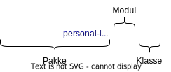

# Mer om klasser og objekter i Python

## Delmetoder

I boksystemet vårt ønsket vi å kunne vise en rangert liste av bøker. Følgende klassediagram viser metodene vi trenger for å oppnå dette:


Følgende figur viser hvordan noen metoder brukes som byggeblokker til andre metoder:


Hvor skal vi starte? Vi kan se at nesten alle metodene er avhengig av noen andre metoder for å fungere. Nettopp derfor er det lurt å lage figuren ovenfor, slik at vi enkelt ser hvor vi skal starte. De første byggeblokkene som vi trenger er følgende metoder: 

- `get_reviews_from_goodreads()`
- `get_reviews_from_librarything()`
- `get_online_critics()`

Det er ofte i de første metodene at mesteparten av kodearbeidet må gjøres. Derfor er det lurt å starte med å la disse metodene returnere noen enkle testverdier. I følgende kode oppretter vi derfor noen fiktive anmeldelser, og en funksjon som returnerer et tilfeldig utvalg av disse: 


```python
from random import sample

r1 = ["Veldig interessant bok", 9]
r2 = ["Boken var for lang", 5]
r3 = ["Slutten ødela boken", 2]
r4 = ["En bok som får deg til å tenke", 7]
r5 = ["Handlingen var veldig spennende", 8]

all_reviews = [r1, r2, r3, r4, r5]

def get_random_reviews(n):
	return sample(all_reviews, n)

print(get_random_reviews(3))
```

    [['Boken var for lang', 5], ['Handlingen var veldig spennende', 8], ['Slutten ødela boken', 2]]


Funksjonen `get_random_reviews` henter et altså tilfeldig utvalg av de fem testanmeldelsene vi har skrevet. 

Nå kan vi opprette de første metodene, som skal være i klassen `Book`:


```python
 class Book:
    def __init__(self, title, author, number_of_pages):
        self.title = title
        self.author = author
        self.number_of_pages = number_of_pages
        self.borrower_reviews = get_random_reviews(3)

    def get_reviews_from_goodreads(self):
    	reviews = get_random_reviews(3)
    	return reviews

    def get_reviews_from_librarything(self):
    	reviews = get_random_reviews(3)
    	return reviews

    def get_online_critics(self):
    	critics = get_random_reviews(3)
    	return critics 
```

Nå kan vi late som vi har anmeldelser fra flere forskjellige kilder: 
* Datafeltet `borrower_reviews`, altså anmeldelser som vi har registrert fra våre egne brukere. Vi har sørget for at konstruktøren fyller datafeltet med testanmeldelser.
* Tre metoder for å hente anmeldelser på nett. Alle disse returner testanmeldelser. 

Det neste vi ønsker er en metode som samler alle brukeranmeldelser på nett. Siden vi allerede har en metode for hver av nettsidene vi ønsker å hente brukeranmeldelser fra, blir dette enkelt: 


```python
def get_online_user_reviews(self):
	from_goodreads = self.get_reviews_from_goodreads()
	from_librarything = self.get_reviews_from_librarything()
	reviews = from_librarything + from_goodreads
	return reviews 

Book.get_online_user_reviews = get_online_user_reviews
```

*I siste linje bruker vi en teknikk i Python for å legge til en metode i en eksisterende klasse. Vi kan bruke følgende kodelinje for å gjøre dette:*
```py
MyClass.my_method = my_function
```
* *`MyClass` navnet på klassen*
* *`my_function` er navnet på funksjonen som vi har definert utenfor klassen*
* *`my_method` er navnet vi ønsker at funksjonen skal ha inni klassen*

Det neste vi ønsker oss er en funksjon som kan regne ut gjennomsnittet til en liste med anmeldelser:


```python
def calculate_average(reviews):
	total_score = 0
	n = len(reviews)
	for review in reviews:
		score = review[1]
		total_score += score
	average = total_score/n
	return average

reviews = get_random_reviews(3)
print(reviews)
print(calculate_average(reviews))
```

    [['Handlingen var veldig spennende', 8], ['Boken var for lang', 5], ['En bok som får deg til å tenke', 7]]
    6.666666666666667


Les utskriften for å se at metoden regner ut riktig gjennomsnitt, og forsøk gjerne å forstå hvordan utregningen gjøres.

*I planleggingen av programmet plasserte vi denne funksjonen i klassen `Book`. Men her ser vi at funksjonen egentlig bare gjør en operasjon på en liste med tall, og vi har derfor valgt å plassere den utenfor klasseblokken.*


Nå er vi klare til å kode metoden som regner ut gjennomsnittsvurderingen til en bok! Funksjonen skal:

1. Hente anmeldelser fra tre forskjellige kilder; lånetakere, nettbrukere og kritikere.
2. Regne ut gjennomsnittsvurderingen for hver av disse kildene.
3. Regne ut et totalt gjennomsnitt.


```python
def calculate_average_score(self): 
	borrowers = self.borrower_reviews
	online_users = self.get_online_user_reviews()
	critics = self.get_online_critics()

	score_borrowers = calculate_average(borrowers)
	score_online_users = calculate_average(online_users)
	score_critics = calculate_average(critics)

	total_score = (score_borrowers + score_online_users + score_critics)/3

	return total_score

Book.calculate_average_score = calculate_average_score
```

Legg merke til hvordan de tre stegene blir til tre blokker med kode. I de to første blokkene gjøres alt arbeidet av delmetodene, mens det er det siste steget som er metodens "eget arbeid". I denne linjen kan vi endre hvor mye de ulike kildene skal vektes. Hvis vi for eksempel ønsker at vurderinger fra nettbrukere skal telle 50%, mens de andre kildene skal telle 25% hver, kan vi endre til følgende:

```py
total_score = 0.25*score_borrowers + 0.5*score_online_users + 0.25*score_critics
```

## Kommunikasjon mellom objekter

I forrige seksjon programmerte vi høyre side av følgende diagram: 


På venstre side har vi rangeringsmetoden, som ligger i klassen `BookCollection`. Denne metoden skal fungere ved å be alle bokobjekter om å regne ut sin gjennomsnittlige poengsum. Da må metoden `calculate_average_score()` være en offentlig metode. 

Hvordan forteller vi om en metode skal være offentlig eller privat? Det kommer an på hvilket programmeringsspråk vi bruker! I Java brukes for eksempel nøkkelordene `public` og `private`, og dersom en metode er definert med `private`, er det kun mulig å bruke den innad i klassen. Dersom vi prøver å bruke en privat metode utenfor klassen, får vi en feilmelding!

I Python er det ikke mulig å tvinge en metode til å være privat! Hva kan vi gjøre i stedet? Tenk deg for eksempel at noen har lyst til å ta i bruk bokklassen vår i sitt eget program. Hvordan kan vi fortelle denne personen at det kun er `calculate_average_score()` som er offentlig, og at de andre metodene ikke bør brukes? 

I Python har man blitt enige om en spesiell skrivemåte for å skille mellom offentlige og private metoder:

```python
class Book: 
    def _get_reviews_from_goodreads(self):
    	return

    def _get_reviews_from_librarything(self):
    	return

    def _get_online_critics(self):
    	return

    def calculate_average_score(self):
        return
```

*For å forenkle presentasjonen har vi definert klassen på nytt, uten å ta med verken konstruktør eller kode i metodene.*

Ser du hva som er forskjellen på de private metodene og den offentlige metoden? 

For å markere at en metode er privat, setter vi altså en understrek i starten av navnet! Dette forhindrer ikke noen fra å bruke metoden, men det gir en klar beskjed om at metoden kan endre seg eller slutte og fungere, og at det derfor ikke er trygt å bruke den i sitt eget program!

Nå er vi klare til å definere klassen `BookCollection`, som skal inneholde rangeringsmetoden:


```python
class BookCollection: 
    def __init__(self, books):
        self.books = books

    def show_ranked_list(self):
        
        scores_and_titles = []
        for b in self.books: 
            score_and_title = [b.calculate_average_score(), b.title]
            scores_and_titles.append(score_and_title)
        
        scores_and_titles = sorted(scores_and_titles, reverse=True)

        for s, t in scores_and_titles:
            print(round(s, 1), t)
```

Rangeringsmetoden har fire blokker med kode: 

**Blokk 1.** I den første blokken henter vi poengsummen og tittelen til hvert bokobjekt, og legger disse i listen `scores_and_titles`. Etter denne blokken kan vi for eksempel ende opp med følgende liste:

```
[ [7.8, "Når villdyret våkner"],  [9.2, "Sofies verden"],  [8.9, "Beatles"] ]
```
Merk at hvert element i listen er en ny liste, som inneholder poengsummen og tittelen til en bok. 

**Blokk 2.** I den andre blokken sorterer vi denne listen. Hvis vi fortsetter med det samme eksempelet får vi følgende liste:

```
[ [9.2, "Sofies verden"],  [8.9, "Beatles"],  [7.8, "Når villdyret våkner"] ]
```
*Merk at vi bruker en sorteringsfunksjon som er innebygd i Python. Det er viktig at poengsummen kommer først i de indre listene, siden det er disse elementene som brukes i sorteringen. Legg også merke til at vi reverserer listen, fordi sorteringsfunksjonen som standard sorterer i stigende rekkefølge.*

3. I den siste linjen printer vi den sorterte listen. For eksempel vil listen ovenfor bli printet på følgende måte:

```
9.2 Sofies verden
8.9 Beatles
7.8 Når villdyret våkner
```

Hvordan kan vi teste at metoden faktisk fungerer? La oss opprette noen bokobjekter som vi kan teste med:


```python
b1 = Book("Sofies verden", "Jostein Gaarder", 512)
b2 = Book("Beatles", "Lars S. Christensen", 732)
b3 = Book("Når villdyret våkner", "Jack London", 86)
my_books = [b1, b2, b3]
```

Videre kan vi opprette et `BookCollection`-objekt og legge bøkene i samlingen: 


```python
my_collection = BookCollection(my_books)
```

Nå kan vi teste rangeringsmetoden:


```python
my_collection.show_ranked_list()
```

    6.6 Beatles
    6.4 Når villdyret våkner
    5.5 Sofies verden


*Husk at bokobjektene bruker et tilfeldig utvalg av testanmeldelsene som vi opprettet i forrige seksjon!*

Som oppsummering kan vi si at boksamlingobjektet ber hvert bokobjekt om å finne sin poengsum, og deretter brukes disse poengene til å lage en rangert liste. Kommunikasjonen mellom objektene skjer gjennom den offentlige metoden `calculate_average_score`. 

## Set-metoder

Tidligere har vi nevnt at alle datafelter bør være private. For hva er konsekvensene hvis man fritt kan endre på datafelter utenfor en klasse? Se på følgende eksempel: 


```python
b4 = Book("Faen ta skjebnen", "John Green", 338)
my_review = ["Fantastisk bok!", "Terningkast 6"]
b4.borrower_reviews.append(my_review)
print(b4.borrower_reviews)
```

    [['En bok som får deg til å tenke', 7], ['Veldig interessant bok', 9], ['Slutten ødela boken', 2], ['Fantastisk bok!', 'Terningkast 6']]


Her har vi lagt til en anmeldelse som ikke følger det riktige formatet! Vurderingen skal nemlig skrives som et tall mellom 0 og 10. Nå får vi en feilmelding dersom vi tester rangeringsmetoden fra forrige seksjon:


```python
my_books = [b1, b2, b3, b4]
my_collection = BookCollection(my_books)
my_collection.show_ranked_list()
```


    ---------------------------------------------------------------------------

    TypeError                                 Traceback (most recent call last)

    Cell In[109], line 3
          1 my_books = [b1, b2, b3, b4]
          2 my_collection = BookCollection(my_books)
    ----> 3 my_collection.show_ranked_list()


    Cell In[82], line 9, in BookCollection.show_ranked_list(self)
          7 scores_and_titles = []
          8 for b in self.books: 
    ----> 9     score_and_title = [b.calculate_average_score(), b.title]
         10     scores_and_titles.append(score_and_title)
         12 scores_and_titles = sorted(scores_and_titles, reverse=True)


    Cell In[81], line 6, in calculate_average_score(self)
          3 online_users = self.get_online_user_reviews()
          4 critics = self.get_online_critics()
    ----> 6 score_borrowers = calculate_average(borrowers)
          7 score_online_users = calculate_average(online_users)
          8 score_critics = calculate_average(critics)


    Cell In[80], line 6, in calculate_average(reviews)
          4 for review in reviews:
          5 	score = review[1]
    ----> 6 	total_score += score
          7 average = total_score/n
          8 return average


    TypeError: unsupported operand type(s) for +=: 'int' and 'str'


For å forhindre at datafeltene blir endret på en feil måte, bør vi derfor gjøre dem private: 


```python
class Book:
    def __init__(self, title, author, number_of_pages):
        self._title = title
        self._author = author
        self._number_of_pages = number_of_pages
        self._borrower_reviews = get_random_reviews(3)
```

*For å forenkle presentasjonen har vi skrevet opp bokklassen på nytt, kun med konstruktøren. Navnet på datafeltene må også oppdateres alle andre steder de brukes!*

Men hvordan skal vi tillate at brukere gjør endringer på datafeltene? Vi ønsker jo ofte at det skal være mulig! Løsningen er å definere en offentlig metode som kalles en *set*-metode (også kalt *setter*, fra engelsk *to set*). For eksempel kan vi lage en *set*-metode som gjør det mulig å endre tittelen til en bok:


```python
class Book:
    def set_title(self, title):
        self._title = title
```

Dermed unngår vi at brukeren av klassen har direkte tilgang til datafeltet `_title`. I stedet gir vi tilgang på en måte som vi kan kontrollere, nemlig gjennom metoden `set_title`. Nå kan vi for eksempel sjekke at parameteren er av riktig datatype - vi ønsker nemlig at tittelen på en bok skal være en streng: 


```python
class Book: 
    def set_title(self, title):
        if type(title) == str:
            self._title = title
```

Tilsvarende kan vi lage en *set*-metode som gjør det mulig å endre sideantallet til en bok.


```python
class Book: 
    def set_number_of_pages(self, num):
        if type(num) == int and num > 0 and num < 10000:
            self._number_of_pages = num
```

Her ønsker vi at brukeren skriver et positivt heltall som ikke er urimelig høyt.

Til slutt kan vi se på datafeltet `_borrower_reviews`. Dette er en liste av anmeldelser, og vi ønsker egentlig ikke at brukeren skal kunne overskrive hele listen. Derfor gir det mer mening å lage en metode for å legge til en anmeldelse i lista: 


```python
class Book: 
    def add_borrower_review(self, text, score):
        if type(text) == str and type(score) == int and score >= 0 and num <= 10:
            review = [text, score]
            self._borrower_reviews.append(review)
```

Her sjekker vi både datatypene og at poengsummen er et tall mellom 0 og 10. Dette løser problemet vi hadde i starten av seksjonen, nemlig at det ble lagt inn en anmeldelse som var feil formatert. Nå har vi sørget for at alle anmeldelser som blir lagt inn har riktig format!

## Get-metoder

Hva med når brukeren bare ønsker å hente et datafelt? For eksempel ønsker man kanskje å vite tittelen til en bok. Til dette formålet legger vi til en *get*-metode (også kalt *getter*, fra engelsk *to get*):


```python
class Book:
    def set_title(self, title):
        if type(title) == str:
            self._title = title
            
    def get_title(self):
        return self._title
```

Vi kan bruke denne forenklede klassen til å opprette et bokobjekt, endre tittelen, og til slutt hente tittelen:


```python
my_book = Book()
my_book.set_title("Sofies verden")
title = my_book.get_title()
print(title)
```

    Sofies verden


Husk at *Sofies verden* er en streng som ligger i minnet, og at variabelen `title` nå inneholder adressen til denne strengen. Men å ha tilgang til adressen gjør oss ikke i stand til å endre strengen! Dette er gode nyheter, for hvis ikke ville vi ha mislyktes i å beskytte datafeltet.

Hvorfor kan ikke strengen endres? I Python finnes to typer objekter: 

* Ikke-muterbare objekter (*immutable objects*): I denne kategorien finnes strenger, heltall, desimaltall, boolske verdier og tupler. Det finnes ingen måter å endre slike objekter, det er bare mulig å opprette nye.
* Muterbare objekter (*mutable objects*): Alle andre objekter kan endres. Et eksempel er en liste, fordi vi kan endre verdien på en bestemt indeks. Et annet eksempel er et objekt fra vår egen klasse, fordi vi kan endre verdien på et bestemt datafelt.

Vi kan vise denne forskjellen med følgende kode: 


```python
mutable = ["Hei"]
immutable = "Hei"

test1 = mutable
test2 = immutable

test1[0] = "Hade"
print(mutable)
```

    ['Hade']


Her har vi opprettet et ikke-muterbart og et muterbart objekt. Minneadressene til disse objektene kopieres deretter til `test1` og `test2`.
* Vi kan bruke `test1` til å endre `mutable`, fordi variablene peker til det samme, muterbare objektet.
* Vi kan ikke bruke `test2` til å endre `immutable` (dersom vi skriver `test2 = "Hade"`, oppnår vi bare at `test` peker til et nytt objekt, mens `immutable` fortsetter å peke til det gamle objektet). 

Som konklusjon kan vi si at det er trygt å lage følgende gettere:


```python
class Book:
    def get_title(self):
        return self._title

    def get_author(self):
        return self._author

    def get_number_of_pages(self):
        return self._number_of_pages
```

Siden vi returnerer ikke-muterbare objekter (strenger og heltall), kan disse ikke endres av brukeren. Altså er datafeltene beskyttet. 

Men hva om vi ønsker å ha en *get*-metode for datafeltet `_borrower_reviews`? Vi kan jo ikke returnere dette objektet, for det er jo en liste og dermed muterbart! Den eneste måten å beskytte objektet er å returnere en kopi!


```python
class Book:
    def get_borrower_reviews(self):
        return copy(self.borrower_reviews)
```

Funksjonen `copy` er innebygd i Python, og er viktig å bruke når vi ønsker å returnere verdiene i et objekt, men beskytte selve objektet fra å bli endret. Merk at hvis vi skal returnere et objekt som inneholder indre objekter (for eksempel en liste av bokobjekter), må vi bruke funksjonen `deepcopy`, som også oppretter kopier av alle de indre objektene. 

## Arv

Fra seksjonene om arv fra kapittelet *Konsepter i objektorientert programmering* kom vi fram til følgende klassediagram: 



*Dette klassediagrammet er oversatt til engelsk og litt modifisert. Vi hadde klassen `Utlånsobjekt`, som vi har oversatt til `Loanable`. Vi kan tenke på dette som en kortversjon av *"Loanable object"*. I slike navn er det vanlig å utelate ordet *object* i klassenavnet.*

Klassene `Book` og `Movie` skal arve datafeltene og metodene til klassen `Loanable`. Hvordan får vi til dette i Python? 

Superklassen `Loanable` arver ikke fra noen klasser, så denne kan programmeres på vanlig måte:


```python
class Loanable:
    def register_loan(self, person):
        print("Loan registered: ", title, " -> ", person)

    def register_delivery(self):
        print("Delivery registered: ", title)
```

*På dette stadiet er det ikke viktig at vi har fungerende kode, så vi kan begynne med å printe ut noen enkle meldinger.*

Hvordan kan vi nå endre klassen `Book` slik at den arver fra `Loanable`? La oss ta utgangspunkt i en enkel versjon av bokklassen: 


```python
class Book:
    def __init__(self, title, author, number_of_pages):
        self.title = title
        self.author = author
        self.number_of_pages = number_of_pages
```

Nå kan vi endre den første linjen til `class Book(Loanable)`. Det forteller at klassen `Book` skal arve fra klassen `Loanable`. Merk at superklassen må være definert først!


```python
class Book(Loanable):
    def __init__(self, title, author, number_of_pages):
        self.title = title
        self.author = author
        self.number_of_pages = number_of_pages
```

Vi kan nå opprette et bokobjekt på vanlig måte:


```python
my_book = Book("Sofies verden", "Jostein Gaarder", 512)
```

Siden `Book` arver alle metodene til `Loanable`, kan et bokobjekt utføre disse metodene: 


```python
my_book.register_loan("Per Hansen")
```

    Loan registered:  Sofies verden  ->  Per Hansen


Når du programmerer klassen `Book`, så har du også tilgang til alle datafelter og metoder fra superklassen. Disse kan brukes som byggeblokker til nye metoder: 


```python
class Book(Loanable):
    def renew(self, person):
        self.register_delivery()
        self.register_loan(person)
```

Metodene `register_delivery()` og `register_loan()` er ikke noe vi henter utenfra. Tvert imot er de en del av bokklassen! Klassen `Book` består nemlig av alle metodene vi har definert i klasseblokken, **pluss** alle metodene som kommer fra superklassene til `Book`.

## Dokumentasjon

Målet i denne seksjonen er å gjøre det lettere for brukerne av bokklassen å se hvilke metoder som er offentlige og hvordan de brukes. Til dette formålet kan vi skrive en dokumentasjon, og den kan skrives direkte i kodefilen!

Du vet kanskje hvordan man skriver kommentarer i Python? Kommentarer er tekst som ikke er kode, og som ikke regnes med når vi kjører kodefilen. Det finnes to måter å skrive kommentarer i Python:


```python
# Dette er en kommentar på én linje

""" Dette er en kommentar
som går over
flere linjer.
"""
```


    ' Dette er en kommentar\nsom går over\nflere linjer.\n'


Det er kommentarene som går over flere linjer vi skal bruke når vi skriver dokumentasjon for en klasse. 

I stedet for å forklare hver del i detalj, går vi rett på sak og viser en full dokumentasjon av bokklassen. For presentasjonen sin del har vi utelatt koden i dette eksempelet (vi har skrevet `pass` der vi ellers ville hatt kode). Det er lurt å skrive dokumentasjonen på engelsk, slik at klassen blir mest mulig tilgjengelig (det kan hende at vi ønsker å publisere klassen senere):


```python
class Book: 
    """Class used to represent a physical book

    Public methods
    -------
    Book(title, author, number_of_pages)
        Creates a new book object from given data

    Book(isbn)
        Creates a new book object from ISBN

    set_title(title)
        Sets a new title for the book

    get_title()
        Returns the title of the book

    calculate_average()
        Returns a score between 0 and 10 based on reviews from different sources 
    """
    
    def __init__(self, title=None, author=None, number_of_pages=None, isbn=None):
        """
        Creates a new book object

        If the parameter isbn is passed, attempts to find the book data in a database.
        Otherwise uses the other parameters.

        Parameters
        ----------
        title : str, optional
            The full title of the book (default is None)
        author : str, optional
            The full name of the author, on the form "[First name] [Surname]" (default is None)
        number_of_pages : int, optional
            The number of pages in the book (default is None)
        isbn : int, optional
            The ISBN of the book (default is None)
        """
        pass

    def set_title(self, title):
        """
        Sets a new title for the book

        Parameters
        ----------
        title : str, optional
            The new title of the book

        Returns
        -------
        None
        """
        
        pass

    def get_title(self):
        """
        Returns the title of the book 

        Returns
        -------
        string
            The title of the book
        """
        pass

    def calculate_average_score(self):
        """
        Returns a score between 0 and 10
        
        The score is based on reviews from the following sources:
        * Reviews from borrowers of the book
        * Online user reviews: Bokelskere, Goodreads
        * Online critics

        Returns
        -------
        float
            A decimal number between 0 and 10 if at least one review is found.
            Otherwise -1 (if no reviews are found).   
        """
        
        pass
```

**Forklaring.** Vi dokumenterer både klassen i seg selv og alle metodene. Dokumentasjon av klassen skal komme rett etter `class Book:`, altså i starten av klasseblokken. Tilsvarende skal dokumentasjon av en metode komme i starten av metodeblokken.

Vi strukturerer dokumentasjonen slik: 
1. Den første linjen skal med en kort setning forklare hva klassen eller metoden gjør.
2. På de neste linjene kan man, hvis ønskelig, skrive en lengre forklaring av klassen eller metoden.
3. Deretter kommer det an på om man dokumenterer en klasse eller metode:
    * **Klasse:** Under overskriften *Public methods* lister vi opp alle de offentlige metodene. Under hver metode skriver vi en kort forklaring av hva metoden gjør. Dersom en metode kan brukes på forskjellige måter (med valgfrie parametre), lister vi alle måtene den kan brukes.
    * **Metoder:** Under overskriften *Parameters* lister vi alle parametre (dersom metoden har parametre). For hver parameter skriver vi navn og datatype, og på neste linje en kort beskrivelse av hva parameteren skal inneholde. Under overskriften *Returns* gir vi en tilsvarende beskrivelse av returverdien (dersom metoden har returverdi).

Husk å inkludere et ekstra linjeskift mellom hver av punktene 1-3. 

Hva er poenget med å skrive dokumentasjonen på akkurat denne måten? Ved å følge denne standarden, vil alle som er kjent med Python-programmering forstå dokumentasjonen! En annen fordel er at når noen importerer klassen din, kan de enkelt hente dokumentasjon for klasser og metoder:


```python
my_book = Book()
help(my_book.calculate_average_score)
```

    Help on method calculate_average_score in module __main__:
    
    calculate_average_score() method of __main__.Book instance
        Returns a score between 0 and 10
        
        The score is based on reviews from the following sources:
        * Reviews from borrowers of the book
        * Online user reviews: Bokelskere, Goodreads
        * Online critics
        
        Returns
        -------
        float
            A decimal number between 0 and 10 if at least one review is found.
            Otherwise -1 (if no reviews are found).
    


For å hente dokumentasjonen til hele klassen, brukes kommandoen `help(my_book)` eller `help(Book)`.

## Opprettelse av pakke

Fram til nå har vi definert alle klasser i én Python-fil, men det kan være lurt å organisere prosjektet bedre. Kort sagt bør vi ha én fil per klasse. Hvis vi har et klassediagram som består av klassene `Loanable`, `Book`, og `BookCollection`, kan vi opprette følgende mappestruktur:
```
└── Desktop
    └── personal-library-tool
        ├── __init__.py
        ├── Loanable.py
        ├── Book.py  
        ├── BookCollection.py
```

Vi har opprettet mappen `personal-library-tool/`, der vi finner én fil for hver klasse, samt den spesielle filen `__init__.py`. Denne filen er for å fortelle Python at `personal-library-tool` er en pakke! 

Nå er vi klare for å teste programmet vårt i kommandolinjen (for å åpne kommandolinjen, kan du bruke programmet `Terminal` på Mac og Linux, eller `cmd.exe` på Windows). Vi må først navigere oss inn på mappen der vi har lagt `personal-library-tool/` (i eksempelet ovenfor er det altså `Desktop/` vi skal navigere oss inn på). 

```bash
~$ cd Desktop
```

Vi bruker nå kommandoen `python3` til å starte *Python-tolkeren*, som gjør at vi kan kjøre Python-kode direkte i kommandolinjen:

```bash
~/Desktop$ python3
Python 3.8.10 (default, May 26 2023, 14:05:08) 
[GCC 9.4.0] on linux
Type "help", "copyright", "credits" or "license" for more information.
>>>
```
Det første vi må gjøre er å importere pakken vår:

```python
>>> import personal-library-tool
```
Hvordan tar vi i bruk bokklassen til å opprette et bokobjekt? Først må vi gå inn på riktig *modul*. Hver Python-fil blir til en modul, så pakken vår består av tre moduler: 

* `personal-library-tool.Loanable`
* `personal-library-tool.Book`
* `personal-library-tool.BookCollection`

For å opprette et bokobjekt, må vi gå inn på den andre modulen, og deretter bruke klassen som ligger i modulen:

```python
>>> my_book = personal-library-tool.Book.Book()
```

Følgende diagram viser hva de ulike delene betyr:



For å slippe å skrive det lange pakkenavnet hele tiden, kan vi importere modulene direkte:

```python
>>> from personal-library-tool import Loanable, Book, BookCollection
```
Nå har vi tilgang til `Book`-modulen uten å gå gjennom pakken: 

```python
>>> my_book = Book.Book()
```

Nå kan vi opprette objekter av typen `Book` og `BookCollection`, og utføre metodene som objektene tilbyr. Slik kan vi gjennom kommandolinjen opprette vårt personlige bibliotek!

Det er viktig å huske at alle objekter vi oppretter kun blir lagret i minnet, så hvis vi lukker Python-tolkeren, mister vi objektene. 

For at programmet vårt skal bli et fullverdig biblioteksverktøy, må vi inkludere funksjonalitet for permanent lagring, for eksempel i en database. Videre ville det være naturlig å lage et grafisk brukergrensesnitt, for eksempel en nettside som kjører på din egen maskin. Disse temaene kan du lære mer om i kurset *Informasjonsteknologi 1*. 

## Aktiviteter

**Prosjektoppgave 7.** Ta utgangspunkt i klassediagrammet og Python-filene du har fra de forrige prosjektoppgavene. Gjør følgende oppgaver:

1. Definer alle metoder i sine riktige klasser. Her trenger du bare å skrive `return` i selve metodeblokken, men du skal sørge for at metodene er riktig definert med tanke på parametre, og om metoden skal være offentlig eller privat.
2. Dersom du har delmetoder, skal du nå skrive kode i disse. Tegn gjerne figurer som vist i seksjonen *Delmetoder*, slik at du enkelt kan se hvilke metoder som er lurt å starte med. På dette stadiet trenger ikke delmetodene å returnere riktige verdier! Det er nok at delmetodene returnerer noen testverdier.
3. Skriv kode for resten av metodene. Når du skriver kode for en metode som er oppdelt, er det viktig at du tar i bruk delmetodene. Fortsett å bruke testverdier når det er nødvendig. Forsøk å gjøre koden så oversiktlig som mulig, ved å dele den opp i noen enkle steg.
4. Finnes kommunikasjon mellom objekter i koden? Finn i så fall kodelinjene der dette skjer.
6. Marker alle datafelter som private, og opprett offentlige *set*-metoder for de datafeltene som det skal være mulig å endre. Vurder om noen av metodene bør sjekke at parameteren har en gyldig verdi.
7. Opprett offentlige *get*-metoder for de datafeltene som det skal være mulig å hente. Husk at dersom et datafelt har et muterbart objekt, så må du returnere en kopi av objektet.
8.  Har du noen klasser som arver fra en superklasse? Hvilken endring må du gjøre for at disse klassene arver datafeltene metodene til superklassen? 
9. Skriv dokumentasjon av alle klasser og metoder ved å bruke *docstring*.
10. Opprett en mappe for prosjektet ditt, og sørg for at hver klasse er i sin egen modul (sin egen fil). Hvilken ekstra fil må du opprette for at prosjektet ditt skal bli en pakke?
11. Åpne kommandolinjen og importer modulene fra pakken din. Opprett objekter, minst ett objekt fra hver klasse. Forsøk å printe ut objektene. Test alle de offentlige metodene som objektene dine tilbyr, og print ut resultatene. Er utskriftene som forventet?

