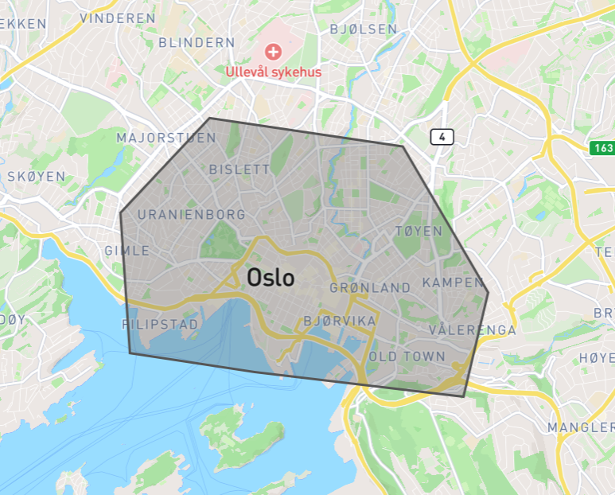
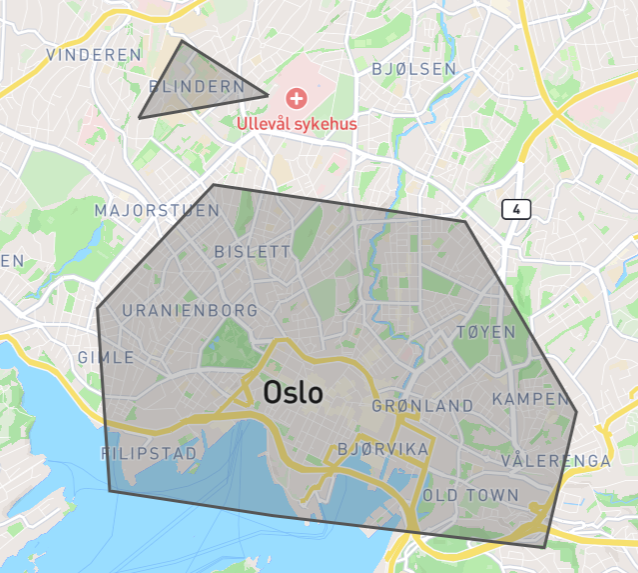

# Databehandling

## Innhenting og inspeksjon av data

I disse seksjonene skal vi bruke turdata fra [*Oslo bysykkel*](https://oslobysykkel.no/apne-data/historisk) - mer spesifikt skal vi importere *JSON*-filen for Juni 2023. Vi trenger ikke å laste ned filen manuelt, men kan i stedet kopiere nettadressen til filen:

[*https://data.urbansharing.com/oslobysykkel.no/trips/v1/2023/07.json*](https://data.urbansharing.com/oslobysykkel.no/trips/v1/2023/07.json)

Python-pakken `requests` kan brukes til å hente innholdet i filen:


```python
import requests

url = "https://data.urbansharing.com/oslobysykkel.no/trips/v1/2023/07.json"
page_content = requests.get(url).text

print(page_content[0:1000])
```

    [{"started_at": "2023-07-01 01:22:38.878000+00:00", "ended_at": "2023-07-01 01:40:04.748000+00:00", "duration": 1045, "start_station_id": "387", "start_station_name": "Studenterlunden", "start_station_description": "langs Karl Johan", "start_station_latitude": 59.914586, "start_station_longitude": 10.735453, "end_station_id": "499", "end_station_name": "Bjerregaards gate", "end_station_description": "ovenfor Fredrikke Qvams gate", "end_station_latitude": 59.925488, "end_station_longitude": 10.746058}, {"started_at": "2023-07-01 03:02:43.726000+00:00", "ended_at": "2023-07-01 03:13:45.064000+00:00", "duration": 661, "start_station_id": "2315", "start_station_name": "Rostockgata", "start_station_description": "utenfor Bj\u00f8rvika visningssenter", "start_station_latitude": 59.90691970255054, "start_station_longitude": 10.760311802881915, "end_station_id": "410", "end_station_name": "Landstads gate", "end_station_description": "langs Uelands gate", "end_station_latitude": 59.929005, "end


Siden vi har hentet filinnholdet som en tekststreng, er neste steg å oversette den til en dictionary:


```python
import json

trips = json.loads(page_content)

print(type(trips))
```

    <class 'list'>


Her ser vi at variabelen `trips` er en Python-liste. Det er fordi *Oslo Bysykkel* har lagret dataene som en liste av objekter, der hvert objekt svarer til en sykkeltur. Som eksempel kan vi skrive ut det første elementet i lista:  


```python
first = trips[0]

print(type(first))
print(first)
```

    <class 'dict'>
    {'started_at': '2023-07-01 01:22:38.878000+00:00', 'ended_at': '2023-07-01 01:40:04.748000+00:00', 'duration': 1045, 'start_station_id': '387', 'start_station_name': 'Studenterlunden', 'start_station_description': 'langs Karl Johan', 'start_station_latitude': 59.914586, 'start_station_longitude': 10.735453, 'end_station_id': '499', 'end_station_name': 'Bjerregaards gate', 'end_station_description': 'ovenfor Fredrikke Qvams gate', 'end_station_latitude': 59.925488, 'end_station_longitude': 10.746058}


Hvert element i lista er altså en dictionary. La oss prøve å skrive ut de to første elementene med penere formatering:


```python
two_first = trips[:2]
print(json.dumps(two_first, indent=4))
```

    [
        {
            "started_at": "2023-07-01 01:22:38.878000+00:00",
            "ended_at": "2023-07-01 01:40:04.748000+00:00",
            "duration": 1045,
            "start_station_id": "387",
            "start_station_name": "Studenterlunden",
            "start_station_description": "langs Karl Johan",
            "start_station_latitude": 59.914586,
            "start_station_longitude": 10.735453,
            "end_station_id": "499",
            "end_station_name": "Bjerregaards gate",
            "end_station_description": "ovenfor Fredrikke Qvams gate",
            "end_station_latitude": 59.925488,
            "end_station_longitude": 10.746058
        },
        {
            "started_at": "2023-07-01 03:02:43.726000+00:00",
            "ended_at": "2023-07-01 03:13:45.064000+00:00",
            "duration": 661,
            "start_station_id": "2315",
            "start_station_name": "Rostockgata",
            "start_station_description": "utenfor Bj\u00f8rvika visningssenter",
            "start_station_latitude": 59.90691970255054,
            "start_station_longitude": 10.760311802881915,
            "end_station_id": "410",
            "end_station_name": "Landstads gate",
            "end_station_description": "langs Uelands gate",
            "end_station_latitude": 59.929005,
            "end_station_longitude": 10.7496755
        }
    ]


Her ser vi tydelig hvordan dataene er organisert. Dersom vi er usikre på hva de ulike nøklene betyr, kan vi lese [dokumentasjonen](https://oslobysykkel.no/apne-data/historisk) (gå lengre ned på siden). 

Merk at alle dataene er skrevet som tall og tekststrenger. Noen av disse er skrevet i henhold til bestemte standarder, som vi nå skal se.

**Tidspunkt.** Start -og sluttidspunkt er skrevet i et standard datoformat ([ISO](https://en.wikipedia.org/wiki/ISO_8601)):

```
yyyy-MM-dd hh:mm:SS.ssssssZ
```
I dette formatet listes tidsenhetene fra størst til minst: 

| år   | måned | dag | time | minutt | sekund | mikrosekund | tidssone |
|------|-------|-----|------|--------|--------|-------------|----------|
| yyyy | MM    | dd  | hh   | mm     | SS     | ss          | Z        |

Merk at tidssonen angis til slutt. I dataene fra *Oslo bysykkel* benyttes tidssonen *+00:00*, som er *London*-tid. Dersom vi ønsker tidspunktene i norsk tid, må én time legges til.

**Varighet.** Varighet er angitt i antall sekunder. Dersom vi ønsker antall minutter og sekunder, må verdiene konverteres. 

**Posisjon.** Geografisk posisjon er angitt i henhold til standarden [WGS](https://no.wikipedia.org/wiki/World_Geodetic_System), som er koordinatsystem for jordas overflate. I eksempelet ovenfor finner vi følgende koordinater:

Startstasjon: *59.91944043984847, 10.7437646218726*   
Endestasjon: *59.922425, 10.758182*

Forsøk å lime *59.922425, 10.758182* inn i søkefeltet på [*Google Maps*](https://www.google.no/maps) for å se den eksakte posisjonen! For å gå motsatt vei kan du høyreklikke på et punkt i *Google Maps* - da vil koordinatene til punktet vises øverst i verktøylisten (trykk for å kopiere til utklippstavlen).

**Stasjoner.** Vi merker oss at en stasjon (start -eller endestasjon) er registrert med fem forskjellige verdier: *id*, *name*, *description*, *latitude*, *longitude*. En stasjon er for eksempel:

```
"id": "551",
"name": "Olaf Ryes plass",
"description": "langs Sofienberggata",
"latitude": 59.922425,
"longitude": 10.758182
```

Det kan være nyttig å opprette en dictionary som kun inneholder stasjonene, slik at vi raskt kan slå opp på en bestemt stasjon. Vi ønsker altså en dictionary på formen: 

```json
{
    "551": {
        "name": "Olaf Ryes plass",
        "description": "langs Sofienberggata",
        "latitude": 59.922425,
        "longitude": 10.758182  
    },
    "384": {
        "name": "V\u00e5r Frelsers gravlund",
        "description": "langs Ullev\u00e5lsveien",
        "latitude": 59.91944043984847,
        "longitude": 10.7437646218726   
    },
    ...
}
```

Merk at vi bruker id'ene til stasjonene som nøkler. For å lage en slik dictionary, kan vi gå gjennom alle turer, og stoppe opp hver gang vi kommer til en stasjon vi enda ikke har registrert: 


```python
stations = {}
for t in trips: 
    for s in ["start", "end"]:
        id = t[f"{s}_station_id"]
        if id not in stations:
            new_station = {
                "name": t[f"{s}_station_name"],
                "description": t[f"{s}_station_description"],
                "latitude": t[f"{s}_station_latitude"],
                "longitude": t[f"{s}_station_longitude"]
            }
            stations[id] = new_station
```

For å hente mer informasjon om stasjonen med id *2358*, slår vi enkelt opp i den nye variabelen `stations`: 


```python
print(stations["2358"])
```

    {'name': 'Aker Brygge 3 mot Fergene', 'description': 'ved bryggen', 'latitude': 59.91087115068967, 'longitude': 10.729828757277915, 'distance_to_oslo_s': 1.1572389016534543}


Hvordan kan vi gå gjennom alle stasjoner? Det er ikke mulig å skrive `for s in stations`, fordi `stations` er en dictionary (som ikke er itererbar). I stedet kan vi hente alle nøklene i `stations`:


```python
print(stations.keys())
```

    dict_keys(['387', '499', '2315', '410', '384', '551', '584', '583', '600', '465', '408', '625', '593', '523', '518', '462', '412', '443', '603', '572', '563', '481', '2333', '619', '508', '597', '478', '2339', '2328', '444', '437', '392', '608', '446', '2305', '456', '425', '460', '489', '428', '576', '534', '2340', '421', '448', '382', '479', '578', '623', '436', '742', '480', '2350', '496', '442', '463', '621', '570', '577', '617', '531', '737', '403', '611', '569', '512', '485', '416', '400', '449', '404', '580', '529', '397', '2307', '620', '579', '502', '517', '535', '599', '2309', '383', '470', '519', '748', '447', '475', '450', '406', '2308', '503', '513', '484', '735', '549', '457', '627', '424', '435', '440', '396', '415', '388', '537', '2358', '507', '455', '2357', '626', '500', '525', '596', '744', '540', '581', '495', '550', '616', '469', '521', '2334', '393', '524', '426', '417', '1009', '398', '738', '614', '407', '491', '427', '558', '1023', '453', '545', '381', '493', '514', '2347', '433', '552', '787', '970', '594', '377', '2270', '390', '468', '486', '586', '2332', '589', '414', '516', '561', '574', '530', '568', '607', '567', '547', '418', '395', '413', '564', '464', '405', '590', '430', '1755', '615', '1919', '441', '575', '399', '571', '401', '445', '506', '548', '609', '402', '624', '461', '497', '378', '618', '423', '511', '2337', '431', '2351', '746', '2349', '389', '588', '582', '554', '542', '452', '522', '509', '487', '459', '473', '505', '585', '610', '622', '451', '587', '541', '598', '422', '592', '566', '562', '526', '380', '429', '488', '458', '434', '411', '483', '476', '474', '438', '1101', '560', '555', '543', '2330', '573', '2304', '454', '394', '472', '739', '482', '595', '565', '2329', '2306', '556', '409', '432', '532', '559', '601', '533', '471', '501', '2280', '420', '498', '439', '591', '466', '527', '2355', '613', '3725', '612'])


Nå kan vi gå gjennom alle nøklene, og på den måten gå gjennom alle stasjoner! La oss lage en løkke som teller antall stasjoner:


```python
i = 0
for id in stations.keys():
    s = stations[id]
    i += 1

print(i)
```

    266


Fra dette kan vi konkludere med at 266 forskjellige stasjoner ble brukt i Juni 2023!

**Oppsummering.** I denne seksjonen har vi hentet data fra *Oslo Bysykkel* og lagt dem i variabelen `trips`. Dataene er strukturert som en liste av turer. Hver tur er lagret som en dictionary, og verdiene følger bestemte standarder.

Videre har trukket ut informasjon om alle stasjoner og lagt dem i variabelen `stations`. Dette er en dictionary der stasjons-id brukes som nøkkel.

**Aktivitetsforslag 1.** Opprett variablene `trips` og `stations` som vist i denne seksjonen. Du kan velge selv hvilken måned du vil hente fra [*Oslo bysykkel*](https://oslobysykkel.no/apne-data/historisk).

Bruk løkker, indekser og nøkler til å skrive ut følgende inforasjon: 

- Skriv ut en liste over alle stasjoner, på formen *navn,  beskrivelse*:
```
Olaf Ryes plass, langs Sofienberggate
Vår Frelsers gravlund, langs Ullevålsveien
...
```
- Skriv ut informasjon om de 50 første turene, på følgende form:
```

Tur 1:
Fra: Studenterlunden
Til: Bjerregaards gate
Varighet: 1045 sekunder

Tur 2:
Fra: Rostockgata
Til: Landstads gate
Varighet: 661 sekunder

Tur 3:
Fra: Vår Frelsers gravlund
Til: Olaf Ryes plass
Varighet: 718 sekunder

...
```

* Utfordring: Skriv ut varighet som antall minutter og sekunder.

**Aktivitetsforslag 2.** Bruk programmering til å finne ut følgende om sykkeldataene: 

1. Hvor mange turer startet og endte på samme stasjon? Hvor stor prosentandel utgjør dette?
2. Hvor mange turer varte kortere enn fem minutter (300 sekunder)? Hvor stor prosentandel utgjør dette? Hva med turer som varte lengre enn én time (3600 sekunder)?
3. Finnes det turer som varte kortere enn 20 sekunder? Skriv ut informasjon om disse turene.
4. Finn sykkelturene som varte kortest og lengst.  Skriv ut informasjon om disse sykkelturene. *Hint: For å finne største verdi i en liste, trenger vi en variabel som oppdateres hver gang vi oppdager et nytt tall som er større enn det hittil største. Tilsvarende metode brukes for å finne minste verdi.* 

**Aktivitetsforslag 3.** 

1. Hvordan kan vi regne ut hva som er gjennomsnittlig varighet til en sykkeltur? 
2. Bruk programmering til å regne ut den gjennomsnittlige varigheten til en sykkeltur.
4. Utfordring: Hva er den gjennomsnittlige varigheten for sykkelturer som startet og endte på samme stasjon.  
  
*Hint: Den grunnleggende formelen er å summere varigheten til alle sykkelturene, og deretter dele på antall turer.* 

## Håndtering av dato og tid

Tenk deg at vi ønsker å finne ut hvor mange som sykler mellom 7 og 10 på hverdager. Da må vi gå gjennom alle sykkelturer, og trekke ut turene som tilfredsstiller kravene. 

La oss først sjekke om en spesifikk tur tilfredsstiller kravene:


```python
print(json.dumps(trips[800], indent=4))
```

    {
        "started_at": "2023-07-01 09:32:13.801000+00:00",
        "ended_at": "2023-07-01 09:33:45.726000+00:00",
        "duration": 91,
        "start_station_id": "449",
        "start_station_name": "Rusel\u00f8kkg\u00e5rden",
        "start_station_description": "langs L\u00f8kkeveien",
        "start_station_latitude": 59.91357497092093,
        "start_station_longitude": 10.726229742333288,
        "end_station_id": "449",
        "end_station_name": "Rusel\u00f8kkg\u00e5rden",
        "end_station_description": "langs L\u00f8kkeveien",
        "end_station_latitude": 59.91357497092093,
        "end_station_longitude": 10.726229742333288
    }


Hva må vi få programmet vårt til å gjøre? Vi må sjekke om datostrengen *2023-07-01 09:32:13.801000+00:00* tilfredsstiller kravene, nemlig at det er en hverdag og mellom klokken 7 og 10!

Hvordan trekker vi informasjon ut av datostrengen? For eksempel kan vi enkelt hente årstallet:


```python
my_date_string = "2023-07-01 09:32:13.801000+00:00"
year = int(my_date_string[:4])
print(year)
```

    2023


Her har vi hentet ut de fire første tegnene i datostrengen, og konvertert det til et heltall. Denne metoden vil alltid fungere, fordi alle datostrengne er skrevet i samme format. Å hente ut informasjon fra strenger kalles *parsing*. 

Det finnes mange Python-pakker som kan brukes til parsing av bestemte formater. Ved å søke etter *python parse date and time*, vil du antagelig komme over pakken [*datetime*](https://docs.python.org/3/library/datetime.html). 

En vanlig virkemåte for slike pakker er å  konvertere en streng til et objekt. I vårt tilfelle kan vi bruke *datetime* til å konvertere en datostreng til et Python-objekt: 


```python
from datetime import datetime
my_date_object = datetime.fromisoformat("2023-07-01 09:32:13.801000+00:00")
```

Et Python-objekt er kort sagt en enhet som består av variabler og funksjoner. Objektet `my_date_object` består for eksempel av følgende variabler: 


```python
print(my_date_object.year)
print(my_date_object.month)
print(my_date_object.day)
print(my_date_object.hour)
print(my_date_object.minute)
```

    2023
    7
    1
    9
    32


Objektet har også funksjoner som utfører operasjoner på disse variablene. Det finnes en funksjon som regner ut ukedagen til datostrengen:


```python
print(my_date_object.weekday())
```

    5


Her må vi lese [dokumentasjonen](https://docs.python.org/3/library/datetime.html#datetime.datetime.weekday) for å forstå at ukedagene er nummerert fra 0 til 6. Tallet 5 betyr altså lørdag, så vi kan konkludere med at denne spesifikke turen ikke skjedde på en hverdag!

Nå kan vi gå gjennom alle sykkelturer og dele dem inn i to lister, avhengig av om turen skjedde på hverdag eller helg:


```python
weekday_trips = []
weekend_trips = []

n = len(trips)
for i in range(n):
    date_string = trips[i]["started_at"]
    date_object = datetime.fromisoformat(date_string)
    if date_object.weekday() < 5: 
        weekday_trips.append(i)
    else:
        weekend_trips.append(i)

print(weekday_trips[:10])
print(weekend_trips[:10])
```

    [6989, 6990, 6991, 6992, 6993, 6994, 6995, 6996, 6997, 6998]
    [0, 1, 2, 3, 4, 5, 6, 7, 8, 9]


Her har vi laget to lister, `weekday_trips` og `weekend_trips`, og vi har printet ut de ti første turene i hver liste. I disse listene har vi kun lagret indeksen til turene. Hvorfor det? Vel, dersom vi ønsker mer informasjon om en bestemt tur i listen, for eksempel tur nummer 6989, kan vi alltid hente dette i variabelen `trips`:


```python
print(trips[6989])
```

    {'started_at': '2023-07-03 03:06:45.130000+00:00', 'ended_at': '2023-07-03 03:13:54.871000+00:00', 'duration': 429, 'start_station_id': '403', 'start_station_name': 'Parkveien', 'start_station_description': 'ved trikkestoppet', 'start_station_latitude': 59.921768, 'start_station_longitude': 10.730476, 'end_station_id': '609', 'end_station_name': 'Fred Olsens gate', 'end_station_description': 'ved Karl Johans gate', 'end_station_latitude': 59.9110506, 'end_station_longitude': 10.7493737}


Nå bruker vi samme metode til å hente alle turer som startet mellom 7 og 10:


```python
morning_trips = []

n = len(trips)
for i in range(n):
    date_string = trips[i]["started_at"]
    date_object = datetime.fromisoformat(date_string)
    if date_object.hour >= 7 and date_object.hour <= 10: 
        morning_trips.append(i)

print(morning_trips[:10])
```

    [190, 191, 192, 193, 194, 195, 196, 197, 198, 199]


Målet vårt var å hente alle turer som startet på en hverdag mellom 7 og 10. Da må vi hente turene som er i både `weekday_trips` og i `morning_trips`! Dette kan gjøres effektivt hvis vi først konverterer listene til *mengder* (*sets* på engelsk): 


```python
weekday_trips = set(weekday_trips)
morning_trips = set(morning_trips)
```

*En mengde er det samme som en liste, bortsett fra at den er usortert.*

Nå kan vi bruke operasjonen `&`, som henter alle elementer som finnes i **begge** mengdene:


```python
weekday_morning_trips = weekday_trips & morning_trips
```

Resultatet er en ny mengde, og vi kan konvertere denne tilbake til en liste:


```python
weekday_morning_trips = list(weekday_morning_trips)
print(weekday_morning_trips[:10])
```

    [114883, 127533, 127388, 127909, 114884, 127389, 127910, 114885, 128117, 127390]


Så hvor mange turer ble gjort mellom 7 og 10 på hverdager? 


```python
k = len(weekday_morning_trips)
n = len(trips)

print(k)
print(n)
print(k/n)
```

    18763
    131381
    0.14281364885333495


Her ser vi at 18.763 turer ble gjort på hverdager mellom 7 og 10, og at dette utgjør omtrent 14.3 % av alle turer. 

**Fordeling av turer på ukedager.** Hvordan kan vi telle antall turer som skjedde på mandag, tirsdag, onsdag, og resten av ukedagene? Vi kan ta utgangspunkt i følgende dictionary: 


```python
counts = {
    0: 0,
    1: 0,
    2: 0,
    3: 0,
    4: 0,
    5: 0,
    6: 0
}
```

Vi har én attributt for hver dag; 0 for mandag, 1 for tirsdag, og så videre. Vi ønsker at verdien til attributtet skal være antall turer som skjedde på den aktuelle dagen. Da må vi gå gjennom alle turer, og for hver tur må vi øke verdien til den riktige nøkkelen: 


```python
for t in trips:
    date_string = t["started_at"]
    date_object = datetime.fromisoformat(date_string)
    weekday = date_object.weekday()
    counts[weekday] += 1

print(counts)
```

    {0: 21259, 1: 18696, 2: 19305, 3: 18998, 4: 19367, 5: 19005, 6: 14751}


Den mest populære dagen er altså mandag, med 21259 turer. Vi kan konvertere disse tallene til prosentandeler ved å dele på totalt antall turer: 


```python
percentages = {}
n = len(trips)

for k in counts.keys():
    percentages[k]= counts[k]/n

print(percentages)
```

    {0: 0.1618118297166257, 1: 0.14230368165868734, 2: 0.14693905511451427, 3: 0.14460233975993483, 4: 0.14741096505582998, 5: 0.14465561991459952, 6: 0.11227650877980834}


Her ser vi at omtrent 16.2 % av turene skjer på mandager, mens 11.2 % av turene skjer på søndager.  

**Oppsummering.** I denne seksjonen har vi lært følgende: 
- *Parsing* er å hente ut informasjon fra strenger som er skrevet i et strukturert format.
- Det finnes Python-pakker for parsing av kjente strengformater.
- Python-pakken *datetime* kan brukes til å hente informasjon fra en standard datostreng, som for eksempel *2023-07-03 03:06:45.130000+00:00*.

I vårt eksempel brukte vi *datetime* til å hente sykkelturer som startet mellom 7 og 10 på en hverdag, samt å telle antall sykkelturer for hver ukedag.

**Aktivitetsforslag 1.**

1. Opprett variabelen `evening_weekend_trips`, som skal være en liste over alle turer som ble gjort på kveldstid i helger, det vil si mellom 20 og 24 på enten fredag, lørdag eller søndag. Listen trenger kun å inneholde indeksen til de aktuelle turene. 
2. Hvor mange slike turer finnes og hvor stor prosentandel utgjør de?
3. Hva er gjennomsnittlig varighet for slike turer? 

**Aktivitetsforslag 2.** Hva er gjennomsnittlig varighet for hverdagsturer? Og for helgesturer? Hva tror du forskjellen skyldes? 

**Aktivitetsforslag 3.** 
1. Tell antall sykkelturer som startet på hver av klokketimene, det vil si 0, 1, 2, 3 og opp til 23. Hvilken klokketime har flest og færrest sykkelturer? Vis fordelingen i prosent. 
2. Hvordan fordeler turene seg på følgende perioder av dagen?
    * Natt: kl. 0-5
    * Morgen: kl. 6-11
    * Ettermiddag: kl. 12-17
    * Kveld: kl. 18-23

## Håndtering av geografisk data

Hvordan kan vi behandle geografiske koordinater i Python? For eksempel, hvordan kan vi finne ut hvor mange som pendler til Oslo sentrum? Er det mulig å hente alle turer som er lengre enn tre kilometer og ender på en sykkelstasjon i sentrum? 

La oss igjen se på en tilfeldig tur:


```python
print(json.dumps(trips[1000], indent=4))
```

    {
        "started_at": "2023-07-01 10:07:16.682000+00:00",
        "ended_at": "2023-07-01 10:27:10.715000+00:00",
        "duration": 1194,
        "start_station_id": "464",
        "start_station_name": "Sukkerbiten",
        "start_station_description": "ved gangbroen",
        "start_station_latitude": 59.905124380703484,
        "start_station_longitude": 10.753763553726515,
        "end_station_id": "440",
        "end_station_name": "Lakkegata",
        "end_station_description": "ved Sundtkvartalet",
        "end_station_latitude": 59.9172088,
        "end_station_longitude": 10.7622135
    }


Vi har følgende posisjoner: 

Start: *59.91944043984847, 10.7437646218726*   
Slutt: *59.922425, 10.758182*

Vi har ikke noe informasjon om hvilken rute syklisten tok mellom de to stasjonene, men som en forenkling kan vi regne ut avstanden mellom start -og sluttposisjonen. I Python kan vi bruke pakken [*GeoPy*](https://geopy.readthedocs.io/en/stable/) for å regne ut avstanden mellom to koordinater: 


```python
from geopy import distance

start = (59.91944043984847, 10.7437646218726)
end = (59.922425, 10.758182)

d = distance.distance(start, end)

print(d.km)
```

    0.8722726079461717


Forklaring:

* Vi definerer de geografiske punktene som variabler. Et punkt defineres som et tuppel med skrivemåten `start = (latitude, longitude)`.
* Vi regner ut avstanden mellom to punkter ved å bruke kommandoen `d= distance.distance(start, end)`.
* Variabelen `d` er nå et Python-objekt som inneholder ulike verdier, for eksempel avstanden i kilometer (`d.km`) og engelske mil (`d.miles`).
* Resultatet er avstanden i **luftlinje**, også kjent som den *[geodetiske kurven](https://no.wikipedia.org/wiki/Geodetisk_kurve)* mellom punktene. Syklisten må ha syklet **minst** denne avstanden for å reise mellom stasjonene. 

Vi ser at avstanden mellom de to stasjonene er omtrent 0.87 km. Resultatet forteller oss at sykkelturen var **minst** 0.87 km. 

Vi kan bruke denne metoden til å hente alle turer som var minst 3 km: 


```python
long_trips = []

n = len(trips)
for i in range(n):
    t = trips[i]
    start = (t["start_station_latitude"], t["start_station_longitude"])
    end = (t["end_station_latitude"], t["end_station_longitude"])
    d = distance.distance(start, end)
    if d.km > 3:
        long_trips.append(i)

print(long_trips[:10])

k = len(long_trips)
print(k)
print(k/n)
```

    [3, 6, 37, 40, 60, 74, 78, 143, 163, 166]
    11791
    0.08974661480731613


Igjen lagrer vi kun indeksen til de aktuelle turene, siden all annen informasjon kan hentes i variabelen *trips*. Fra utskriften ser vi at 11791 turer var minst tre kilometer lange, og at dette utgjør omtrent 9% av alle turer.

Vi ønsket lange turer som ender i sentrum av Oslo. Dersom vi går inn på [*Google Maps*](https://www.google.no/maps/place//@59.9105115,10.7484254,17z) og høyreklikker på *Oslo S*, kan vi kopiere koordinatene og legge dem i en Python-variabel:


```python
oslo_s = (59.91085305987858, 10.750512158605307)
```

Som en forenkling kan vi nå hente alle turer som endte i en viss nærhet til *Oslo S*. For eksempel kan vi kreve at endestasjonen er innen 1 km av *Oslo S*:


```python
trips_to_city_centre = []

n = len(trips)
for i in range(n):
    t = trips[i]
    end = (t["end_station_latitude"], t["end_station_longitude"])
    d = distance.distance(oslo_s, end)
    if d.km < 1:
        trips_to_city_centre.append(i)

print(trips_to_city_centre[:10])

k = len(trips_to_city_centre)
print(k)
print(k/n)
```

    [4, 5, 6, 8, 11, 12, 14, 15, 16, 19]
    44896
    0.34172368911790896


Vi ser at omtrent 34.2% av turene endte i nærheten av *Oslo S*. Denne koden tok en del tid å kjøre, fordi vi gikk gjennom over 130.000 turer og gjorde en avstandsutregning hver gang. Finnes det en mer effektiv måte å gjøre det på? 

Fra tidligere vet vi at det bare finnes 266 sykkelstasjoner:


```python
print(len(stations))
```

    266


Alt vi trenger er å regne ut avstanden til *Oslo S* én gang for hver stasjon! Husk at variabelen `stations` inneholder en dictionary på følgende form: 

```json
{
    "551": {
        "name": "Olaf Ryes plass",
        "description": "langs Sofienberggata",
        "latitude": 59.922425,
        "longitude": 10.758182  
    },
    "384": {
        "name": "V\u00e5r Frelsers gravlund",
        "description": "langs Ullev\u00e5lsveien",
        "latitude": 59.91944043984847,
        "longitude": 10.7437646218726   
    },
    ...
}
```

Det vi ønsker er å legge til en ekstra attributt for hver stasjon, slik at vi ender opp med følgende dictionary:

```json
{
    "551": {
        "name": "Olaf Ryes plass",
        "description": "langs Sofienberggata",
        "latitude": 59.922425,
        "longitude": 10.758182,
        "distance_to_oslo_s": 1.3587591231552714
    },
    "384": {
        "name": "V\u00e5r Frelsers gravlund",
        "description": "langs Ullev\u00e5lsveien",
        "latitude": 59.91944043984847,
        "longitude": 10.7437646218726,
        "distance_to_oslo_s": 1.028501530622403
    },
    ...
}
```

Vi må altså gå gjennom hver stasjon, regne ut avstanden til *Oslo S*, og legge til dette som et ekstra attributt:


```python
for id in stations.keys(): 
    s = stations[id]
    station_coordinates = (s["latitude"], s["longitude"])
    d = distance.distance(station_coordinates, oslo_s)
    stations[id]["distance_to_oslo_s"] = d.km
```

Nå kan vi enkelt hente avstanden fra en bestemt stasjon til *Oslo S*:


```python
print(stations["384"]["distance_to_oslo_s"])
```

    1.028501530622403


Nå som vi har lagret alle relevante avstander, kan vi mer effektivt hente alle turer som endte i nærheten av *Oslo S*:


```python
trips_to_city_centre = []

n = len(trips)
for i in range(n):
    end_station_id = trips[i]["end_station_id"]
    d = stations[end_station_id]["distance_to_oslo_s"]
    if d < 1:
        trips_to_city_centre.append(i)

print(trips_to_city_centre[:10])

k = len(trips_to_city_centre)
print(k)
print(k/n)
```

    [4, 5, 6, 8, 11, 12, 14, 15, 16, 19]
    44896
    0.34172368911790896


Målet vårt var å hente turer som både var lengre enn 3 km og endte i nærheten av *Oslo S*, altså turer som er i både listen `long_trips` og `trips_to_city_centre`. Da kan vi bruke samme metode som i forrige seksjon:


```python
long_trips_to_city_centre =  set(long_trips) & set(trips_to_city_centre)
long_trips_to_city_centre = list(long_trips_to_city_centre)

print(long_trips_to_city_centre[:10])

k = len(long_trips_to_city_centre)
print(k)
print(k/n)
```

    [6, 49158, 65545, 81933, 65553, 16406, 32793, 114714, 49186, 49188]
    3056
    0.023260593236464937


Her ser vi at 3056 turer, som utgjør omtrent 2.3% av alle turer, tilfredstiller begge kravene. 

**Oppsummering.** I denne seksjonen har vi lært følgende: 
* Hvordan vi kan lagre et geografiske punkt som et tuppel av typen `(59.922425, 10.758182)`, og bruke `geopy` til å regne ut avstanden mellom punkter.
* Hvordan avstander kan lagres på en systematisk måte, slik at vi unngår å gjøre de samme utregningene mange ganger.

Vi har brukt dette til å hente alle sykkelturer som var minst 3 km lange og endte i Oslo sentrum. 

**Aktivitetsforslag 1.** 

1. Hva er gjennomsnittlig avstand mellom start -og sluttstasjon blant alle sykkelturer? Finn også den største og minste avstanden.
2. Sammenlign gjennomsnittlig avstand for hverdagsturer og helgesturer. Hvis det er en forskjell, hva tror du det skyldes?

**Aktivitetsforslag 2.** 

Velg deg et geografisk punkt i Oslo og hent koordinatene tl punktet (for eksempel ved å høyreklikke på punktet i *Google Maps*). Gjør følgende oppgaver: 

1. Endre variabelen `stations` slik at den også inneholder avstanden fra stasjonene til ditt valgte punkt, på følgende måte:

```
{
    "551": {
        "name": "Olaf Ryes plass",
        "description": "langs Sofienberggata",
        "latitude": 59.922425,
        "longitude": 10.758182,
        "distance_to_my_point": 
    },
    "384": {
        "name": "V\u00e5r Frelsers gravlund",
        "description": "langs Ullev\u00e5lsveien",
        "latitude": 59.91944043984847,
        "longitude": 10.7437646218726,
        "distance_to_my_point": 
    },
    ...
}
```
Du kan selv velge navnet til det nye attributtet. 

Bruk avstandene du har lagret til å gjøre følgende oppgaver:

2. Opprett en liste med alle turer som **startet** i nærheten av ditt valgte punkt.
3. Opprett en liste med alle turer som **endte** i nærheten av ditt valgte punkt.
4. Opprett en liste med alle turer som **både** startet og endte i nærheten av ditt valgte punkt.
5. Hvor mange turer finnes i hver av listene og hvor stor prosentandel utgjør de?
6. Hvor nærme ender sykkelturene ditt punkt i gjennomsnitt? Finn også gjennomsnittet for hverdagsturer, og for helgesturer. Sammenlign resultatene - hvis det er en stor forskjell, hva tror du det skyldes?

**Aktivitetsforslag 3 (utfordring).** Gå gjennom alle turer med en løkke. For hver stasjon, regn ut avstand delt på varighet. Dette forteller hvor raskt syklisten har tilbakelagt avstanden mellom de to stasjonene, altså en slags "gjennomsnittlig hastighet". Skriv ut informasjon om følgende turer:

* Turen med høyest "hastighet" og
    * avstand over 1 km
    * avstand over 3 km
    * avstand over 5 km
      
Finn start -og endestasjon for disse turene på kartet. Finn ut hvor lang tid *Google* beregner at det tar å sykle mellom stasjonene. Sammenlign med hvor kort tid syklisten faktisk brukte.

**Aktivitetsforslag 4 (utfordring).** 

Vi ønsker nå å legge til følgende informasjon i variabelen `stations`: 

```json
{
    "551": {
        "name": "Olaf Ryes plass",
        "description": "langs Sofienberggata",
        "latitude": 59.922425,
        "longitude": 10.758182,
        "distance_to_other_stations": {
            "387": 1.5424618400028995,
            "499": 0.7591003631405512,
            "2315": 1.731562337348591,
            "410": 0.8739156584845489,
            ...
        }
    },
    ...
}
```
For hver stasjon skal du altså opprette attributtet *distance_to_other_stations*, der du skal lagre avstanden til alle andre stasjoner. Husk at for å gå gjennom alle stasjoner kan du bruke løkken:


```python
for id in stations.keys(): 
    s = stations[id]       
```

Bruk avstandene du har lagret til å hente alle turer som var minst 3 km.

## Geografiske områder

Hva om vi ønsker å selv definere et område og hente alle turer som endte i dette området? Under kan du se et eksempel på et område:



Hvordan kan vi definere dette området i Python? Alt vi trenger å gjøre er å angi *hjørnepunktene* som en liste av koordinater. Disse hjørnepunktene danner nemlig en mangekant (*polygon*):


```python
from shapely.geometry import Point, Polygon, MultiPolygon

corners = [(59.92065829373027, 10.705038426191948),
           (59.904743048315424, 10.707183476660077),
           (59.902591754210164, 10.73549814283615),
           (59.89979486351757, 10.782689253130059),
           (59.91162625297167, 10.78826638434711),
           (59.92818311704261, 10.76896093013562),
           (59.93140751894279, 10.725201900590633)]

my_area = Polygon(corners)
```

Forklaring: for å definere området brukte vi funksjonen  `Polygon(corners)`, som vi hentet fra Python-pakken [*shapely*](https://shapely.readthedocs.io/en/stable/manual.html). Denne pakken brukes til å gjøre operasjoner på geometriske objekter, slik som punkter, linjer og mangekanter.

Når vi har definert det geometriske objektet, gir `shapely` oss en rekke funksjoner, blant annet å sjekke om et punkt ligger innenfor objektet. Med andre ord, vi kan sjekke om et geografisk punkt ligger innenfor mangekanten: 


```python
oslo_s = Point(59.91085305987858, 10.750512158605307)
vigelandsparken = Point(59.9286828181158, 10.697803494202565)

print(oslo_s.within(my_area))
print(vigelandsparken.within(my_area))
```

    True
    False


Resultatet forteller oss at *Oslo S* ligger innenfor området vårt, mens *Vigelandsparken* ligger utenfor. 

Metoden for å sjekke om et punkt ligger innenfor et område er: 
1. Definer området med kommandoen `my_area = Polygon(corners)`, der `corners` er en liste av koordinater. 
2. Definer punktet med kommandoen `my_point = Point(longitude, latitude)`. Her må vi bruke `Point`-funksjonen, som vi importerer fra `shapely`. 
3. Bruk kommandoen `my_point.within(my_area)`. Dersom resultatet er `True` betyr det at punktet er innenfor området.

Vi kan nå bruke en `if`-setning for å bestemme hva vi skal gjøre ved positivt resultat:


```python
if oslo_s.within(my_area):
    print("Oslo S er innenfor mitt område!")
```

    Oslo S er innenfor mitt område!


Det er også mulig å definere et område som består av flere mangekanter, som i figuren under: 



For å få til dette må vi definere de to mangekantene hver for seg, for eksempel med variabelnavnene `my_area1` og `my_area2`. Deretter kan vi kombinere disse med kommandoen `my_combined_area = MultiPolygon(my_area1, my_area2)`. 

**Hente sykkelturer innenfor et område.** Hva om vi nå ønsker å hente sykkelturer som både startet og endte innenfor mangekanten? Vi går gjennom hver tur, definerer start -og endepunktet, og sjekker om begge er innenfor området: 


```python
trips_in_my_area = []

n = len(trips)
for i in range(n):
    t = trips[i]
    
    lat1, lon1 = t["start_station_latitude"], t["start_station_longitude"]
    start = Point(lat1, lon1)
    
    lat2, lon2 = t["end_station_latitude"], t["end_station_longitude"]
    end = Point(lat2, lon2)
    
    if start.within(my_area) and end.within(my_area):
        trips_in_my_area.append(i)

k = len(trips_in_my_area)

print(k)
print(k/n)
```

    77629
    0.5908693037806075


Her ser vi at 77629 turer startet og slutter innnenfor området, som svarer til omtrent 59% av alle turer!

**Oppsummering.** I denne seksjonen har vi lært hvordan vi definerer et geografisk område i Python, og hvordan vi kan sjekke om et geografisk punkt er innenfor et område. Vi har brukt dette til å hente alle sykkelturer som startet og endte innenfor et bestemt område. 

**Aktivitetsforslag 1.** 

I nettleseren: 

1. Gå inn på [*geojson.io*](https://geojson.io/#map=10.68/59.9195/10.7298) og bruk funksjonen *Draw polygon* til å markere ett eller flere områder. Hjørnepunktene vil vises til høyre.

I Python:

3. Oprett en liste med hjørnekoordinatene, og opprett deretter mangekanten (*polygon*). 
4. Opprett en liste som inneholder alle turene som endte i ditt valgte område. Hvor stor prosentandel utgjør dette av alle turer? 

**Aktivitetsforslag 2.** Bruk [*geojson.io*](https://geojson.io/#map=10.68/59.9195/10.7298) til å lage to områder; et startområde og et sluttområde. Opprett en liste over alle turer som starter i det første området og slutter i det andre området. Hvor stor prosentandel utgjør dette av alle turer? 
