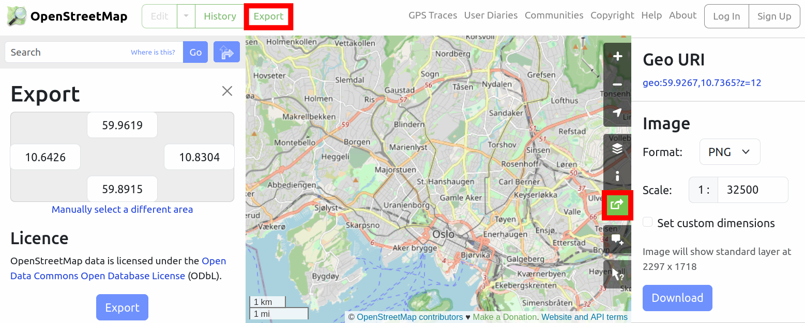
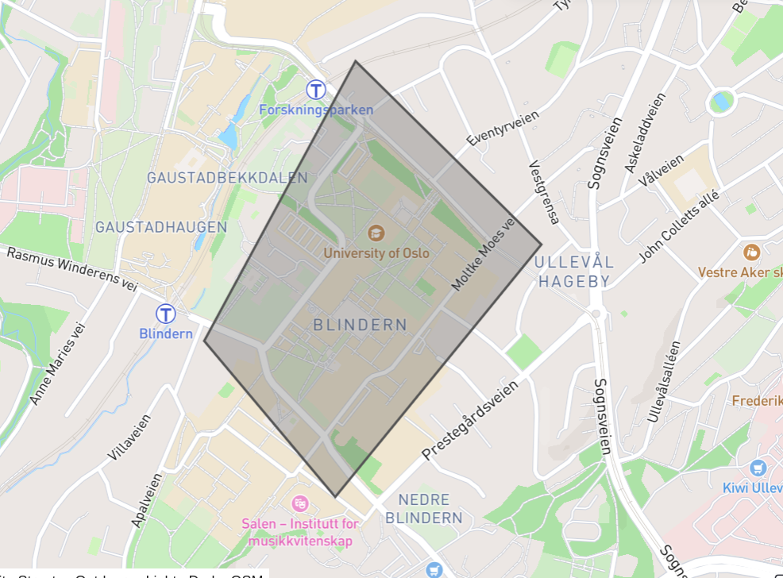

```python
import requests
import json
import numpy as np
import pandas as pd
import matplotlib.pyplot as plt
from matplotlib.image import imread
import seaborn as sns
from datetime import datetime
from geopy import distance
from scipy.stats import gaussian_kde
%store -r trips
%store -r stations
```

## Opprettelse av kartdiagram

Hva om vi ønsker å markere sykkelstasjonene som sirkler på på et kart, der størrelsen på sirkelen indikerer hvor populær stasjonen er? I disse seksjonene skal vi lære å visualisere data på kart!

I den første seksjonen skal vi gå gjennom følgende steg: 
1. Laste ned et høyoppløselig bilde av et kart.
2. Bruke Python til å opprette et *plott*, det vil si et diagram med en $x$ -og $y$-akse.
3. Sette bildet av kartet inn i plottet, på riktige koordinater i henhold til lengde -og breddegrad.
4. Sette inn objekter på bestemte lengde -og breddegrader.

For å kunne gjøre kartvisualisering på eksamen må du ta høyde for følgende: 
* Steg 1 krever internettilkobling og må gjøres **før** eksamen.
* Steg 2-4 krever ikke internettilkobling og kan gjøres **under** eksamen.

**1. Laste ned statisk kart.** I dette steget ønsker vi å laste ned et bestemt segment av et kart. I prinsippet kan man ta et skjermbilde fra *Google Maps*, men vi skal her vise en framgangsmåte som gir et mer høyoppløselig og nøyaktig resultat. 

a) Vi går inn på [*OpenStreetMap*](https://www.openstreetmap.org/) i en valgfri nettleser. *OpenStreetMap* (*OSM*) er en svært populær kartdatabase blant programmerere, fordi kartdataene er fritt tilgjengelig for nedlasting og bruk i egne programmer. Databasen vedlikeholdes og oppdateres av frivillige.

b) Vi åpner panelene *Export* og *Share* ved å trykke på følgende knapper:



c) Vi flytter og zoomer kartet slik at det ønskede området er i kartvinduet. Dersom du ønsker et mer rektangulært eller mer kvadratisk utsnitt, må du endre **nettleservinduet**. 

d) Vi gjør følgende to steg **uten å bevege** på kartet:

* I *Share*-vinduet er det et felt som heter *Scale*. Vi skriver inn tallet 1 og trykker *Enter*. Da vil tallet endres til lavest mulige verdi og et *PNG*-bilde vil lastes ned. Dette bildet vil ha høyest mulig oppløsning for det valgte kartutsnittet.
* Øverst i *Export*-vinduet finner vi lengde -og breddegraden til sidekantene i bildet. Vi noterer disse verdiene i en Python-fil:


```python
map_image_file = "oslo.png"
left = 10.6426
right = 10.8304
bottom = 59.8915
top = 59.9619
```

Det er svært viktig å ta vare på disse verdiene, slik at vi senere kan plassere bildet riktig i koordinatsystemet. 

**2. Opprette et plott**. Et *plott* er som nevnt et diagram med en $x$ -og $y$-akse, der vi for eksempel kan sette inn punkter, linjer og grafer, slik vi er vant til i matematikkfagene. Vi bruker følgende kommando for å opprette diagrammet: 


```python
import matplotlib.pyplot as plt

fig, ax = plt.subplots()
plt.show()
```


    

    


Forklaring:

* Det er vanlig å bruke kommoandoen `fig, ax = plt.subplots()` for å opprette et diagram. Variabelen `ax` vil inneholde koordinatsystemet, mens `fig` vil inneholde hele figuren, med eventuelle overskrifter og annet.
* Vi bruker funksjonen `plt.show()` for å vise figuren. Denne funksjonen skal alltid skrives **til slutt** i Python-filen. Når du kjører Python-programmet, vil den ferdige figuren komme opp i et eget vindu. Deretter kan du lagre figuren som en bildefil.
* Begge funksjonene er hentet fra Python-pakken [*matplotlib.pyplot*](https://matplotlib.org/3.5.3/index.html). En vanlig praksis er å gi navnet `plt` til denne pakken, slik vi har gjort her.

**3. Sette inn kart i plottet.** Nå skal vi igjen opprette et diagram, og sette inn bildet av kartet:


```python
from matplotlib.image import imread

fig, ax = plt.subplots(dpi=500)
image = imread('oslo.png')
ax.imshow(image)
plt.show()
```


    

    


Forklaring: 
* Vi bruker parameteren `dpi=500` for å gi figuren høy oppløsning, slik at vi senere kan zoome inn på detaljer i kartet. *Dersom koden tar lang tid å kjøre på din maskin, kan du forsøke å redusere denne verdien.*
* Vi må først laste inn bildet med funksjonen `imread`, som vi importerer fra `matplotlib.image`.
* Vi bruker funksjonen `ax.imshow` for å legge bildet inn i koordinatsystemet. Merk at funksjonen brukes på objektet `ax`, som inneholder selve koordinatsystemet.
* Siden bildet er $2297\times 1717$ piksler, har bildet blitt lagt inn på koordinatene 0 til 2297 i $x$-retning, og 0 til 1717 i $y$-retning. Som standard vokser $y$-aksen nedover når man legger inn et bilde.

Vi skal nå modifisere programmet, slik at $x$-aksen svarer til lengdegrad, og $y$-aksen svarer til breddegrad. Husk at vi tok vare på lengde -og breddegraden til sidekantene i det første steget.


```python
fig, ax = plt.subplots(dpi=500)

left = 10.6426
right = 10.8304
bottom = 59.8915
top = 59.9619

image = imread('oslo.png')
ax.imshow(image, extent=(left, right, bottom, top))

plt.show()
```


    

    


Her har vi inkludert parameteren `extent=[left, right, bottom, top]`, som definerer en "boks" i koordinatsystemet der bildet skal legges inn. Merk at sidene må listes i nøyaktig denne rekkefølgen.

Men her har det oppstått et problem, nemlig at bildet har blitt "strukket ut" i $x$-retning. Hvorfor har dette skjedd? 

Dersom du finner et bilde av jordkloden med lengde -og breddegrader, vil du se at lengdegradene ($x$-verdiene) ligger tettere sammen nær polene enn nær ekvator, mens breddegradene ($y$-verdiene) ligger i samme avstand over hele jordkloden. Siden Norge er langt nord, må vi sørge for at $x$-verdiene ligger tettere sammen enn $y$-verdiene. 

For å finne nøyaktig riktig forhold mellom $y$ -og $x$-aksen, skal vi bruke en matematisk formel. Du trenger ikke forstå formelen, men kan kopiere kodelinjen inn i ditt eget program.


```python
fig, ax = plt.subplots(dpi=500)

left = 10.6426
right = 10.8304
bottom = 59.8915
top = 59.9619

image = imread('oslo.png')
ax.imshow(image, extent=(left, right, bottom, top))

aspect_ratio = (image.shape[0] / (top - bottom))/(image.shape[1] / (right - left))
ax.set_aspect(aspect_ratio)

print(aspect_ratio)

plt.show()
```

    1.994032483080709


    

    


Sideforholdet mellom $y$ -og $x$-aksen kalles *aspect ratio*, og i dette tilfellet er den omtrent 2. Det betyr at én enhet på $y$-aksen skal være dobbelt så lang som én enhet på $x$-aksen. Vi bruker funksjonen `ax.set_aspect` til å sette ønsket sideforhold. 

Basert på det vi har lært, kan vi nå definere en funksjon som setter et kart inn i et koordinatsystem: 


```python
def insert_map(image_file, left, right, bottom, top):
    ax = plt.gca()
        
    map_image = imread(image_file)
    ax.imshow(map_image, extent=(left, right, bottom, top))

    aspect_ratio = (map_image.shape[0] / (top - bottom))/(map_image.shape[1] / (right - left))
    ax.set_aspect(aspect_ratio)

    ax.set_xticks([])
    ax.set_yticks([])
```

*De siste linjene i funksjonen fjerner merkingen på aksene, siden vi ikke trenger å se koordinatene i de neste stegene.*

Nå kan vi enkelt opprette ett plott, sette inn kartet, og vise diagrammet: 


```python
fig, ax = plt.subplots(dpi=500)
insert_map("oslo.png", 10.6426, 10.8304, 59.8915, 59.9619)
plt.show()
```


    

    


**4. Sette inn objekter.** Nå er vi klare for å sette inn objekter på kartet. Som eksempel skal vi sette inn følgende stasjon: 

```json
{
    "551": {
        "name": "Olaf Ryes plass",
        "description": "langs Sofienberggata",
        "latitude": 59.922425,
        "longitude": 10.758182  
    }
}
```
Disse dataene henter vi i variabelen `stations`:


```python
p = stations.loc["377"]

x = p["longitude"]
y = p["latitude"]

print(x,y)
```

    10.7775665 59.915667


Vi bruker funksjonen `ax.plot` til å tegne punktet på kartet: 


```python
fig, ax = plt.subplots(dpi=500)
insert_map("oslo.png", 10.6426, 10.8304, 59.8915, 59.9619)
ax.plot(x, y, 'o', color="blue", markersize=3)
plt.show()
```


    

    


Forklaring av parametrene til funksjonen `ax.plot`:
* De to første parametrene er $x$ og -$y$-verdien der objektet skal plasseres.
* Den tredje parameteren er en streng eller tall som definerer formen til objektet - [her](https://matplotlib.org/stable/api/markers_api.html) kan du se en oversikt over mulige alternativer.
* Til slutt definerer vi fargen og størrelsen til objektet.

**Oppsummering.** I denne seksjonen har vi sett hvordan vi henter et kartbilde med høy oppløsning, og setter det riktig inn i et koordinatsystem. Dette gjør at vi enkelt kan sette inn punkter (eller andre objekter) med bestemte geografiske koordinater. 

**Aktivitetsforslag.** Følg stegene i denne seksjonen til å vise et kart over ditt hjemsted. Finn koordinatene til din hjemadresse og tegn det som et objekt i kartet. Sett inn andre punkter etter eget ønske. Eksperimenter gjerne med forskjellig form, farge og størrelse på objektene.

## Kartvisualisering 

Vi ønsker nå å gå gjennom alle stasjonene og plassere dem på kartet. Siden stasjonene er lagret i en tabell, skal vi ikke bruke en løkke. Vi følger i stedet den faste oppskriften (fra seksjonen *Tabelloperasjoner*) med å lage en funksjon for det som skal gjøres på **én rad** i tabellen:


```python
def place_on_map(row):
    x = row["longitude"]
    y = row["latitude"]
    ax.plot(x, y, 'o', color="blue", markersize=1)
    return
```

Med `apply` kan vi nå utføre funksjonen på alle radene i turtabellen:


```python
fig, ax = plt.subplots(dpi=500)
insert_map("oslo.png", 10.6426, 10.8304, 59.8915, 59.9619)
stations.apply(place_on_map, axis=1)
plt.show()
```


    

    


Men hva om vi nå ønsker at størrelsen til hver sirkel skal indikere populariteten til stasjonen? 

Vi må begynne med å hente antall forekomster av hver stasjon i turtabellen: 


```python
counts = trips["start_station_id"].value_counts()
print(counts)
```

    start_station_id
    464     1598
    551     1590
    479     1550
    421     1525
    396     1468
            ... 
    1919      75
    560       65
    527       37
    3725       5
    612        1
    Name: count, Length: 266, dtype: int64


Forklaring: ved å skrive `trips["start_station_id"].value_counts()`, henter vi først kolonnen *start_station_id*, og deretter ber vi om antall forekomster av hver verdi. 

Resultatet vi får er en kolonne som inneholder tallene 1598, 1590, 1550, og så videre. Kolonnen er også indeksert etter *start_station_id*, og dermed kan vi lese at tallet 1598 tilhører stasjonen med id 464. Altså ble denne stasjonen brukt 2598 ganger som startstasjon. 

I forrige seksjon sørget vi for at stasjonstabellen er indeksert etter stasjons-id. Siden kolonnen vi fikk over også har denne indekseringen, kan vi sette den inn i tabellen: 


```python
stations["used_as_start"] = trips["start_station_id"].value_counts()
stations.head()
```


<div>
<style scoped>
    .dataframe tbody tr th:only-of-type {
        vertical-align: middle;
    }

    .dataframe tbody tr th {
        vertical-align: top;
    }

    .dataframe thead th {
        text-align: right;
    }
</style>
<table border="1" class="dataframe">
  <thead>
    <tr style="text-align: right;">
      <th></th>
      <th>name</th>
      <th>description</th>
      <th>latitude</th>
      <th>longitude</th>
      <th>used_as_start</th>
    </tr>
    <tr>
      <th>id</th>
      <th></th>
      <th></th>
      <th></th>
      <th></th>
      <th></th>
    </tr>
  </thead>
  <tbody>
    <tr>
      <th>387</th>
      <td>Studenterlunden</td>
      <td>langs Karl Johan</td>
      <td>59.914586</td>
      <td>10.735453</td>
      <td>466</td>
    </tr>
    <tr>
      <th>2315</th>
      <td>Rostockgata</td>
      <td>utenfor Bjørvika visningssenter</td>
      <td>59.906920</td>
      <td>10.760312</td>
      <td>1005</td>
    </tr>
    <tr>
      <th>384</th>
      <td>Vår Frelsers gravlund</td>
      <td>langs Ullevålsveien</td>
      <td>59.919440</td>
      <td>10.743765</td>
      <td>887</td>
    </tr>
    <tr>
      <th>584</th>
      <td>Henrik Wergelands allé</td>
      <td>ved Bogstadveien</td>
      <td>59.926894</td>
      <td>10.720789</td>
      <td>723</td>
    </tr>
    <tr>
      <th>600</th>
      <td>Dyvekes bru</td>
      <td>ved skatepark</td>
      <td>59.905323</td>
      <td>10.768958</td>
      <td>598</td>
    </tr>
  </tbody>
</table>
</div>


Nå inneholder altså stasjonstabellen kolonnen *used_as_start*, som vi skal bruke til å bestemme størrelsen på sirklene.

Den mest populære stasjonen bør ha den største sirkelen:


```python
max_value = stations["used_as_start"].max()
print(max_value)
```

    1598


Den mest populære stasjonen ble altså brukt 1598 ganger.
La oss si at denne stasjonen skal ha en sirkel med diameter 80 mm.

Hva med de andre stasjonene? Hvis en stasjon for eksempel ble brukt 799 ganger, skal diameteren være $799/1598 = 0.5$ ganger så stor som den største sirkelen. Diameteren blir da 80 $\cdot$ 0.5 mm $=$ 40 mm. En stasjon som blir brukt halvparten så mye som en annen stasjon, får altså en halvparten så stor sirkel.

Som vanlig må vi definere en funksjon for det vi ønsker å gjøre med **én rad** i stasjonstabellen:


```python
max_value = stations["used_as_start"].max()
max_diameter = 5
def place_on_map_by_popularity(row):
    x = row["longitude"]
    y = row["latitude"]
    value = row["used_as_start"]
    diameter = max_diameter * (value/max_value)
    ax.plot(x, y, 'o', color="blue", markersize=diameter)
    return
```

Merk at vi har brukt parameteren *markersize* til å angi diameteren til sirkelen. Legg også merke til formelen for å regne ut diameteren.

Nå kan vi igjen plotte kartet og bruke funksjonen på alle radene:


```python
fig, ax = plt.subplots(dpi=500)
insert_map("oslo.png", 10.6426, 10.8304, 59.8915, 59.9619)
stations.apply(place_on_map_by_popularity, axis=1)
plt.show()
```


    

    


Her har vi visualisert hva som er mest populært som startstasjoner, men kanskje vi også ønsker å visualisere de mest populære endestasjonene?

Ved å følge samme metode som tidligere, kan vi opprette en kolonne i stasjonstabellen som inneholder antall ganger hver stasjon er brukt som endestasjon:


```python
stations["used_as_end"] = trips["end_station_id"].value_counts()
```

Det neste steget er som vanlig en funksjon for det vi ønsker å gjøre med én rad i stasjonstabellen. 

Funksjonen vi nå trenger er nesten helt lik den forrige. Den eneste forskjellen er at vi skal bruke kolonnen *used_as_end* i stedet for *used_as_start*. 

For å gjøre koden vår mer effektiv, kan vi lage en generell funksjon for å sette inn alle punktene: 


```python
def place_weighted_points(table, column):
    max_value = table[column].max()
    max_markersize = 5

    def place_weighted_point(row):
        x = row["longitude"]
        y = row["latitude"]
        value = row[column]
        markersize = max_markersize * (value/max_value)
        ax.plot(x, y, 'o', color="blue", markersize=markersize)
        return
    
    table.apply(place_weighted_point, axis=1)
```

Merk at denne funksjonen tar en tabell og et kolonnenavn som parametre. Tenk deg at tabellen `stations` og kolonnenavnet *used_as_end* blir brukt som parametre. Da vil følgende skje:

1. Maksimumsverdien til kolonnen hentes.
2. En radfunksjon defineres i henold til hvilken kolonne som er valgt. 
3. Radfunksjonen brukes på alle rader i stasjonstabellen.

Vi tester den nye funksjonen:


```python
fig, ax = plt.subplots(dpi=500)
insert_map("oslo.png", 10.6426, 10.8304, 59.8915, 59.9619)
place_weighted_points(stations, "used_as_end")
plt.show()
```


    

    


**Oppsummering.** I denne seksjonen har vi tatt utgangspunkt i en tabell med geografiske punkter, og vist hvordan vi kan visualisere alle punktene som sirkler på et kart. Dersom hvert punkt har en tilknyttet tallverdi, kan dette vises gjennom størrelsen på sirklene. Dette gjør at vi effektivt kan sammenligne punkter eller områder på kartet, og finne trender i dataene.

## Aktiviteter til kartvisualisering

**Aktivitetsforslag 1.** 
* Lag en tabell som kun inneholder turer som skjedde på helger. Vis et kart med de mest populære endestasjonene i helger. Forsøk også med kun søndagsturer. *Hint: se seksjonen* Introduksjon til pandas *for bruk av betingelser.* 
* Vis et kart med de mest populære startstasjonene for kveldsturer (turer som startet mellom 18 og 24). Hva med turer som startet på natta (mellom 0 og 6)? *Hint: du trenger en kolonne som indikerer hvilken periode på dagen en tur startet, og deretter lage en tabell som inneholder de riktige turene.*

**Aktivitetsforslag 2.** I denne oppgaven skal vi prøve å finne ut hvor folk reiser fra når de sykler til *Universitetet i Oslo*. Vi avgrenser først universitetsområdet: 



Her har vi brukt [stasjonsoversikten](https://oslobysykkel.no/stasjoner) og [*geojson.io*](https://geojson.io/#map=14.18/59.94056/10.72249) til å tegne et område som dekker de relevante stasjonene. Ifølge *geojson.io* har dette området følgende hjørnekoordinater: 

```
(10.721463545002223, 59.93721185255322)   
(10.728019630851009, 59.94123625428736)      
(10.722107784652138, 59.944159334211946)     
(10.717294935502565, 59.93969868675066)
```

1. Definer et polygon i Python som svarer til området ovenfor (se seksjonen *Geografiske områder*).
2. Opprett kolonnen *ends_in_university_area* i tabellen `trips`. Denne kolonnen skal inneholde *yes* for sykkelturer som slutter i universitetsområdet, og ellers *no*.
* *Hint 1: Lag først en funksjon som konverterer en enkelt rad til riktig svar. Bruk seksjonen* Tabellfunksjoner *til hjelp.*   
* *Hint 2: I funksjonen må du opprette et punkt og sjekke om det er innenfor universitetsområdet. Bruk seksjonen* Geografiske områder *til hjelp*.  
4. Opprett en ny tabell med alle turer som ender i universitetsområdet. *Hint: bruk en betingelse med kolonnen du opprettet i forrige punkt. Se seksjonen* Introduksjon til pandas *for hjelp.*
5. Bruk kartvisualisering til å vise de mest populære startstasjonene fra tabellen du opprettet. Kommenter resultatet. 

**Aktivitetsforslag 3.** I denne oppgaven skal vi dele inn sykkelturene i to grupper; transportturer (for eksempel til og fra jobb) og rekreasjonsturer (for eksempel besøk av attraksjoner). Vi har ikke nok informasjon til å vite om en tur faller i den ene eller andre gruppen, men vi kan gjøre noen antagelser med dataene vi har tilgjengelig. 

En slik antagelse er at en tur som varer mer enn én time (3600 sekunder) er en rekreasjonstur.

1. Opprett en ny tabell med rekreasjonturer, det vil si turer som varer mer enn én time.
2. Visualiser på et kart hva som er de mest populære startstasjonene for rekreasjonsturer. Visualiser også de mest populære endestasjonene.
3. Tror du resultatet forteller noe om hvilke attraksjoner i Oslo som er mest populære (blant brukere av *Oslo Bysykkel*)?

En annen antagelse er at turer som starter og slutter på samme stasjon er en rekreasjonstur. 

3. Opprett en tabell med alle turer som startet og sluttet på samme punkt og visualiser de mest populære stasjonene i tabellen. Kommenter resultatet.

**Aktivitetsforslag 4.** I denne oppgaven skal vi gruppere sykkelturene etter hvilken stasjon de endte på. Deretter skal vi sammenligne de ulike gruppene med hensyn på avstand og varighet på sykkelturene, samt forhold mellom avstand og varighet. 

Vi begynner først med å finne gjennomsnittlig varighet for sykkelturene, gruppert etter endestasjon: 


```python
grouped = trips.groupby("end_station_id")
means = grouped["duration"].mean()

print(means)
```

    end_station_id
    1009    1259.064000
    1023     843.815476
    1101     983.459677
    1755     960.944899
    1919     710.907895
               ...     
    744      765.311295
    746     1179.498069
    748      871.735294
    787      882.350254
    970      684.696742
    Name: duration, Length: 266, dtype: float64


Kolonnen ovenfor har stasjons-id som indekser, akkurat som stasjonstabellen. Det betyr at kolonnen kan settes inn i stasjonstabellen:


```python
stations["average_time_to_arrive"] = means
stations.head()
```


<div>
<style scoped>
    .dataframe tbody tr th:only-of-type {
        vertical-align: middle;
    }

    .dataframe tbody tr th {
        vertical-align: top;
    }

    .dataframe thead th {
        text-align: right;
    }
</style>
<table border="1" class="dataframe">
  <thead>
    <tr style="text-align: right;">
      <th></th>
      <th>name</th>
      <th>description</th>
      <th>latitude</th>
      <th>longitude</th>
      <th>used_as_start</th>
      <th>used_as_end</th>
      <th>average_time_to_arrive</th>
    </tr>
    <tr>
      <th>id</th>
      <th></th>
      <th></th>
      <th></th>
      <th></th>
      <th></th>
      <th></th>
      <th></th>
    </tr>
  </thead>
  <tbody>
    <tr>
      <th>387</th>
      <td>Studenterlunden</td>
      <td>langs Karl Johan</td>
      <td>59.914586</td>
      <td>10.735453</td>
      <td>466</td>
      <td>462</td>
      <td>1024.896104</td>
    </tr>
    <tr>
      <th>2315</th>
      <td>Rostockgata</td>
      <td>utenfor Bjørvika visningssenter</td>
      <td>59.906920</td>
      <td>10.760312</td>
      <td>1005</td>
      <td>1066</td>
      <td>902.244841</td>
    </tr>
    <tr>
      <th>384</th>
      <td>Vår Frelsers gravlund</td>
      <td>langs Ullevålsveien</td>
      <td>59.919440</td>
      <td>10.743765</td>
      <td>887</td>
      <td>876</td>
      <td>816.297945</td>
    </tr>
    <tr>
      <th>584</th>
      <td>Henrik Wergelands allé</td>
      <td>ved Bogstadveien</td>
      <td>59.926894</td>
      <td>10.720789</td>
      <td>723</td>
      <td>579</td>
      <td>868.561313</td>
    </tr>
    <tr>
      <th>600</th>
      <td>Dyvekes bru</td>
      <td>ved skatepark</td>
      <td>59.905323</td>
      <td>10.768958</td>
      <td>598</td>
      <td>596</td>
      <td>913.263423</td>
    </tr>
  </tbody>
</table>
</div>


Oppgaver:  
1. Vis sykkelstasjonene på et kart, og sørg for at den nye kolonnen *average_time_to_arrive* bestemmer størrelsen på sirklene. Er det noen stasjoner som har spesielt stor sirkel? I så fall, hva tror du er årsaken?
1. Gjenta prosessen ovenfor, men visualiser i stedet avstand, det vil si gjennomsnittlig avstand syklister reiser fra for å komme seg til hver stasjon. Kommenter resultatet.

Med følgende kode kan vi opprette en ny kolonne i turtabellen, som inneholder forholdet mellom avstand og varighet, det vil si en slags "gjennomsnittlig hastighet" for turen: 


```python
trips["speed"] = trips["distance"]/trips["duration"]
```

*Å kombinere to kolonner på denne måten fungerer når vi bruker enkle matematiske formler. Dersom vi ønsker å gjøre mer kompliserte operasjoner, må vi bruke `apply`, som beskrevet i seksjonen* Tabellfunksjoner.

3. Gjenta prosessen fra punkt 1, men visualiser i stedet "gjennomsnittlig hastighet" for å komme seg til hver stasjon. Hvis det er noen stasjoner som har spesielt høy eller lav verdi, hvorfor tror du dette er tilfelle? 
