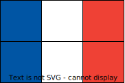
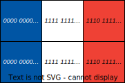

# Lagring av data

## Digitale data

Når vi introduserte begrepet *data* i begynnelsen av kapittelet, så var vi litt upresise, for vi bør egentlig skille mellom *digitale data* og *analoge data*. Vi kan for eksempel tenke på to forskjellige måter å lagre data om et hus:

* Skrive en tabell med diverse lengdemål.
* Tegne huset.

Når vi tegner huset, gjenskaper vi informasjon med fysisk materiale. Et ark har en overflate der vi kan gjenskape fysisk avstand og posisjon. Med blyanten kan vi tegne med ulikt trykk og gjenskape forskjeller i lysstyrke.

Hvis vi i stedet skriver en tabell, gjenskaper vi informasjon med en sekvens av tegn (i dette tilfellet bokstaver og tall).

Tenk deg at vi ønsker å sende informasjonen om huset til en person som står på den andre siden av en elv. 
* For å sende all data som tegningen inneholder, er den eneste måten å sende hele arket. Vi kan ikke bruke stemmen til å gi en helt presis beskrivelse av tegningen.
* For å sende all data som tabellen inneholder, kan vi enkelt og greit lese høyt det som står på papiret. Dersom det ikke er mulig å formidle data med lyd, kan vi for eksempel oversette bokstavene og tallene til [morsetegn](https://snl.no/morsetegn), og formidle disse med lyssignaler. 
* Dersom tegningen blir ødelagt, har vi mistet dataene, for det er ingen måte å gjenskape akkurat den samme tegningen. Men dersom arket med tabellen blir ødelagt, har vi ikke nødvendigvis mistet dataene; så lenge vi husker alle tallene, så eksisterer dataene fortsatt!

Som oppsummering kan vi si at en sekvens av tegn ikke er avhengig av fysisk materiale for å eksistere, og dataene kan sendes på utallige måter. Dette kalles *digitale data*.

*Analoge data* er registrert ved å benytte fysiske størrelser, slik som posisjon, lengde, tetthet av materiale, og så videre. Disse dataene er avhengig av det fysiske materialet for å eksistere, og kan bare sendes i sin originale form uten å miste data.

En fordel ved å bruke fysiske materialer er at vi kan skape helt jevne overganger. Med en blyant kan vi for eksempel øke trykket gradvis og oppnå en jevn overgang fra lyst til mørkt. Vi kan si at analoge data er *kontinuerlige*.

Med en sekvens av tegn kan vi derimot ikke oppnå gradvise overganger. Vi er nødt til å definere kategorier, som for eksempel "helt hvitt", "helt svart", og kategorier i mellom. Overgangen fra et tegn/ord til det neste vil alltid være et hopp fra en kategori til en annen. Vi kan si at digitale date er *diskrete*. 

*Kontinuerlig* og *diskret* er altså motsatte konsepter. 

## Alfabeter

I forrige kapittel sa vi at digitale data kan skrives som en sekvens av tegn. Disse tegnene må komme fra et alfabet. Når vi snakker om et alfabet i informatikk, tenker vi ikke nødvendigvis på det latinske eller norske alfabetet. Et *alfabet* er rett og slett bare en mengde av distinkte tegn.

Følgende mengde er et alfabet: 

```
0,1,2,3,4,5,6,7,8,9
```

Fra dette alfabetet kan vi lage *strenger*, for eksempel *123*, *05235* og  *000000*. En *streng* er rett og slett en sekvens av tegn fra et alfabet.

Arvestoffet vårt (DNA) inneholder utrolig mye digital data. Blant annet finnes rundt $20.000$ gener som fungerer som oppskrifter på proteiner, og proteinene er arbeidsmaskinene som står bak de biologiske prosessene i kroppen. For eksempel er *insulin* et protein som sørger for at karbohydrater blir tatt opp av cellene når vi har spist. Oppskriften på insulin er følgende DNA-sekvens: 

```
AGCCCTCCAGGACAGGCTGCATCAGAAGAGGCCATCAAGCAGGTCTGTTCCAAGGGCCTTTGCGTCAGGT
GGGCTCAGGATTCCAGGGTGGCTGGACCCCAGGCCCCAGCTCTGCAGCAGGGAGGACGTGGCTGGGCTCG
TGAAGCATGTGGGGGTGAGCCCAGGGGCCCCAAGGCAGGGCACCTGGCCTTCAGCCTGCCTCAGCCCTGC
CTGTCTCCCAGATCACTGTCCTTCTGCCATGGCCCTGTGGATGCGCCTCCTGCCCCTGCTGGCGCTGCTG
GCCCTCTGGGGACCTGACCCAGCCGCAGCCTTTGTGAACCAACACCTGTGCGGCTCACACCTGGTGGAAG
CTCTCTACCTAGTGTGCGGGGAACGAGGCTTCTTCTACACACCCAAGACCCGCCGGGAGGCAGAGGACCT
GCAGGGTGAGCCAACTGCCCATTGCTGCCCCTGGCCGCCCCCAGCCACCCCCTGCTCCTGGCGCTCCCAC
CCAGCATGGGCAGAAGGGGGCAGGAGGCTGCCACCCAGCAGGGGGTCAGGTGCACTTTTTTAAAAAGAAG
TTCTCTTGGTCACGTCCTAAAAGTGACCAGCTCCCTGTGGCCCAGTCAGAATCTCAGCCTGAGGACGGTG
TTGGCTTCGGCAGCCCCGAGATACATCAGAGGGTGGGCACGCTCCTCCCTCCACTCGCCCCTCAAACAAA
TGCCCCGCAGCCCATTTCTCCACCCTCATTTGATGACCGCAGATTCAAGTGTTTTGTTAAGTAAAGTCCT
GGGTGACCTGGGGTCACAGGGTGCCCCACGCTGCCTGCCTCTGGGCGAACACCCCATCACGCCCGGAGGA
GGGCGTGGCTGCCTGCCTGAGTGGGCCAGACCCCTGTCGCCAGGCCTCACGGCAGCTCCATAGTCAGGAG
ATGGGGAAGATGCTGGGGACAGGCCCTGGGGAGAAGTACTGGGATCACCTGTTCAGGCTCCCACTGTGAC
GCTGCCCCGGGGCGGGGGAAGGAGGTGGGACATGTGGGCGTTGGGGCCTGTAGGTCCACACCCAGTGTGG
GTGACCCTCCCTCTAACCTGGGTCCAGCCCGGCTGGAGATGGGTGGGAGTGCGACCTAGGGCTGGCGGGC
AGGCGGGCACTGTGTCTCCCTGACTGTGTCCTCCTGTGTCCCTCTGCCTCGCCGCTGTTCCGGAACCTGC
TCTGCGCGGCACGTCCTGGCAGTGGGGCAGGTGGAGCTGGGCGGGGGCCCTGGTGCAGGCAGCCTGCAGC
CCTTGGCCCTGGAGGGGTCCCTGCAGAAGCGTGGCATTGTGGAACAATGCTGTACCAGCATCTGCTCCCT
CTACCAGCTGGAGAACTACTGCAACTAGACGCAGCCCGCAGGCAGCCCCACACCCGCCGCCTCCTGCACC
GAGAGAGATGGAATAAAGCCCTTGAACCAGC
```
Fra et informatisk perspektiv kan vi se på dette som en streng som kommer fra følgende alfabet: 

```
A, C, G, T
```

Oppskriften på insulin er altså laget med bare fire tegn! Det er fordi DNA-sekvensen i kroppen vår er bygget opp med de fire *nitrogenbasene* adenin (A), cytosin (C), guanin (G), og tymin (T). 

Alle gener i arvestoffet vårt er altså strenger som kommer fra dette lille alfabetet. Men proteinene som kan dannes fra disse genene er utrolig forskjellige og komplekse. Proteiner er bygget opp av aminosyrer, og det finnes 20 av dem! Hvordan kan fire tegn være nok til å lage en oppskrift på et protein?

Når oppskriften ovenfor leses i en celle, så leses den ikke tegn for tegn, den leses tre tegn om gangen! Tre tegn oversettes til én aminosyre i henhold til [denne](https://en.wikipedia.org/wiki/DNA_and_RNA_codon_tables#Standard_DNA_codon_table) tabellen. For eksempel vil sekvensen *TTC* oversettes til aminosyren *fenylalanin*, mens sekvensen *TAA* forteller at oppskriften er slutt. 

For å oppsummere kan vi si at størrelsen på et alfabet ikke begrenser hva vi kan uttrykke med alfabetet. Selv om vi har få tegn, kan vi nemlig lage uendelig mange *kombinasjoner av tegn*. 

**Aktivitetsforslag 1**: 

Ta utgangspunkt i følgende DNA-sekvens:

```
ATGCAAGCTAATGGGTTCCAGTAA
```

Anta at dette er et gen, altså en oppskrift på et protein.
Bruk [DNA-til-aminosyre-tabellen](https://en.wikipedia.org/wiki/DNA_and_RNA_codon_tables#Standard_DNA_codon_table) til å finne sekvensen av aminosyrer som proteinet er bygget opp av.  

**Aktivitetsforslag 2:** Ta utgangspunkt i følgende alfabet: 

```
@, !, =
```

*@@* og *!=* er eksempler på strenger av lengde 2. Kan du på en systematisk måte skrive opp alle mulige strenger av lengde 2? Hva med alle strenger av lengde 3? 

Tenk deg nå at *@@@* er en kode som betyr mellomrom. Lag en unik kode for alle bokstavene i alfabetet (du kan utelate *x*, *z*, *w* og *c*), og lag også en unik kode for komma og punktum. Det er viktig at alle tegn har forskjellige koder!

Oversett følgende setning til kodene du har laget: 

*Jeg har bare tre tegn, men kan skrive hva som helst.*

Husk at du også må oversette mellomrom!

## Binære data

I forrige kapittel så vi at et lite alfabet ikke setter noen begrensninger for hva vi kan uttrykke. Nå skal vi se på det minste mulige alfabetet vi kan bruke, nemlig et alfabet med bare to tegn! Det er vanlig å bruke *0* og *1* som symboler for et slikt alfabet: 

```
0, 1
```

Noen strenger vi kan lage med dette alfabetet er *00*, *01*, *10*, *11* og *000*. At vi har valgt *0* og *1* som tegn betyr ikke at vi skal tenke på dem som tall. Strengen *1000* betyr **ikke** tusen, men har i stedet den betydning vi velger å gi det. For eksempel kan det bety en bokstav i det norske alfabetet, eller en farge. 

Med dette alfabetet kan vi lagre all digital informasjon, det vil si all informasjon som kan skrives som en sekvens av tegn. Vi kan for eksempel se på en DNA-sekvens: 

```
ATGCAAGCTAATGGGTTCCAGTAA
```

Hvordan lagrer vi denne informasjonen ved å bare bruke *0* og *1*? Vi kan gi en kode til hvert av tegnene *A*, *T*, *C*, *G*: 

| Tegn | Kode |
|------|------------|
| A    | 00         |
| C    | 01         |
| G    | 10         |
| T    | 11         |

Kan du bruke denne koden til å oversette DNA-sekvensen? 

Resultatet blir: 

```
0011100100001001110000111010111101010010110000
```

Med kun to tegn kan vi altså lagre en DNA-sekvens, og data som er lagret på denne måten kalles *binære data*. Strengene vi kan lage med alfabetet, som for eksempel *00*, *111*, *0101*, kalles  *bitstrenger*. Vi kan bruke enheten *bit* til å angi mengden data i en bitstreng. Antall bit er rett og slett antall tegn, så *00* består av to bits, *111* av tre bits, *0101* av fire bits, og så videre. 

Hva er poenget med å lagre informasjon som binære data? 

Tenk deg at du har fire lyspærer og ønsker å bruke dem til å lagre bitstrengen *0101*. Da kan du slå på den andre og fjerde lyspæren, og la den første og tredje være avslått. Altså kan vi tenke at *1* betyr påslått, og *0* betyr avslått. 

Litt forenklet kan vi si at en datamaskin er bygget opp av bittesmå elektroniske kretser som enten kan være på eller av. Dette kan vi utnytte til å lagre binære data! Vi kan si at binære data er datamaskinens naturlige språk. 

**Aktivitetsforslag 1:** De binære strengene av lengde 2 er *00*, *01*, *10* og *11*. Kan du skrive opp alle binære strenger av lengde 3? Hva med lengde 4? Og lengde 5? Skriv antall binære strenger du finner i tabellen under.

| Lengde | Antall strenger |
|--------|-----------------|
| 2      | 4               |
| 3      |                 |
| 4      |                 |
| 5      |                 |

Hvor mange binære strenger tror du det finnes av lengde 6? 

**Aktivitetsforslag 2.** Gjør først *Aktivitetsforslag 1*. Tenk deg nå at du skal lage en binær kode for alle norske bokstaver, mellomrom, komma og punktum. Hvor mange binære koder trenger du?

For at du skal ha nok binære koder, må de ha en viss lengde. Hvor lange må de være? 

Lag en binær kode for alle bokstaver, samt mellomrom, komma og punktum. Oversett deretter følgende setning til binær kode: 

*Informatikk er gøy.*

## Lagring av tall

Hvordan kan tall lagres på datamaskinen, altså ved å bare bruke *0* og *1*? Vi kan bruke det *binære tallsystemet*, også kalt *totallsystemet*.

Til vanlig bruker vi *titallsystemet*. Det betyr at når vi skriver et tall, for eksempel 1506, så betyr det

$$1560 = (1 \cdot \textcolor{green}{1000}) +   (5 \cdot \textcolor{green}{100})  +   (0 \cdot \textcolor{green}{10})   +   (6 \cdot \textcolor{green}{1}). $$

Tallet 1560 skal altså tolkes ved å gange hvert siffer med en potens av 10 og deretter summere leddene. I totallssystemet gjør vi akkuratdet samme, men med potenser av 2! Vi begynner derfor med å skrive opp potensene av 2: 

$2^0 = \textcolor{green}{1}$   
$2^1 = \textcolor{green}{2}$   
$2^2 = \textcolor{green}{4}$   
$2^3 = \textcolor{green}{8}$   
$2^4 = \textcolor{green}{16}$   
$2^5 = \textcolor{green}{32}$   
$2^6 = \textcolor{green}{64}$   
$2^7 = \textcolor{green}{128}$

For å skrive et tall i det binære tallsystemet, må alle sifrene være enten 0 eller 1. Et eksempel på et gyldig binært tall er 1011. Hvordan tolker vi dette tallet? Det er fire sifre, så vi trenger de fire første potensene av 2:

$$1101 \rightarrow (1 \cdot \textcolor{green}{8})  +  (1 \cdot \textcolor{green}{4})  +  (0 \cdot \textcolor{green}{2})  +  (1 \cdot \textcolor{green}{1}) = 8 + 4 + 1 = 13$$

Tallet tretten skrives altså som $1101$ i totallssystemet. Her er to andre eksempler: 

$10100 \ \ \rightarrow \quad \quad \quad \quad \ (1 \cdot \textcolor{green}{16} ) + ( 0\cdot \textcolor{green}{8} ) + ( 1\cdot \textcolor{green}{4} ) + ( 0\cdot \textcolor{green}{2} ) + ( 0\cdot \textcolor{green}{1}) = 16 + 4 \quad \ \   = 20$    
$101010 \rightarrow (1\cdot \textcolor{green}{32} ) + ( 0\cdot \textcolor{green}{16} ) + (1 \cdot \textcolor{green}{8} ) + ( 0\cdot \textcolor{green}{4} ) + ( 1 \cdot \textcolor{green}{2} ) + ( 0 \cdot \textcolor{green}{1}) = 32 + 8 + 2 = 42$   

Altså kan tallet tjue skrives som binærtallet $10100$, og førtito kan skrives som $101010$. Vi har lov til å legge på nuller i starten, så  $00010100$ er fortsatt lik 42. Nå kan vi for eksempel skrive alle tall fra 0 til 255:

$0000 0000 \rightarrow 0$   
$0000 0001 \rightarrow (1 \cdot \textcolor{green}{1}) = 1$   
$0000 0010 \rightarrow (1 \cdot \textcolor{green}{2} ) + ( 0 \cdot \textcolor{green}{1}) = 2$   
$\quad \quad \vdots$   
$1111 1111 \rightarrow (1 \cdot \textcolor{green}{128} ) + ( 1 \cdot \textcolor{green}{64} ) + ( 1 \cdot \textcolor{green}{32} ) + ( 1\cdot \textcolor{green}{16} ) + (1 \cdot \textcolor{green}{8} ) + ( 1\cdot \textcolor{green}{4} ) + ( 1 \cdot \textcolor{green}{2} ) + ( 1 \cdot \textcolor{green}{1}) = 255$

Siden $1111 1111$ er det høyeste tallet vi kan skrive med åtte bits, trenger vi en ekstra bit for å skrive det neste tallet, som er 256:

$1 0000 0000 \rightarrow (256 \cdot \textcolor{green}{1}) = 256$

Ser du mønsteret? Med åtte bits bruker vi potensene 1, 2, 4, 8, 16, 32, 64 og 128. Da kan vi skrive alle tall opp til den neste potensen, som er 256. 

Antall tall vi kan skrive med åtte bits er altså $2^8 = 256$. På samme måte kan vi komme fram til at antall tall vi kan skrive med ni bits er $2^9 = 512$. Du har kanskje hørt at moderne datamaskiner har 64-bits prosessorer? Det betyr blant annet at tall lagres med 64 bits. Antall tall vi kan skrive med 64 bits er $2^{64}\approx 1.8\cdot 10^{19}$!

**Finne binærformen til et tall.** Hvordan kan vi skrive et vilkårlig tall i det binære tallsystemet? Vi skal nå vise stegene for å skrive tallet 84 i det binære tallsystemet. 

Vi skriver  opp potensene av 2, helt fram til det første tallet som er høyere enn 84:
$$1, 2, 4, 8, 16, 32, 64, 128 \quad \vert \quad 84$$
Vi skal nå plukke ut potenser av 2 som til sammen blir 84. 
Til høyre skriver vi hvor mye vi mangler. 
Foreløpig har vi ikke tatt med noen potenser, så vi mangler 84. 
Først tar vi med det høyest mulige tallet, som er 64. Etter å ha tatt med 64, mangler vi 20 for å komme til 84:
$$1, 2, 4, 8, 16, 32, \cancel{64}, 128 \quad \vert \quad \cancel{84} \ {20}$$
Hva er det høyeste mulige tallet vi kan ta med nå? Vi kan ta med 16, og da mangler vi bare 4:
$$1, 2, 4, 8, \cancel{16}, 32, \cancel{64}, 128 \quad \vert \quad \cancel{84} \ \cancel{20} \ 4$$
Nå kan vi ta med 4, og da mangler vi ingenting!
$$1, 2, \cancel{4}, 8, \cancel{16}, 32, \cancel{64}, 128 \quad \vert \quad \cancel{84} \ \cancel{20} \ \cancel{4} \ 0$$
Siden det står 0 på høyere side, har vi nå funnet tallene som til sammen blir 84! La oss skrive opp potensene i motsatt rekkefølge og markere tallene vi har tatt med i grønt: 
$$\textcolor{green}{64}, 32, \textcolor{green}{16}, 8, \textcolor{green}{4}, 2, 1$$
Nå kan vi oversette dette til en bitstreng! Tallene i grønt skrives som 1, og de andre tallene skrives som 0:
$$\textcolor{green}{1}0\textcolor{green}{1}0\textcolor{green}{1}00$$
Kan du dobbeltsjekke at $1010100$ blir 84, ved å gå den andre veien?

I denne seksjonen har vi vist hvordan man oversetter mellom titallssystemet og totallssystemet. Det er lurt å vite hvordan disse utregningene gjøres, men i de neste seksjonene kan du gjerne bruke en kalkulator, som for eksempel [Bin2Dec](https://eliasbiondo.github.io/bin2dec/).

**Aktivitetsforslag.**
1. Tell fra 0 til 15 med det binære tallsystemet. Skriv alle binærtallene med fire siffer.
2. Hvor mange tall kan du skrive med ti bits?
3. Hvor mange bits trenger du for å skrive tallet 2000?
4. Gjør oppgavene som er generert under. Du skal gjøre utregningene for hånd, men etterpå kan du sjekke svarene dine med [Bin2Dec](https://eliasbiondo.github.io/bin2dec/).


```python
from random import randint
print("a. Oversett følgende binærtall:")
for i in range(5):
    s = ""
    for i in range(8): 
        s += str(randint(0,1))
    print(s)
print()
print("b. Skriv følgende tall som binærtall:") 
for i in range(5):
    print(str(randint(0,255)))
```

    a. Oversett følgende binærtall:
    00001000
    01001000
    10100110
    01010000
    00110001
    
    b. Skriv følgende tall som binærtall:
    133
    204
    200
    128
    64


## Hvordan lagres bilder og videoer?

Når vi ser et fotografert bilde på en skjerm, ser vi egentlig på et stort rutenett der hver av rutene har en farge. Et eksempel er: 


På et *JPEG*-bilde med høy oppløsning er rutene så små at vi ikke kan se dem, men dersom du zoomer nok inn på et bilde, vil du til slutt se de ensfargede rutene. Disse kalles *piksler*. Bildet over har 130 piksler; det er 13 piksler bredt og 10 piksler høyt, så vi kan si at det har en *dimensjon* på $13\times 10$ piksler. 

Hvordan kan vi lagre dette bildet på en datamaskin? Prinsippet er ganske enkelt, for vi trenger bare å lagre alle pikslene som en sekvens. Først må vi gi en binær kode til hver farge som kan forekomme i bildet. Vårt bilde består av følgende farger: 


Siden det er åtte farger, trenger vi åtte binære koder:


Nå kan vi skrive hver piksel som en binær kode: 


For å skrive dette som en sekvens av tegn, altså en bitstreng, kan vi starte på pikselen øverst til venstre, og følger den samme retningen som vi ville lest en bok.

```
000 000 000 000 000 000 000 000 000 000 000 000 000 
000 000 110 110 111 000 000 000 000 000 000 000 000 
000 110 110 110 110 111 001 001 001 000 000 000 000
000 000 001 001 010 010 010 010 010 001 001 000 000
000 001 001 010 011 011 011 011 011 010 001 001 000
000 001 010 011 011 100 100 100 011 011 010 001 000
000 001 010 011 100 100 101 100 100 011 010 001 000
000 001 010 011 100 101 000 101 100 011 010 001 000
000 001 010 110 110 111 000 101 100 011 010 001 000
000 000 110 110 110 110 111 000 000 000 000 000 000
```

Her har vi tatt med mellomrom og linjeskift for presentasjonen sin del, men husk at dette egentlig er en sekvens som kun består av *0* og *1*! Denne sekvensen kan lagres på en datamaskin! Deretter kan bildet gjenskapes på en skjerm, men det kreves litt ekstra informasjon. Datamaskinen må nemlig vite hvordan kodene skal oversettes til farger, og hvor lange radene i bildet skal være. 

I denne seksjonen har vi laget våre egne fargekoder, men den gir oss bare muligheten til å bruke ni farger. I neste seksjon skal vi se på hvordan vi kan få tilgang til over 16. millioner farger ved å bruke *RGB*-fargekoder. 

**Videoer.** Når vi forstår hvordan bilder lagres, så er det ikke vanskelig å forstå hvordan en video kan lagres. En video er nemlig bare en veldig rask sekvens av bilder! 

## Lagring av bilder med *RGB*-fargekode

I forrige kapittel lagde vi våre egne binære koder for farger, men det finnes en standardisert måte å gjøre dette på, som tar utgangspunkt i at alle farger kan lages ved å blande tre *primærfarger*. Rød, grønn og blå brukes som primærfarger, og derfor kalles denne standarden for *RGB*. 

I [fargevelgeren](https://www.google.com/search?q=color%20selector) på *Google*  kan du velge en hvilken som helst farge og se hva *RGB*-koden til fargen er. Utforsk gjerne fargevelgeren, for eksempel ved å finne *RGB*-koden til følgende farger:
* Helt hvitt
* Helt svart
* Rød
* Grønn
* Blå
* Lilla
* Lysegrønn
* Mørkegrønn
* Oransje
* Brun
* Grå

En *RGB*-fargekode skrives på formen *(0-255*, *0-255*, *0-255)*, altså tre tall mellom 0 og 255. Det første tallet forteller intensiteten av rød, og de to neste tallene er intensiteten av henholdsvis grønn og blå. For å få en helt grønn farge bruker vi derfor koden *(255, 0, 0)*. Vi kan tenke på svart som fravær av farge, så koden  blir *(0, 0, 0)*. Motsatt kan vi tenke på hvit som tilstedeværelse av alle farger, altså *(255, 255, 255)*. Lave tall gir mørke farger og høye tall gir lyse farger. En mørk lilla farge kan vi oppnå ved å blande litt rød og blå, for eksempel *(50, 0, 50)*.

Hvorfor må tallene være mellom 0 og 255? La oss skrive disse tallene med det binære tallsystemet: 

0: *0000 0000*   
255: *1111 1111*  

255 er altså det høyeste tallet vi kan skrive med 8 bit! Tenk deg at vi skal lagre fargen *(50, 100, 150)* på datamaskinens minne. I det binære tallsystemet blir *RGB*-koden *(00110010, 01100100, 10010110)*. Dette er en bitsekvens som kan lagres på datamaskinens minne! 


Nå tar vi utgangspunkt i følgende bilde, som har 6 piksler:



For å lagre dette bildet på datamaskinen, må vi først skrive fargene med *RGB*-kode: 


Sjekk gjerne at disse fargekodene stemmer med det vi har lært om *RGB*! Nå kan vi skrive tallene med det binære tallsystemet: 



Nå kan vi lagre bildet som en bitstreng: 

```
0000 0000 	0101 0101	1010 0100
1111 1111	1111 1111	1111 1111
1110 1111	0100 0001	0011 0101
0000 0000 	0101 0101	1010 0100
1111 1111	1111 1111	1111 1111
1110 1111	0100 0001	0011 0101
```

Her har vi skrevet hver piksel på en linje, men egentlig er dette en sekvens av *0* og *1* uten linjeskift eller mellomrom. 

Merk at vi trenger 8 bit for å lagre mengden rød, og tilsvarende for grønn og blå. Til sammen trenger vi altså $8\cdot 3 = 24$ bits for å lagre fargen til én piksel. Det er ganske mange bits for bare én piksel, men til gjengjeld gir det oss tilgang til veldig mange farger! Hvor mange? Siden en *RGB*-kode er på formen *(0-255*, *0-255*, *0-255)*, kan vi velge mellom 256 verdier i hver av de tre komponentene. Antall kombinasjoner blir da

$$256\cdot 256 \cdot 256 = 16777216,$$

altså nesten 17 millioner farger! 

24-bits *RGB*-fargekoder brukes av nesten alle datamaskiner, nettbrett og smarttelefoner, og i nesten alle bildeformater. [Denne](https://en.wikipedia.org/wiki/Color_depth#Comparison) sammenligningen viser at vi kanskje kunne brukt færre bits, ettersom det menneskelige øyet ikke kan skille mellom så mange forskjellige farger!

**Aktivitetsforslag 1.** Vi har lagret et bilde med følgende bitsekvens:

```
0000 0000	1000 1100	0100 0101
1111 0100	1111 0101	1111 0000
1100 1101	0010 0001	0010 1010
0000 0000	1000 1100	0100 0101
1111 0100	1111 0101	1111 0000
1100 1101	0010 0001	0010 1010
```

Dimensjonen til bildet er $3 \times 2$ piksler, og du skal finne fargen i hver piksel:


Bildet er lagret med *RGB*-kode, det vil si at hver piksel inneholder $3\cdot 8 = 24$ bit med data. Den første pikselen er øverst til venstre til venstre i bildet, og de neste pikslene er registrert etter vanlig leseretning. 

Finn *RGB*-koden som hører til hver piksel, og bruk deretter [fargevelgeren](https://www.google.com/search?q=color%20selector)  i *Google* til å fargelegge pikslene (du kan skrive inn din egen verdi i feltet *RGB*). Hva viser bildet?

**Aktivitetsforslag 2.** Finn et enkelt bilde som du kan tegne med noen få piksler, for eksempel et flagg. Fargelegg hver piksel, og bruk [fargevelgeren](https://www.google.com/search?q=color%20selector)  i *Google* til å finne *RGB*-koder som er mest mulig lik hver farge. Oversett *RGB*-tallene til binære tall og skriv bildet som en bitstreng. 

## Vektorgrafikk

Når et *JPEG*-forstørres nok, vil man til slutt se pikslene. Men du har kanskje sett bilder som aldri blir uskarpe, uansett hvor mye man forstørrer det? Dersom du ikke har sett slike bilder, kan du finne eksempler på [SVG Repo](https://www.svgrepo.com/). Her kan du søke etter illustrasjoner av hva som helst, og du kan forsøke å forstørre bildene så mye du vil for å se at de ikke blir uskarpe. 

Bildene på denne nettsiden har formatet *SVG*, som står for *Scalable Vector Graphics*. Når du lagrer et slikt bilde på datamaskinen, vil det **ikke** lagres som en sekvens av piksler. I stedet er det de geometriske objektene i bildet som lagres, og det er først når du åpner bildet at datamaskinen "tegner" de geometriske objektene som piksler. Når du forstørrer bildet, vil de geometriske objektene tegnes på nytt, men denne gangen større. Denne måten å lagre og tegne bilder på kalles *vektorgrafikk*.

Du lurer kanskje på hvordan man lagrer et geometrisk objekt? Gå inn på [Geogebra](https://www.geogebra.org/classic?lang=no) og forsøk å tegne noen figurer. Hvilke data må du lagre for å kunne tegne de samme figurene igjen senere? 

* For å tegne et bestemt linjestykke, trenger vi kun å lagre endepunktene.
* For å tegne en bestemt sirkel, trenger vi kun å lagre sentrum og radius.

Her er et enkelt eksempel på et *SVG*-bilde: 


Dette bildet kan lagres med følgende *SVG*-kode: 

```xml
<svg>
  <circle cx="50" cy="50" r="50" fill="white" stroke="black" />
  <line x1="50" y1="0" x2="50" y2="100" stroke="black" />
  <line x1="0" y1="50" x2="100" y2="50" stroke="black" />
</svg>
```
Ser du hva de ulike verdiene betyr? Du kan gå inn på [*SVG Viewer*](https://www.svgviewer.dev/s/fpQJVmYj) og forsøke å endre noen av verdiene for å se hva som skjer!

Denne *SVG*-koden kan oversettes til en bitstreng og deretter lagres på datamaskinen. Som du kan tenke deg, vil disse kodelinjene ikke ta mye lagringsplass! Dersom vi i stedet hadde lagret bildet med piksler, for eksempel med dimensjonen $100\times 100$, ville det tatt mye mer plass! Dessuten ville sirkelen blitt uskarp ved forstørring. 

Bokstavene du nå leser er tegnet med vektorgrafikk, slik at du kan forstørre teksten uten at det blir uskarpt! [Her](https://www.geogebra.org/m/fJHKHWuR) kan du se hvordan bokstaven *r* kan tegnes (du må dra $t$-parameteren frem og tilbake). For å tegne bokstaver holder det ikke med linjestykker og sirkler, vi trenger mer kompliserte kurver. Men i prinsippet trenger vi bare å lagre *kontrollpunktene*, altså punktene som bestemmer hvordan kurvene skal tegnes. Se gjerne hvordan kurvene endrer seg når du flytter kontrollpunktene, for eksempel punktene $M_1$, $N_1$, $R_1$ og $S_1$. 

Som oppsummering kan vi si at vektorgrafikk alltid bør brukes for grafiske illustrasjoner som er tegnet med jevne kurver. Eksempler på dette er ikoner, logoer, flagg, bokstaver og andre tegn. Vektorgrafikk sparer lagringsplass og gjør at bildet aldri blir uskarpt ved forstørring. 

En annen viktig fordel med vektorgrafikk er at vi kan effektivt *tegne med programmering*! Kort sagt kan vi skrive kode som genererer diagrammer eller andre illustrasjoner. Dersom du synes dette virker spennende og ønsker å lære mer, kan du lese mer i neste seksjon.

Til slutt kan det nevnes at *SVG* også kan brukes til å lage jevne animasjoner! I følgende eksempel endrer vi radiusen til en sirkel: 

```xml
<svg height="100" width="100">
  <circle cy="50" cx="50">
     <animate
      attributeName="r"
      values="0;50;0"
      dur="10s"
      repeatCount="indefinite" />
  </circle>
</svg>
```
Lim denne koden inn i [*SVG Viewer*](https://www.svgviewer.dev/s/LfxtOdK1) for å se hva som skjer! Du kan også forsøke å endre på noen av verdiene i animasjonen.

Legg merke til hvor lite data som kreves for å lage denne animasjonen. Tenk deg hvor mye plass det ville tatt hvis vi skulle lagret animasjonen som en sekvens av *JPEG*-bilder i stedet!


**Aktivitetsforslag 1.** I neste seksjon skal vi se at en farge vanligvis lagres med 24 bits, så i denne oppgaven kan du anta at en piksel lagres med 24 bits. 

Tenk deg at du ønsker å lagre symbolet ❌ som et bilde med $500 \times 500$ piksler. Hvor mange bits trenger vi for å lagre bildet som piksler? 

Tenk deg at du i stedet vil lagre bildet med geometriske objekter. Tegn først figuren i [Geogebra](https://www.geogebra.org/classic?lang=no). Hvor mange geometriske  objekter trenger du? Hvilke data må vi lagre om hvert av objektene for å kunne tegne det på nytt senere? Kan du anslå hvor mange bits du trenger for å lagre disse dataene? Du kan anta at et tall lagres med 64 bits på en moderne datamaskin. 

Hva er forskjellen på å lagre ❌ som punktgrafikk og vektorgrafikk?

**Aktivitetsforslag 2.** Tegn en figur i [Geogebra](https://www.geogebra.org/classic?lang=no). Gå deretter til menyvalget "Last ned som...", og last ned både som *SVG* og som *PNG*. Sammenlign filstørrelsen til hver av bildene, og forsøk å forstørre opp begge bildene. Hva kan du si om de to formatene? 

## Tegne med programmering

I denne seksjonen skal vi se på hvordan man kan tegne med programmering. Dette er en seksjon som er ekstra interessert i vektorgrafikk, og hvordan man kan utvikle nyttige tegneverktøy der alt gjøres med kode!

Vi begynner med en oppgave som du kan prøve deg på. Tegn et mønster med sirkler og linjer, enten på et ark eller i et tegneprogram som *Paint*. Gå deretter inn på [*SVG Viewer*](https://www.svgviewer.dev/s/LfxtOdK1) og forsøk å lage det samme mønsteret med *SVG*-kode. 

Tenk at du nå har lyst til å fortsette det samme mønsteret uten å måtte skrive inn de neste linjene og sirklene selv. Kan du lage et Python-program som finner de riktige koordinatene, og deretter skriver ut *SVG*-koden til et større bilde med samme mønster? 

Som hjelp kan du bruke funksjonene under. Først viser vi hvordan du kan tegne et mønsteret én gang. I vårt eksempel består mønsteret av to linjer og en sirkel (se figuren i [*SVG Viewer*](https://www.svgviewer.dev/s/dnXrdjhk)): 


```python
lineA = [0, 0, 100, 100]
lineB = [0, 100, 100, 0]
circle = [100, 50, 35]

def svg_line(line):
    x1, y1, x2, y2 = line
    return '<line x1="%s" y1="%s" x2="%s" y2="%s" stroke="black"></line>\n' % (x1, y1, x2, y2)

def svg_circle(circle):
    x, y, r = circle
    return '<circle cx="%s" cy="%s" r="%s" fill="white" stroke="black"></circle>\n' % (x, y, r)

svg = '<svg width="150" height="100"> \n'
svg += svg_line(lineA) + svg_line(lineB) + svg_circle(circle)
svg += '</svg>'

print(svg)
```

    <svg width="150" height="100"> 
    <line x1="0" y1="0" x2="100" y2="100" stroke="black"></line>
    <line x1="0" y1="100" x2="100" y2="0" stroke="black"></line>
    <circle cx="100" cy="50" r="35" fill="white" stroke="black"></circle>
    </svg>


[Se i SVG Viewer](https://www.svgviewer.dev/s/65R1QjCn)

Nå viser vi hvordan vi kan repetere dette mønsteret fem ganger mot høyre. Til dette kan vi lage funksjoner som flytter linjer og sirkler en viss avstand i x -eller y-retning (positiv x-retning er mot høyre, og positiv y-retning er nedover). 


```python
def move_line(line, move_x=0, move_y=0):
    x1, y1, x2, y2 = line
    x1 = x1 + move_x
    x2 = x2 + move_x
    y1 = y1 + move_y
    y2 = y2 + move_y
    new_line =  [x1, y1, x2, y2]
    return new_line
    
def move_circle(circle, move_x=0, move_y=0):
    x, y, r = circle
    x = x + move_x
    y = y + move_y
    new_circle = [x, y, r]
    return new_circle
```

*Merk at disse funksjonene ikke returnerer *SVG*-kode, men en liste av verdier for en linje eller sirkel.*

Nå kan vi skrive kode som tegner linjene og sirklene fem ganger. Mellom hver gang vi tegner dem, må vi flytte dem 100 i x-retning, slik at vi oppnår mønsteret vi ønsker oss.


```python
lineA = [0, 0, 100, 100]
lineB = [0, 100, 100, 0]
circle = [100, 50, 35]
move_x = 100

svg = '<svg width="600" height="100" > \n'
for i in range(4): 
    svg += svg_line(lineA) + svg_line(lineB) + svg_circle(circle)
    lineA = move_line(lineA, move_x)
    lineB = move_line(lineB, move_x)
    circle = move_circle(circle, move_x)
svg += '</svg>'

print(svg)
```

    <svg width="600" height="100" > 
    <line x1="0" y1="0" x2="100" y2="100" stroke="black"></line>
    <line x1="0" y1="100" x2="100" y2="0" stroke="black"></line>
    <circle cx="100" cy="50" r="35" fill="white" stroke="black"></circle>
    <line x1="100" y1="0" x2="200" y2="100" stroke="black"></line>
    <line x1="100" y1="100" x2="200" y2="0" stroke="black"></line>
    <circle cx="200" cy="50" r="35" fill="white" stroke="black"></circle>
    <line x1="200" y1="0" x2="300" y2="100" stroke="black"></line>
    <line x1="200" y1="100" x2="300" y2="0" stroke="black"></line>
    <circle cx="300" cy="50" r="35" fill="white" stroke="black"></circle>
    <line x1="300" y1="0" x2="400" y2="100" stroke="black"></line>
    <line x1="300" y1="100" x2="400" y2="0" stroke="black"></line>
    <circle cx="400" cy="50" r="35" fill="white" stroke="black"></circle>
    </svg>


[Se i SVG Viewer](https://www.svgviewer.dev/s/KOAGdP01)

Kan du utvide denne koden, eller din egen kode, slik at mønsteret også repeteres nedover? Du kan tenke deg at vi skal ha flere rader av figuren som er vist over. 

I denne oppgaven har vi sett hvordan vi kan bruke vektorgrafikk og Python til å *tegne med programmering*. Dette er spesielt nyttig når vi skal tegne repetitive mønstre eller mange figurer av samme type. Nå skal vi se på hvor effektivt man kan tegne mange figurer av samme type. 

***Tre på rad.*** Tenk deg at du ønsker å lage spillet *Tre på rad* for datamaskinen. For å tegne spillbrettet, kan vi kan ta utgangspunkt i [denne](https://www.svgviewer.dev/s/oRqxV7rg) *SVG*-koden. Vi skal lage en funksjon `draw_board(rows)` som kan gi *SVG*-koden til et hvilken som helst *Tre på rad*-stilling. Et eksempel på en stilling er:

```
my_rows = [[None, None, 'O'], [None, 'X', None], [None, None, None]]
```

Målet er at vi skal kunne kalle på funksjonen `draw_board(my_rows)`, og at den returnerer [denne](https://www.svgviewer.dev/s/mVIgHwu2) *SVG*-koden. Hvordan får vi til dette?

Først kan vi nummerere radene og kolonnene fra 0 til 2. *Tre på rad*-stillingen vi definerte ovenfor har:
* *O* på rad 0 og kolonne 2
* *X* på rad 1 og kolonne 1

Vi kan derfor begynne med å lage funksjoner som tegner *X* (*cross*) eller *O* (*nought*) på et bestemt kvadrat på brettet:


```python
size = 100

def svg_cross(row, col):
    line1 = [25, 25, 75, 75]
    line2 = [75, 25, 25, 75]
    move_x = col*size
    move_y = row*size
    line1 = move_line(line1, move_x, move_y)
    line2 = move_line(line2, move_x, move_y)
    svg = svg_line(line1) + svg_line(line2)
    return svg

def svg_nought(row, col):
    circle = [50, 50, 30]
    move_x = col*size
    move_y = row*size
    circle = move_circle(circle, move_x, move_y)
    svg = svg_circle(circle)
    return svg
```

Forklaring:
* Vi definerer først riktige koordinater for å tegne figuren på rad 0 og kolonne 0 (øverst til venstre.
* Deretter flytter vi figuren i x -og y-retning avhengig av koordinatene som er gitt. Dersom vi for eksempel ønsker å tegne på rad 1 og kolonne 2, må  vi flytte figuren $1\cdot 100$ i y-retning og $2\cdot 100$ i x-retning. Tallet 100 er bredden/høyden til et kvadrat på brettet.
* Merk at vi bruker funksjonene fra forrige oppgave for å flytte linjer og sirkler.

Nå kan vi lage funksjonen som tegner hele spillbrettet. Vi må først tegne rutenettet med fire linjer, og deretter gå gjennom alle cellene. For hver celle må vi sjekke om det skal plasseres *X* eller *O*, og bruke en av funksjonene ovenfor hvis ja. 

Dersom du ønsker en utfordring, kan du forsøke å programmere denne funksjonen selv!


```python
n = 3

def svg_board(rows):
    svg = '<svg height="300" width="300">\n'

    line1 = [0, 100, 300, 100]
    line2 = [0, 200, 300, 200]
    line3 = [100, 0, 100, 300]
    line4 = [200, 0, 200, 300]

    svg_grid = svg_line(line1) + svg_line(line2) + svg_line(line3) + svg_line(line4) 

    svg += svg_grid
    
    for r in range(n):
        for c in range(n):
            cell = rows[r][c]
            if cell == 'X':
                svg += svg_cross(r, c)
            elif cell == 'O':
                svg += svg_nought(r, c)
    
    svg += '</svg>'    

    return svg
```

Vi kan nå teste denne funksjonen på *Tre på rad*-stillingen vi definerte tidligere: 


```python
my_rows = [[None, None, 'O'], [None, 'X', None], [None, None, None]]
my_board = svg_board(my_rows)
print(my_board)
```

    <svg height="300" width="300">
    <line x1="0" y1="100" x2="300" y2="100" stroke="black"></line>
    <line x1="0" y1="200" x2="300" y2="200" stroke="black"></line>
    <line x1="100" y1="0" x2="100" y2="300" stroke="black"></line>
    <line x1="200" y1="0" x2="200" y2="300" stroke="black"></line>
    <circle cx="250" cy="50" r="30" fill="white" stroke="black"></circle>
    <line x1="125" y1="125" x2="175" y2="175" stroke="black"></line>
    <line x1="175" y1="125" x2="125" y2="175" stroke="black"></line>
    </svg>


[Se i SVG Viewer](https://www.svgviewer.dev/s/W0k9YANG)

Koden fungerer! Forhåpentligvis er du nå overbevist om at tegning med programmering kan være et svært effektivt verktøy! Når vi skal lage mange figurer av samme type, kan vi programmere en funksjon som genererer den riktige *SVG*-koden basert på en eller flere parametre. Tenk deg hvor tungvint det ville vært i et tegneprogram; du måtte ha laget en figur for hver eneste mulige stilling i *Tre på rad*!

Dersom du er mer interessert i vektorgrafikk og tegning med programmering, kan følgende kilder være nyttige: 

* [SVG Shapes](https://developer.mozilla.org/en-US/docs/Web/SVG/Tutorial/Basic_Shapes): Forklarer de ulike formene som kan tegnes med *SVG*-kode.
* [drawsvg](https://github.com/cduck/drawsvg#readme): En Python-pakke som gjør det enklere å generere *SVG*-figurer med Python. Installer pakken med terminalkommandoen `python3 -m pip install "drawsvg~=2.0"`og bruk eksemplene gitt på siden for å komme i gang. Det kan være nyttig å programmere i en [Jupyter Notatbok](https://jupyter.org/) for å enkelt kunne se figurene du lager.  

## Hvordan lagres tegn? 

I forrige seksjon så vi at det finnes en standard for hvilke binærkoder farger skal ha. I denne seksjonen skal vi se at det også finnes standarder for hvilke binærkoder tegn skal ha. Alle tegn du kan skrive på tastaturet ditt må ha en binærkode! Det gjelder både bokstaver og spesialtegn, inkludert mellomrom! 

Datamaskiner hadde i begynnelsen liten lagringsplass, så man ønsket små binærkoder. Man kom fram til at med syv bits kunne man lage koder for de viktigste tegnene (i den vestlige verden). For eksempel brukte man koden *110 0001* for bokstaven *a*. Denne standarden kalles *ASCII*. 

Hvor mange binærkoder kan man lage med syv bits? Det kan man finne ut av ved å telle fra *000 0000*  til *111 1111*, altså det laveste og høyeste tallet man kan skrive med syv bits (i det binære tallsystemet).

Tallet *111 1111* kan oversettes til $64 + 32 + 16 + 8 + 4 +2 +1$, som er lik $127$. Med syv bits kan vi altså skrive alle tall mellom 0 og 127. Det betyr at det finnes 128 forskjellige bitstrenger fra *000 0000* til *111 1111*.  Med andre ord kan vi gi en kode til 128 forskjellige tegn. [Her](https://en.wikipedia.org/wiki/ASCII#Printable_characters) kan du se hvilke tegn man valgte å ta med i standarden ASCII, og du kan se binærkoden til hvert tegn. 

**Aktivitetsforslag 1.**  Følgende bitstreng er et spørsmål skrevet i *ASCII*-kode:

```
1001000 1110110 1100001 0100000 1110011 1111001 1101110 1100101 1110011 0100000 1100100 1110101 0100000 1101111 1101101 0100000 1000001 1010011 1000011 1001001 1001001 0111111
```

Bruk [ASCII-tabellen](https://en.wikipedia.org/wiki/ASCII#Printable_characters) til å oversette bitstrengen, og svar på spørsmålet. 

**Aktivitetsforslag 2.** Skriv en setning til en medelev, og bruk [ASCII-tabellen](https://en.wikipedia.org/wiki/ASCII#Printable_characters) til å skrive den som *ASCII*-kode. Be medeleven din om å oversette setningen. 

## Lagring av tegn med UTF-8

I dag har datamaskinene blitt mye kraftigere, noe som tillater oss å bruke lengre bitkoder, og dermed ha mange flere tegn. *ASCII* har derfor blitt erstattet av en ny standard som heter *UTF-8*. Hvor mange tegn finnes i den nye standarden? I 2023 hadde omtrent 150.000 tegn fått sin *UTF-8*-kode. men hvert år utvides standarden med nye tegn, og det finnes nok bitkoder til over 1 million tegn!

Egentlig finnes flere lignende standarder (*UTF-8*, *UTF-16* og *UTF-32*) som har samlebetegnelsen *Unicode* (navnet kommer fra *universal encoding*). Forskjellen på de ulike versjonene er lengden på bitkodene. Med *UTF-8* blir et tegn kodet som en *bytesekvens*. En *byte* består av åtte bit, så et eksempel på en bytesekvens er:

```11100010 10000010 10101100```

Størrelsen på denne bitstrengen er altså tre bytes. I *UTF-16* brukes ikke bytes, men blokker på 16 bits. 

Grunnen til *UTF-8* er den mest populære standarden, er at alle de 128 *ASCII*-tegnene kan lagres med bare én byte! Det betyr at alle de latinske bokstavene og de vanligste spesialtegnene kan lagres med samme korte bitkode som *ASCII* bruker.

Teksten du nå leser er antagelig kodet med *UTF-8*, og nesten alle tegnene vi bruker her trenger bare én byte! Dersom teksten hadde blitt skrevet på et språk som bruker et annet alfabet, ville kanskje *UTF-16* vært mer plassbesparende. 

Måten *UTF-8* gir bitkoder til tegn fungerer litt annerledes enn *ASCII*. Som eksempler skal vi bruke bokstaven *s* og eurotegnet *€*.

**Steg 1.** Alle tegn i *Unicode* får tildelt et unikt tall mellom 0 og 1.114.111. Tegnene *s* og *€* har fått følgende tall: 

*s*: 115   
*€*: 8364   

Vi sier at 101 er *kodepunktet* til *s* (*code point* på engelsk). De vanligste tegnene har gjerne lavere kodepunkter, så det er naturlig at *€* har et høyere kodepunkt enn *s*. 

**Steg 2.** Nå må vi avgjøre hvor mange bytes vi trenger for å skrive tegnet. Det kan vi finne ut med følgende tabell:

| Kodepunkt | Antall bytes |
|-----------|--------------|
| 0 - 127        | 1           |
| 128 - 2047         | 2           |
| 2048 - 65.535         | 3           |
| 65.536 - 1.114.111        | 4           |

Hvor mange bytes trenger vi for å skrive *s*, og hvor mange trenger vi for å skrive *€*?

Siden teksten du nå leser er skrevet med *UTF-8*, betyr det den lagret som en sekvens av bytes. Men hvordan kan datamaskinen vite om det neste tegnet er skrevet med én byte eller tre bytes?

* Dersom en byte starter med $\textcolor{green}{0}$, så har vi kommet til et tegn som er skrevet med én byte. 
* Dersom en byte starter med $\textcolor{green}{110}$, så har vi kommet til et tegn som er skrevet med to bytes. 

Nå skjønner du sikkert hva det betyr dersom en byte starter med $\textcolor{green}{110}$ eller $\textcolor{green}{1110}$? 

Den siste regelen er: 

* Dersom en byte starter med $\textcolor{green}{10}$, så er det ikke et nytt tegn, men fortsettelsen av bitkoden til det forrige tegnet.

**Steg 3.** Nå kan vi lage en tabell med all informasjon vi har så langt:

| Tegn | Kodepunkt | Antall bytes  | *UTF-8*-kode |
|-----------|--------------|---|---|
| *s*        | 115           | 1  |  $\textcolor{green}{0}xxxxxxx$ |
| *€*         | 8364           |  3 | $\textcolor{green}{1110}xxxx \ \textcolor{green}{10}xxxxxx \ \textcolor{green}{10}xxxxxx$ |

Vi har altså brukt reglene ovenfor til å fylle ut så mye av *UTF-8*-koden som mulig. Hva skal vi fylle inn i stedet for $x$-ene? Vi skal rett og slett skrive kodepunktet til tegnet, oversatt til det binære tallsystemet!

Kodepunktet til *s* er 115, som i det binære tallsystemet er $1110011$. Dermed blir *UTF-8*-koden $\textcolor{green}{0}1110011$. 

Kodepunktet til *€* er 8364, som i det binære tallsystemet er $0010 \ 000010 \ 101100$. Dermed blir *UTF-8*-koden $\textcolor{green}{1110}0010 \ \textcolor{green}{10}000010 \ \textcolor{green}{10}101100$. Merk hvordan vi har fordelt det binære tallet i tre deler, og at vi måtte legge til to nuller i starten for å fylle opp alle $x$-ene. 

Selv om du ikke vil få bruk for å oversette tegn til *UTF-8*-koder, er det nyttig å kjenne til systemet. Som en oppsummering kan vi si at alle tegn har et kodepunkt, altså et tall mellom 0 og 1.114.111. Dette kodepunktet kan oversettes til en *UTF-8*-kode bestående av 1-4 bytes. Tegn med lave kodepunkt kan skrives med færre bytes. 

*Når man søker opp hva et tegn er i Unicode, er svaret man får noe slikt som U+20AC. Dette er egentlig bare kodepunktet til tegnet, men skrevet på en spesiell måte:* 
1. *U+ er bare for å markere at det er Unicode som er brukt.*
2. *Hvert tall kan oversettes til det binære tallsystemet. Bokstavene A-F er tallene 10-15, som også kan oversettes til det binære tallsystemet:*
    * *2: 0010*
    * *0: 0000*
    * *A: 1010*
    * *C: 1100*
3. *Til slutt plasseres disse i sekvens: 0010 0000 1010 1100. Dette er tallet 8364 skrevet i det binære tallsystemet. Dermed kan vi konkludere med at U+20AC er tegnet med kodepunkt 8364, altså €.*

**Aktivitetsforslag 1:** Gå inn på [UTF-8 Tool](https://www.cogsci.ed.ac.uk/~richard/utf-8.cgi?mode=char) og søk på de dansk-norske bokstavene *æ*, *ø* og *å*. Hva er kodepunktet til bokstavene? Du finner kodepunktet i feltet *Decimal code point*. Kan du finne *UTF-8-koden* til disse bokstavene ved å følge stegene beskrevet i denne seksjonen? 

**Aktivitetsforslag 2.** Gå inn på [UTF-8 Tool](https://www.cogsci.ed.ac.uk/~richard/utf-8.cgi?mode=decimal) og søk på forskjellige kodepunkter, både veldig lave og veldig høye tall (det høyeste er omtrent 150.000 i 2023). Forsøk gjerne mange tall mellom 0 og 2000, som er de mest vanlige tegnene. Kan du finne ulike grupper av tegn? 
