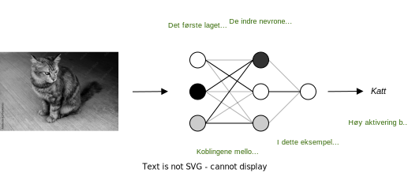

# Individ, samfunn og systemer

## Introduksjon

Informasjonsteknologi påvirker individet og samfunnet på flere måter. En av de viktigste måtene er gjennom økt tilgang til informasjon og kommunikasjonsmuligheter. Internett og sosiale medier gir folk mulighet til å dele og få tilgang til informasjon på en mer demokratisk måte enn noen gang tidligere. Spesielt internett og sosiale medier kan bidra til å underbygge demokratisering og styrke demokratiet på flere måter:

* Økt tilgang til informasjon: Internett gir folk muligheten til å få tilgang til en bredere mengde informasjon enn noen gang før, noe som kan bidra til å øke deres kunnskap og kritisk tenkning.
* Økt medvirkning: Sosiale medier gir folk mulighet til å delta i offentlig debatt og organisere seg for å påvirke politiske beslutninger.
* Økt transparens: Informasjonsteknologi gjør det lettere for regjeringer og organisasjoner å dele informasjon med allmennheten, noe som kan bidra til å øke transparensen og ansvarligheten i politiske prosesser.
* Økt valgdeltagelse: Informasjonsteknologi kan gjøre det lettere for folk å delta i valg, for eksempel ved å gjøre det mulig å stemme elektronisk eller å gi folk mulighet til å lære mer om kandidatene og sakene før valget.
* Økt konkurranse i mediebransjen: Internett og sosiale medier har økt konkurransen i mediebransjen, noe som kan bidra til å øke mangfoldet i mediene og gjøre det lettere for uavhengige stemmer å bli hørt.

Det er viktig å merke seg at informasjonsteknologi alene ikke kan styrke demokratiet. Det kan være en verktøy for å styrke det, men det kan også være en fare for demokratiet hvis det ikke håndteres på en ansvarlig måte. For eksempel kan sosiale medier være et verktøy for å spre feilinformasjon og øke polarisering. På den annen side kan overforbruk av teknologi føre til isolasjon og avhengighet, og kan også bidra til å øke deling av feilinformasjon.

* Mindre sosial interaksjon: Folk kan bruke mer tid på å kommunisere gjennom teknologi og mindre tid å møtes ansikt til ansikt med andre mennesker. Dette kan føre til mindre sosial interaksjon og mindre følelse av tilhørighet.
* Økt avhengighet: Folk kan bli avhengige av teknologi for å kommunisere og få tilgang til informasjon, og kan føle seg fortapt uten det. Dette kan føre til økt stress og angst.
* Økt isolasjon: Folk kan føle seg isolert fra andre mennesker og samfunnet, spesielt hvis de bruker teknologi i stedet for å delta i fysiske aktiviteter og samfunnet.
* Feilinformasjon: Sosiale medier og internett kan være et sted for å spre feilinformasjon, noe som kan føre til økt polarisering og økt risiko for å bli påvirket av propaganda eller feilinformasjon.
* Påvirkning av vår mentale helse: Overforbruk av teknologi kan føre til økt stress, søvnproblemer, og depresjon.

Det er også bekymringer knyttet til personvern og datalagring, spesielt etter at flere store datalekkasjer har funnet sted.

Det er viktig å merke seg at teknologi ikke nødvendigvis er skadelig for individet eller samfunnet, men det kan være farlig hvis det ikke brukes på en ansvarlig måte. Det er viktig å sette grenser for teknologibruken, å ha en balansert holdning til teknologi, og å være kritisk til informasjonen man finner på internett.

Informasjonsteknologi har også en stor påvirkning på arbeidsplassen, med flere jobber som krever kompetanse innen teknologi, samt økt automatisering av arbeidsoppgaver. Dette kan føre til økt produktivitet, men også til arbeidsløshet og endringer i arbeidsmarkedsstrukturen.

I tillegg er det bekymringer om hvordan teknologi påvirker økonomien, med økt avhengighet av teknologiselskaper og konsentrasjon av rikdom og makt i få hender.

Så alt i alt kan informasjonsteknologi være en kraft for positiv endring, men det kan også ha negative konsekvenser hvis det ikke håndteres på en ansvarlig måte.

## Sosiale medier

Med sosiale medier mener vi alle plattformer og nettsider som muliggjør interaksjon mellom mennesker. I begynnelsen fantes enkle plattformer der man kunne opprette en profil, legge til kontakter og sende meldinger, men i dag har sosiale medier blitt den viktigste arenaen for deling av informasjon og samfunnsdebatt. Denne transformasjonen har hatt betydelige konsekvenser for samfunnet. 

**Konsekvenser for samfunnet.** Sosiale medier har demokratisert både tilgangen til informasjon og muligheten til påvirkning. Noen eksempler på dette er: 

* Da internett kom, tok det ikke lang tid før man kunne få nyhetsoppdateringer fra hele verden, men det var i stor grad begrenset til de store, vestlige mediehusene. Sosiale medier har ført til en stor vekst av frivillige enkeltpersoner og organisasjoner som deler viktige nyheter som ikke prioriteres av mediehusene. Det er en svært positiv utvikling for demokrati og folkeopplysning at slike frivillige aktører kan få en sterkere stemme på sosiale medier enn det som var mulig tidligere. 
* Sosiale medier gir et større mangfold av synspunkter. Mens man tidligere i størst grad hadde tilgang til kronikker og debatter i vestlige medier, er det nå mulig å høre stemmene til folk fra hele verden og fra alle sosiale grupper. Dermed får man tilgang til den faktiske opplevelsen til personer som påvirkes av beslutningene som blir tatt fra maktposisjoner. 
* Som en positiv konsekvens av punktene ovenfor kan vi si at sosiale medier gjør at personer og institusjoner i maktposisjoner i større grad må stå til ansvar for handlinger og beslutninger som har negative konsekvenser. 
* Med sosiale medier er det også lettere for folk å organisere seg, og stå samlet i kamp for menneskerettigheter og viktige saker, slik som klima -og miljøkrisen. 
* Internett gav tidlig økt tilgang til kunnskap, gjennom sider som *Wikipedia*, men med sosiale medier har det vokst fram et stort samfunn av kunnskapsformidlere. Å se en pedagogisk formidlet *Youtube*-video om global oppvarming er noe helt annet enn å lese *Wikipedia*-artikkelen om det samme temaet. Kunnskapsformidlere kan nå ut til en mye større del av befolkningen, og gjøre folk mer informert når de tar valg, stemmer og deltar i samfunnsdebatt. Ved å tilby gratis læringsressurser bidrar de også til sosial og økonomisk utjevning.  

En stor bekymring med sosiale medier er spredning av **feilinformasjon**. Noen eksempler på feilinformasjon er fiktive historier om politiske kandidater, manipulerte videoer som fremstiller en fredelig protest som et voldelige sammenstøt, eller grafikk som viser misledende statistikk om viktige saker. Slikt innhold kan spre seg raskt og ha stor påvirkningskraft, og konsekvensene kan være både tilsiktede og tilfeldige: 

- Det kan påvirke og avlede politiske debatter, særlig i forkant av valg.
- Det kan skape splittelse og mistillit mellom personer og grupper.
- Det kan øke polariseringen i samfunnet, blant annet ved å styrke ekkokamre. 
- Det kan skape mistillit til politiske kandidater, og øke forekomsten av hatsmeldinger og trusler. 

Feilinformasjon utgjør altså en trussel mot demokratiet, tilliten og stabiliteten i et samfunn. 

En annen negativ konsekvens av sosiale medier er at mye makt havner i hendene på svært få selskaper, slik som *Facebook*/*Meta* og *Google*. Ettersom det er svært upraktisk for brukere å fordele seg over flere konkurrerende plattformer, så har noen få selskaper fått kontroll over store deler av markedet. Mangelen på mangfold av plattformer har noen urovekkende konsekvenser: 

* Det er kjent at de store plattformene benytter **anbefalingsalgoritmer** som **optimerer interaksjon**. Det betyr at når plattformene anbefaler nytt innhold til brukeren, forsøker den å gi mer av den samme type innhold som man har interagert med tidligere, eller blitt værende på lengre enn normalt. Dette kan skape fenomener kjent som *ekkokamre* og *filterbobler*.
    * Et *ekkokammer* referer til et nettmiljø der man kun blir eksponert for meninger som bekrefter og forsterker overbevisninger man allerede har. For eksempel kan et ekkokammer bestå av en gruppe mennesker som kun ser hverandres innlegg, ikke nødvendigvis fordi man følger hverandre, men som en konsekvens av anbefalingsalgoritmene. 
    * En *filterboble* er et relatert konsept, som referer til at nyhetsveggen til hver person er en slags personlig boble der bare visse ting slipper inn. Anbefalingsalgoritmene vil ofte unngå innhold som ikke passer med eksisterende preferanser. 
* Anbefalingsalgoritmene kan målrettet anbefale innhold som genererer sterke følelser. Det fører til at splittende innlegg  kan spre seg raskt, og skape et polarisert og til og med hatefullt debattklima.
* Anbefalingsalgoritmene har ikke nødvendigvis blitt laget spesifikt for å skape splittelse og ekkokamre, men det er konsekvenser av at algoritmene forsøker å *optimere interaksjon*. For de store selskapene er det rett og slett positivt med mest mulig interaksjon, som øker reklameinntekter og styrker deres posisjon.
*  Anbefalingsalgoritmene gjør at feilinformasjon og hatefullt innhold har lettere for å spre seg. I den forbindelse er det også et problem at makten til å moderere innhold er konsentrert hos få selskaper. Moderasjon av innhold skjer ofte automatisk, og reglene om hva som er tillatt settes av selskapene selv. I mange tilfeller er reglene antagelig for svake, mens i andre tilfeller fjernes kanskje innhold uten god grunn. 

Monopolet som noen få selskaper har over sosiale medier er altså et betydelig problem for demokratiet og samfunnsklimaet. 

**Konsekvenser for individet.** Sosiale medier har gjort det lettere for en stor andel av befolkningen å skape vennskap og andre relasjoner. Noen bor kanskje på små og isolerte steder, har utfordringer med muntlig kommunikasjon, eller kan ikke forlate hjemmet enkelt. Uansett hva grunnen er, så har disse menneskene fått en ny mulighet med sosiale medier, der man kan skape relasjoner uten at ens begrensninger kommer i veien. Og uansett hvilken interesse man har, er det nesten alltid mulig å finne personer og nettmiljøer med den samme interessen. 

For andre kan sosiale medier ha skapt mer ensomhet, isolasjon og emosjonell belastning. Noen eksempler på dette er:

- Mange bruker sosiale medier som hovedarena for å søke vennskap, og det kan bli vanskeligere å finne arenaer for å møtes fysisk. Mange kan oppleve at de mangler dybden og støtten som finnes i et nært vennskap basert på fysisk samvær. 
- Negative sosiale strukturer som finnes blant tenåringer (og i andre sosiale grupper) kan bli forsterket i sosiale medier. For eksempel kan faktorer som popularitet og utseende bli framhevet og være grunnlag for sammenligning og ekskludering.
- Muligheten til å være anonym og mangelen på kontroll gjør at negativ atferd ikke straffes, mens den emosjonelle belastningen på ofrene ofte er minst like stor som før. Blant annet har sosiale medier blitt en ny flate for nedsettende kommentarer og mobbing, samt deling av krenkende og private bilder og videoer.

Noen grupper kan være spesielt utsatte for disse effektene, og det er knyttet særlig bekymring til barn og tenåringer som vokser opp med sosiale medier fra tidlig alder. Et vanskelig dilemma er at den eneste måten å unngå de negative effektene kan være å avstå fra sosiale medier, samtidig som det kan føre til at man havner på utsiden av det sosiale miljøet.

## Personvern, personopplysningsloven og GDPR

**Persondata.** *Persondata* eller *personopplysninger* er informasjon som kan knyttes til en enkeltperson. 

Det finnes noen kategorier av persondata som regnes som spesielt sensitive:  
*  *Identitetsdata*: Informasjon som kan knyttes til en spesifikk person, slik som fullt navn, adresse, telefonnummer, e-postadresse, personnummer eller andre identifikasjonsnumre. I denne kategorien finnes også biometrisk informasjon, slik som fingeravtrykk, genetisk informasjon og data for gjenkjennelse av ansikt og stemme.
*  *Beskrivende sensitive data*: Dette inkluderer rasemessig eller etnisk opprinnelse, politisk oppfatning, religion, filosofisk overbevisning eller fagforeningsmedlemskap, samt opplysninger om seksuelle forhold og seksuell orientering. 
*  *Helsedata*, slik som sykdommer, resepter, medisinsk historie og biometriske måledata (målinger av hjerterytme, blodtrykk og lignende).
*  *Bankinformasjon*, slik som kredittkortnumre og transaksjonshistorikk. 
*  *Lokasjonsdata*, det vil si data om hvor man befinner seg eller historisk data om hvor man har vært. 
* *Kommunikasjonsdata*, det vil si private meldinger, e-poster og annen digital kommunikasjon. Dette kan inkludere private bilder, videoer og andre filer. 
* *Registrerte persondata*, slik som straffeattest (rulleblad), arbeidsforhold, utdanning og personlig økonomi.

De tre første kategoriene regnes formelt som sensitive data i norsk og europeisk lovgivning, og er underlagt ekstra beskyttelse. 

Sensitive persondata bør underlegges ekstra beskyttelse fordi de er spesielt sårbare for misbruk. Eksempler på misbruk er:

* Identitetsdata og bankinformasjon kan misbrukes til identitetstyveri, ofte med mål om økonomisk gevinst. Konsekvensene kan være betydelige økonomiske tap og opprettelse av svindelkontoer i offerets navn.
* Lekking av beskrivende sensitive data, helsedata og registrerte persondata kan føre til stor emosjonell belastning, og kan lede til diskriminering, stigmatisering og hets.  
* *Lokasjonsdata* kan misbrukes av enkeltpersoner, organisasjoner og stater, og kan utgjøre en sikkerhetsrisiko, samt innskrenke både opplevd og reell bevegelsesfrihet. Lokasjonsdata kan også misbrukes til å hente annen sensitiv informasjon relatert til personers bevegelsesmønstre, samt til å lage detaljerte personprofiler. 
* *Kommunikasjonsdata* kan manipuleres og misbrukes til å etterligne individer og lure mottakere. Videre kan personer utsettes for utpressing og trusler etter tyveri av kommunikasjonsdata. 
* Misbruk av alle typer data kan oppleves invaderende og som en svekkelse av privatlivet, samt føre til usikkerhet og frykt. 

**Regler for innhenting og bruk av persondata.** Ettersom persondata er sårbare for misbruk, og konsekvensene er store, finnes det lover for innhenting og bruk av slik data.

I første omgang finnes lovene om personvern, som beskytter enkeltpersoners rett til et privatliv. Disse lovene handler ikke bare om persondata, men skal beskytte alle deler av privatlivet. I den europeiske menneskerettighetskonvensjonene lyder loven: 

> Enhver har rett til respekt for sitt privatliv og familieliv, sitt hjem og sin korrespondanse.

Eksempler på brudd av denne loven er ulovlig overvåkning og inntrenging i personlig sfære, slik som innbrudd eller ulovlig husransakelse. Selv om personlig data også beskyttes av denne loven, så har teknologiutviklingen gjort det stadig lettere å samle inn og bruke persondata,  og det har oppstått behov for en mer spesifikke lover. I Norge kalles disse samlet for *personopplysningsloven*. 

Personopplysningsloven består både av nasjonale regler og *EUs personvernforordning*, også kalt *GDPR* (*General Data Protection Regulation*). GDRP ble opprettet av den Europeiske Union i 2018 som et svar på den økende bekymringen rundt misbruk av persondata. 

Bekymringen var blant annet knyttet til at mange selskaper hentet persondata uten å spørre om samtykke, og formålet med innsamlingen ofte var uklar. Dette kunne blant annet sees gjennom reklame som var så målrettet at det måtte ligge omfattende datainnsamling bak. GDPR ble utviklet for å flytte makten i retning av enkeltpersoner, og sikre mer kontroll over egne data.

Så hva består GDPR av? Noen punkter som kan nevnes er:

* Loven inneholder klare **definisjoner** av relevante begreper, som *persondata*, *datasubjekt* og *prosessering*.
* Loven pålegger organisasjoner å motta et klart **samtykke** før de henter inn persondata.
* Loven gir enkeltpersoner **kontroll** over egne data også etter innhenting. Dette gjøres blant annet ved at den gir retten til å:
    * trekke tilbake samtykket,
    * få dataene sine slettet etter ønske,
    * laste ned alle sine registrerte data i et lesbart format. 
* Loven pålegger organisasjoner å **varsle** myndigheter og individer om dataangrep og datalekkasjer.
* Loven definerer enda strengere krav for innhenting og bruk av **sensitive personopplysninger**, samt persondata om **barn**.   
* Organisasjoner må **dokumentere** sine aktiviteter knyttet til bruk av persondata, samt vise at regelverket etterfølges. Visse organisasjoner må ha en dedikert ansatt for databeskyttelse. 
* Betydelige **bøter** kan pålegges til organisasjoner som bryter loven.

Et viktig prinsipp i lovgivningen er altså at organisasjoner må ha et klart samtykke før de kan hente persondata. Videre må de være åpne om sine intensjoner og hvordan de har tenkt til å prosessere dataene. GDPR skal også gi personer rett til å trekke tilbake samtykket når som helst, og dessuten kunne få dataene sine slettet. 

Bruk av *informasjonskapsler* (*cookies*) er et praktisk eksempel på hvordan GDPR flytter makten til brukeren. Informasjonskapsler er små pakker med data som nettsider bruker for å huske dine aktiviteter og innstillinger, slik at du får en mer tilpasset opplevelse neste gang du besøker nettsiden. Informasjonskapsler kan for eksempel brukes til å lagre ditt språkvalg eller varene i handlekurven. 

Før GDPR ble informasjonskapsler brukt i stort omfang og med lite kontroll og gjennomsiktighet. Uten din viten kunne nettsider lagre nesten all din aktivitet og lage en detaljert brukerprofil over deg, med informasjon om interesser, preferanser og vaner. Slik informasjon kunne ofte selges og deles mellom nettsider, og dataene ble dermed enda mer sårbare for misbruk. 

GDPR pålegger nettsider informere deg om hvordan de bruker informasjonskapsler, samt å gi deg valget mellom å godkjenne eller avslå bruken. Det kan riktignok oppleves litt irriterende å få denne dialogboksen hver gang man besøker en ny nettside, og de fleste leser ikke gjennom alle vilkårene. Men dersom man besøker mange nettsider i løpet av en dag, og ikke har like høy tillit til alle, er det viktig å ha kontroll over hvem som kan samle inn data om nettaktiviteten din.

**Aktivitet 1.** Gå inn på Facebook eller Instagram og be om å få laste ned alle dine persondata.

- [Fremgangsmåte](https://www.facebook.com/help/212802592074644) for Facebook.
- [Fremgangsmåte](https://help.instagram.com/181231772500920) for Instagram.

Gå gjennom alle mappene og filene du har lastet ned. Er det noe data du er overrasket over å finne? Når og hvordan har disse dataene blitt registrert? Hva tror du dataene brukes til?

**Aktivitet 2.** Gå inn på noen nye nettsider, for eksempel noen store nettaviser eller nettbutikker. Når dialogboksen om informasjonskapsler kommer opp, les gjennom vilkårene, og finn ut hvilke data nettsiden registrer og hvordan dataene brukes. Er det noe som overrasker deg? 

## Apper og datainnsamling

I dag er det vanskelig å tenke seg en hverdag uten en smarttelefon med en rekke applikasjoner. Hvordan skal vi sende melding til den personen som vi ikke har nummeret til? Hvordan skal vi betale bussbilletten? Hvordan skal vi høre på musikk på bussen? Dette er eksempler på hvordan **apper** har blitt uunnværlige, både med tanke på sosial interaksjon, praktiske sider av hverdagen, samt avslapning og rekreasjon. 

Du har antagelig brukt ruteplanleggeren i *Google Maps*, som ikke bare gir deg den raskeste ruten, men også forteller hvor lang tid reisen vil tar, trafikken tatt i betraktning. Det kan også hende at du har funnet noen av *Tiktok* -eller *Instagram*-kontoene du liker best gjennom anbefalinger i appen. Dette er to eksempler på apper som bruker **datainnsamling** til å forbedre brukeropplevelsen.

Mange av appene vi bruker er avhengige av å samle data for å fungere godt. Noen måter apper samler data på er: 

- **Data skrevet inn av brukeren.** Det kan for eksempel være snakk om personlig data som navn, alder og kjønn. 
- **Lokasjonsdata.** En app kan lagre posisjonen din, både når appen er åpen og når den kjører i bakgrunnen.
- **Sensordata.** En app kan lagre informasjon fra sensorer på telefonen, som for eksempel mikrofonen eller kameraet. 
- **Brukermønstre.** I prinsippet kan alle handlinger du gjør i appen lagres. For eksempel kan en musikkapp lagre alle låtene du har spilt av, og på hvilket tidspunkt.
- **Integrasjon på tvers av plattformer.** På mange apper vil man logge inn med samme brukerprofil som på nettsider eller andre plattformer. Appen vil da kunne ha tilgang til data tilknyttet brukerprofilen, men registrert utenfor appen. 
- **Innlogging med tredjepart.** Noen apper tilbyr innlogging med for eksempel *Google* eller *Facebook*. Ofte godtar man samtidig at appen kan hente deler av dataene knyttet til brukeren din, og sende data tilbake. 

Data som samles inn kan enten lagres lokalt, det vil si på smarttelefonen sin lagringsdisk, eller det kan lagres i en database hos firmaet som står bak appen. I det siste tilfellet vil dataene lagres sammen med et unikt id-nummer, som forteller hvilken mobilenhet informasjonen kommer fra. Senere kan appen hente den riktige informasjonen fra databasen, ved å søke opp id-nummeret. 

Innsamling av data kan brukes til reelle forbedringer av appen, som brukeren har nytte og glede av. Eksempler er: 

**Tilpasse brukeropplevelser.**  Apper som *Youtube*, *Instagram* og *Tiktok* kan anbefale kanaler, videoer og innlegg basert på hva du har sett mest på, eller hva du har likt eller kommentert. En musikkstrømmingsapp kan foreslå nye låter og artister basert på din lyttehistorikk. Læringsapper som *KhanAcademy* eller *Duolingo* kan lagre data om din progresjon, og bruke det til å anbefale og tilpasse læringsmaterialet.

**Forbedre tjenester.** Mange apper samler data for å forbedre tjenestene til appen. Her er det ikke snakk om tilpasse funksjoner for den enkelte brukeren, men forbedre appen for alle brukere.
* *Google Maps* samler lokasjonsdata fra reisende for å estimere trafikken på veier eller forsinkelser i offentlig transport, og bruker dette til å anbefale bedre ruter. Videre brukes lokasjonsdata til å kontinuerlig oppdatere kartdatabasen med nye veier, gater og landemerker. Appen kan også estimere hvor folksomt det er på offentlige steder, som gjør at man kan planlegge gjøremål og aktiviteter til roligere tidspunkter. 
* Det er verdt å nevne at dataene fra *Google Maps* også kan brukes til samfunnsnyttige formål, for eksempel i forbindelse med by -og veiplanlegging, eller til å hente kritisk informasjon om personers lokasjon i nødssituasjoner, slik som ved naturkatastrofer eller ulykker. 
* Apper for offentlig transport kan på samme måte bruke lokasjonsdata fra reisende til å forbedre nøyaktigheten av avgangstider, reisetider og gi bedre ruteforslag.
* Noen værmeldingsapper kan hente data fra brukeren for å forbedre værmeldinger og eventuelle varslinger om ekstremvær. Appene kan for eksempel la brukeren gi tilbakemeldinger om lokale værforhold eller hente lufttrykksmålinger fra smarttelefonens sensor. 
* Som konklusjon kan vi si at apper som henter lokasjonsdata, eventuelt sammen med annen brukerdata, gir bedre informasjon og tjenester knyttet til lokale forhold. Slike tjenester kan være svært nyttig for både individ og samfunn, og de blir bedre jo flere som bidrar med sine data.
* [*Crowdsourcing*](https://no.wikipedia.org/wiki/Nettdugnad) er en måte å løse oppgaver basert på små og gjerne frivillige bidrag fra et stort antall mennesker. Teknologiene vi har sett på følger slike prinsipper, og viser den store nytteverdien som kan genereres av et stort antall brukerdata. Riktignok eies teknologien av *Google* og andre selskaper, men informasjonen som produseres holdes ikke skjult, og kan hentes til bruk i egne programmer gjennom *Web-APIer* som tilbys av for eksempel *Google*. (Se seksjonen om *Web-API-er* i kapittelet *Datahåndtering - Utveksling og sikring av data*).
  
Datainnsamling i apper skaper imidlertid noen store bekymringer, særlig knyttet til personvern:
* **Samling av sensitive data.** Som vi så i forrige seksjon, er sensitive data spesielt sårbare for misbruk, og konsekvensene for enkeltpersoner kan være store.
* **Deling og salg av persondata.** Når persondata deles eller selges til en tredjepart, mister brukeren i stor grad kontrollen over sine data, og risikoen for misbruk øker. 
* **Datasikkerhet.** Mange firmaer samler inn data uten å gjøre tilstrekkelige grep for å beskytte dataene mot lekkasje og tyveri. 
* **Invasiv datainnsamling.** Mange apper samler inn persondata som ikke er nødvendige for appens funksjon, med mål om å skape detaljerte brukerprofiler, som blant annet kan brukes til målrettet reklame.
* **Permanent lagring av lokasjonsdata.** Selv om lokasjonsdataene samlet inn av *Google Maps* kan brukes til svært nyttige formål på kort sikt, er det problematisk at dataene lagres permanent. Dersom man har brukt *Google Maps* i lengre tid, vil man ha etterlatt seg et stort digitalt fotavtrykk over sine bevegelser. Disse dataene er spesielt sårbare for misbruk, og kan kobles til spesifikke personer selv om de ikke inneholder personinformasjon. 

Som et konkret eksempel på bekymringene rundt datainnsamling anbefales den glimrende saken [*Avslørt av mobilen*](https://www.nrk.no/norge/xl/avslort-av-mobilen-1.14911685), publisert på *NRK* i 2020. Her fortelles det hvordan man kunne betale et britisk selskap 35.000 kroner for omfattende mengder lokasjonsdata, som ga informasjon om bevegelsene til titusener av nordmenn i 2019. 

I denne databasen kunne man hente alle registrerte bevegelser fra en bestemt mobilenhet, og ofte kunne eieren av mobilen identifiseres, ettersom bevegelsesmønstret levnet liten tvil om bostedsadresse, arbeidssted og lignende informasjon. 

Det britiske selskapet hadde altså gjort det til forretning å kjøpe lokasjonsdata fra en rekke populære apper, og deretter selge dem videre. Mange av appene hadde lokasjonssporing uten at det var nødvendig eller relevant for appens funksjon. Disse selskapene prøver ofte å forsvare seg med at dataene de samler inn er anonyme, selv om dataene er så detaljerte at identifisering kan oppnås relativt enkelt. 

Detaljert lokasjonsdata er svært sårbare for misbruk. De kan for eksempel fortelle om opphold på sykehus, psykiatriske institusjoner og krisesentre, som man lese mer om i [oppfølgingssakene](https://www.nrk.no/emne/mobilsporing-1.14925990).  

## Big data

**Hva er *Big data*?** I kapittelet *Datahåndtering - Databehandling* lærte vi om tradisjonelle metoder for databehandling, og vi tok utgangspunkt i datamengder som var strukturerte og relativt små. 

*Big data*, eller *stordata* på norsk, refererer til samlinger av data som er så store og komplekse at de ikke kan analyseres med tradisjonelle metoder for databehandling. Stordata trenger ikke nødvendigvis å være strukturerte, og kan inneholde mange ulike formater, slik som tekst, bilder, videoer og sensormålinger. Det er snakk om datamengder som ikke kan prosesseres på våre egne maskiner, men som gjerne må sendes til store datasentre med høy lagrings -og prosesseringskraft. I tillegg benyttes spesielle verktøy og teknikker som er egnet for stordata, som for eksempel kunstig intelligens (se mer senere). 

Vi kan si at stordata er et resultat av den teknologiske utviklingen fra 2000-tallet og utover. Noen av de viktigste faktorene som har ført til de store datamengdene er: 

* **Digital transformasjon**: Digitale enheter og internett brukes nå av store deler av verdens befolkning, og genererer enorme mengder data. Alle typer handlinger, fra interaksjoner på sosiale medier til netthandel, etterlater et digitalt fotavtrykk og bidrar til akkumulasjonen av data.
* **Teknologisk utvikling**: Det hjelper ikke å ha kilder til store mengder data dersom den ikke kan brukes! Forbedringer innen prossesorkraft og lagringskapasitet gjør det mulig å lagre og analysere dataene stadig raskere og billigere. Dette gir firmaer økt interesse til å samle inn og lagre mange typer data, uten at formålet nødvendigvis er klart definert. 
* **Tingenes internett** (*IoT: Internet of Things*): Mange daglige elektroniske enheter og smartenheter har nå internettilkobling. Det gjør det mulig å sende sanntidsdata til eierens telefon, men også til produksjonsselskapets egne databaser. Slike enheter sender ofte en kontinuerlig strøm av sensordata, og bidrar dermed betydelig til store datamengder. Typiske eksempler er smartklokker og smarthjemenheter, slik som termostater og lyssystemer. 

**Muligheter.** Tilgangen til store datamengder og muligheten til å trekke meningsfull informasjon ut av dem, kan gi spennende muligheter og brukes til samfunnsnyttige formål. Eksempler på dette er: 

* **Helseteknologi:** Der tradisjonelle og generelle behandlingsmetoder ikke fungerer, kan *personalisert medisin* være løsningen. Slik behandling er ofte basert på analyse av gendata. 
    * Analyse av gendata fra kreftceller kan brukes til å velge en behandling som spesifikt angriper kreftcellene. Dette brukes allerede i behandling av noen krefttyper og kan bli stadig vanligere i framtiden. 
    * For noen sykdommer bør medisin og dose tilpasses hver enkelt pasient for å oppnå best behandlingsresultat. Pasientens gendata kan analyseres og sammenlignes med databaser som viser hvordan andre pasienter med lignende gener har respondert.
    * Analyse av gendata kan brukes til forebygging av sykdommer med en sterk genetisk komponent. 
* **Byplanlegging:** I byer kan man samle inn store mengder data som viser pendlermønstre og trafikkflyt. Det kan for eksempel dreie seg om sensordata eller GPS-data fra offentlig transport og *crowdsourcing* (se forrige seksjon). Disse dataene kan analyseres og brukes til å optimere infrastrukturen i byen, slik som effektive offentlige transportlinjer og trygge veier for syklister. Dataene kan være viktige i arbeidet med å skape mer miljøvennlige byer. 
* **Klima og miljø**: Klimaforskere analyserer store datamengder fra satellitter, værstasjoner og andre sensorer, for å bedre forstå hvordan klimaet endrer seg, og bedre predikere ekstremvær. Slike prediksjoner blir stadig viktigere ettersom ekstremvær blir hyppigere og kraftigere med klimaendringene. 
    
**Utfordringer.** Det er også noen viktige utfordringer knyttet til bruk stordata: 
* **Personvern**: I stordata kan man fort miste kontrollen over hva som er persondata, og risikoen for feilhåndtering og misbruk kan være stor. 
    * Selv om *GPS*-data kan brukes til å gjøre nyttige analyser i forbindelse med byplanlegging og trafikkhåndtering, så kan man spørre seg om det er nødvendig å lagre dataene i sitt originale format, det vil si som koordinatdata knyttet til mobilenheter. I forrige seksjon så vi hvordan slik data er sårbare for misbruk, blant annet fordi de kan kobles til spesifikke personer. For byplanlegging er det ikke nødvendig å ha data som viser bevegelsesmønsteret til enkelte mobilenheter over lang tid.
* **Diskriminering**: Data kan inneholde systematiske feil som følge av diskriminering, og dersom slik data analyseres og brukes i beslutninger, kan det føre til at diskrimineringen opprettholdes og forverres. Et relevant eksempel er *prediktivt politiarbeid* (*predictive policing*), som i liten grad brukes i Europa, men som har vært mye brukt og sterkt kritisert i USA. Politiavdelinger i mange byer og stater benytter algoritmer for å analysere historiske forbrytelser, med mål om å fordele politiressursene best mulig, for eksempel ved å predikere når og hvor politiet bør være til stede. Problemet er at urettferdig målretting av enkelte miljøer vil forsterkes med slike algoritmer. Dette var særlig et tema i forbindelse med protestene mot politivold i 2020 etter drapet på George Floyd. I et [offentlig brev](https://www.math-boycotts-police.net/) signert av over tusen matematikere i USA, ble akademikere oppfordret til å boikotte all samarbeid med politiet, og det nevnes blant annet at algoritmene tillater en "vitenskapelig fordekning" av rasisme. 
* **Datapålitelighet.** Stordata er i større grad utsatt for unøyaktigheter eller feil, og beslutninger tatt med slik data kan ha konsekvenser. For eksempel bør man være varsom med å ta viktige medisinske beslutninger basert på resultatet av en algoritme som prosesserer stordata, siden det kan ha konsekvenser for helse og liv. 
* **Datasikkerhet.** Et problem med å lagre store mengder data i en organisasjon er de kan bli målrettet for dataangrep. Konsekvensene av datalekkasje kan være omfattende, særlig dersom stordataene inneholder store mengder persondata. 
* **Maktkonsentrasjon.** Konsentrasjon av store mengder data hos få selskaper fører også til konsentrasjon av makt hos de samme selskapene. I seksjonen *Sosiale medier* så vi noen negative konsekvenser av at selskaper som *Facebook/Meta* har fått så mye makt. 

Vi kan oppsummere med at stordata kan gi innsikt som tidligere ikke var tilgjengelig, som blant annet kan brukes til persontilpasset behandling, forbedring av infrastruktur og prediksjon av  naturkatastrofer. Samtidig har misbruk av stordata ført til økt diskriminering og maktkonsentrasjon, og det er ekstra store bekymringer knyttet til sikkerhet og personvern.

## Hva er kunstig intelligens? 

*Kunstig intelligens*, også kalt *KI* eller *AI* (*Artificial Intelligence*), refererer til datamaskiner som kan løse "menneskelige oppgaver", det vil si oppgaver som fram til nå har krevet menneskelig intelligens.

Man kan si at KI er et begrep i utvikling, ettersom en teknologi som tidligere ble sett på som KI, i dag kan bli sett på som en selvsagt og rutinemessig oppgave for en datamaskin. Sjakkspilling kan være et eksempel på dette. 

Når en datamaskin slo verdens beste sjakkspiller Garry Kasparov i 1997, ble det regnet som kunstig intelligens. Det var første gang en datamaskin kunne gjøre noe som fram til da hadde krevet menneskelig intelligens. Senere ble man imidlertid vant til at datamaskinen for alltid ville spille mye bedre sjakk enn mennesker, og egentlig er det ikke så mystisk, tatt i betraktning at den kan vurdere titalls millioner av mulige trekk hvert sekund. Men i 2017 kom programmet *AlphaZero*, som hadde lært seg sjakk ved å spille mot seg selv i noen timer, og deretter slo de beste sjakkprogrammene, som på sin side hadde blitt utviklet og forbedret av mennesker gjennom mange år. 

Det *AlphaZero* gjorde ble regnet som kunstig intelligens, ikke fordi den kunne spille sjakk så godt, men på grunn av måten den gjorde det på, som minnet mer om menneskelig intuisjon. I motsetning til de tradisjonelle sjakkprogrammene gikk den bare gjennom noen tusen mulige trekk, men var til gjengjeld mye bedre på å "gjenkjenne" de gode mulighetene. 

Selv om kunstig intelligens ikke er et nytt begrep, kan vi si at det som i dag (2023) regnes som KI har noen kjennetegn som er veldig forskjellig fra tidligere oppfatninger av kunstig intelligens. Moderne KI refererer gjerne til datamaskiner som kan lære gjennom erfaring (slik som *AlphaZero*), tilpasse seg ny informasjon og ta avgjørelser basert på store mengder data. *Maskinlæring*, som du kan lære mer om i neste seksjon, er en viktig metode for å oppnå slik funksjonalitet, men ikke den eneste metoden.

Moderne KI er et resultat av kraftigere prosessorer, datatilgjengelighet (se forrige seksjon) og algoritmisk innovasjon. Algoritmene består i mindre grad av å utføre en sekvens av regelbaserte steg, og i større grad av å analysere store mengder data og deretter ta i bruk det den lærer til å tolke ny data. Hvis man for eksempel vil at datamaskinen skal vurdere om et bilde har en hund eller katt, så vil et klassisk program kanskje benytte matematiske operasjoner til å finne ut om pikslene danner bestemte former. En moderne KI-algoritme vil i stedet analysere hundrevis eller tusenvis av hunde -og kattebilder som allerede er riktig merket. Algoritmen vil på denne måten selv lære seg hvilke strukturer som kjennetegner et bilde av en katt. På samme måte spilte *AlphaZero* god sjakk ved å lære seg hva slags trekk som ofte ga et godt utfall når den spilte mot seg selv.

## Tillegg: maskinlæring

I forrige seksjon nevnte vi at maskinlæring er en viktig teknikk i moderne kunstig intelligens. Men hva er egentlig maskinlæring? Hva mener vi når vi sier at tradisjonell programmering er regelbasert, mens KI-algoritmer er datadrevet og selvlært? Det skal vi se nærmere på i denne seksjonen. 

Se for deg en funksjon med følgende spesifikasjon:

> **Inndata:** Et bilde som inneholder ansiktet til enten en hund eller katt.   
> **Ønsket utdata:** *Hund* dersom bildet inneholder en hund, og *Katt* dersom bildet inneholder en katt.

Hvordan kan man programmere en slik funksjon? La oss først definere en algoritme basert på regelbasert programmering, der vi benytter tradisjonelle teknikker for bildeprosessering. Regelbasert programmering er en sekvens av klart definerte operasjoner på inndataen: 

1. Finn konturer i bildet. En kontur er en mengde av piksler som representerer omrisset av et objekt. En slik mengde piksler har omtrent samme intensitet og danner en lukket kurve. Det finnes matematiske formler som kan brukes til å finne slike mengder med piksler. 
2. Gå gjennom alle konturer i bildet, og regn ut i hvor stor grad konturene har sirkelform. Dette kan også regnes ut med  matematiske formler. 
3. Dersom det finnes en kontur som har sirkelform over en viss grenseverdi, returner *katt*. Hvis ikke, returner *hund*. 

Dette er en svært forenklet algoritme basert på antagelsen om et kattehode er mer sirkelformet enn et hundehode. Antagelig vil algoritmen ha lav presisjon, altså gi feil svar på en stor andel av bildene.

Maskinlæring er en helt annen teknikk der vi **ikke** gjør en sekvens av klart definerte operasjoner. For å utvikle en maskinlæringsalgoritme må vi gjennomføre fire viktige steg: opprette treningsdata, opprette modell, trene opp modellen, og teste og evaluere modellen. 

* **Opprette treningsdata**. Først trenger vi en viss mengde data som er korrekt merket. I vårt tilfelle trenger vi en mengde bilder av katter og hunder, der hvert bilde er riktig merket med *Katt* eller *Hund*. Denne datamengden kalles *treningsdata*.
* **Opprette modell**. For å lage en maskinlæringsalgoritme, definerer vi først en *modell*. En modell er en matematisk struktur med parametre som kan endres. 

En av de enkleste modellene vi kan definere er en førstegradsfunksjon med flere variabler: 

$$f(x_1, x_2, x_3, ...) = k_1 x_1 + k_2 x_2 + k_3 x_3 + ...$$

Her kan for eksempel $x_1$ være lysstyrken til den første pikselen, $x_2$ for den andre pikselen, og så videre. Koeffisientene $k_1, k_2, ...$ er parametrene til modellen. 

Målet vårt er å definere en slik funksjon, og deretter endre parametrene på en slik måte at funksjonen blir god til å klassifisere bilder av hunder og katter. Treningsdataene må brukes for å endre parametrene i gunstig retning.

La oss nå se på en mer komplisert modell. Et populært valg av modell er nemlig nevrale nettverk. Du har kanskje hørt om det? Et *nevralt nettverk* er en slags forenkling av hvordan cellene i hjernen fungerer. Nettverket består av *nevroner* og *koblinger* mellom nevroner. Den ene siden av nettverket er inndatanevroner, og den andre siden er utdatanevroner. Mellom disse finnes indre nevroner. Som en forenkling kan vi si at hvert inndatanevron svarer til et piksel i bildet, og dersom nevronet har høy verdi, så betyr det at pikselen har høy lysstyrke. 

I vårt eksempel holder det med ett utdatanevron, som kan ha høy verdi dersom nettverket beregner at bildet inneholder en katt, og lav verdi hvis bildet inneholder en hund. 

Hvordan kan det nevrale nettverket prosessere et bilde? Vi begynner med å sette verdiene til inndatanevronene slik at de svarer til pikslene i bildet. Deretter forplantes et signal gjennom nettverket. Hvilke verdier de indre nevronene får bestemmes ikke bare av inndatanevronene, men også koblingene mellom nevronene. Sterke koblinger mellom nevroner betyr at høye verdier forplantes lettere. 

Det er styrken på koblingene som er parametrene i modellen, og som kan endres for å gjøre nettverket bedre til å klassifisere bilder av hunder og katter. Målet er å finne riktig styrke på koblingene, i den forstand at når vi starter med et kattebilde, så vil signalene forplante seg slik at utdatanevronet har høy aktivering, mens når vi starter med et hundebilde, har utdatanevronet lav aktivering (nærme null). Dette gjøres med opptrening. 

* **Opptrening.** Når vi har definert modellen, i vårt tilfelle et nevralt nettverk, kan vi trene det opp ved å bruke treningsdataene, det vil si bildene som allerede er korrekt merket. 

Vi begynner med sette en tilfeldig startverdi på alle koblingene, og sender det første bildet i treningsdataene gjennom nettverket. Siden signalet nå vil spre seg på en tilfeldig måte, så vil utdatanevronet antagelig ha en feil verdi. Det vi nå må gjøre er å endre styrken til koblingene slik at nettverket gir en litt riktigere verdi. For eksempel, hvis nettverket ga verdien 0.1 på et kattebilde, så kan vi endre koblingene slik at verdien blir høyere. 

Det finnes en matematisk funksjon for å endre koblingene på en slik måte at kattebildet får høyere utdataverdi. Vi kan til og med la nettverket prøve seg på mange bilder, og deretter endre koblingene slik at nettverket i snitt gir riktigere verdier på alle bildene. Når vi har justert koblingene én gang, kan vi la nettverket prøve seg på nytt, og deretter justere ytterligere. På denne måten kan nettverket bli gradvist mer presist.

Hvorfor er et nevralt nettverk bedre enn regelbasert programmering? I stedet for å manuelt definere egenskaper i et bilde, slik som konturer og grad av sirkelform, så kan et nevralt nettverk selv bestemme hva som er relevante egenskaper å trekke ut. Styrken på de ulike koblingene bestemmer hva som skal trekkes ut fra pikslene i bildet, og videre prosessering kan skje i de indre nevronene. Siden et nevralt nettverk har som eneste mål å klassifisere bilder av hunder å katter, vil den forsøke å trekke ut egenskaper som er best egnet til å skille hunder fra katter. Ofte er det ikke mulig å forstå hvilke egenskaper et nevralt nettverk trekker ut. 

* **Testing og evaluering.** Når vi har trent det nevrale nettverket, kan vi la det prøve seg på bilder det aldri har sett før, og deretter måle nettverkets presisjon. Dersom vi gir den 1000 nye bilder av hunder og katter, og den klassifiserer 900 riktig, har algoritmen en presisjon på 90 %.

Dersom nettverket har høy nok presisjon, så kan det brukes til å merke nye bilder. Store databaser med bilder kan dermed merkes automatisk, og det minimerer manuelt arbeid. Riktignok må vi tolerere at noen bilder blir merket feil. I ulike anvendelser kan det være ulike krav til presisjon. 

Her har vi snakket om nevrale nettverk som en struktur bestående av nevroner og koblinger. På samme måte som vår første eksempel på modell var en matematisk formel, så kan et nevralt nettverk også defineres som en matematisk formel, riktignok mer komplisert.  Derfor kreves det i prinsippet ikke mange kodelinjer for å lage en algoritme basert på et nevralt nettverk. I praksis bruker man gjerne en programmeringspakke, for eksempel [scikit-learn](https://github.com/scikit-learn/scikit-learn) for Python, som blant annet gjør det enkelt å opprette nevrale nettverk og trene det opp med egne treningsdata. 

Styrken til maskinlæring ligger altså i dets evne til å lære seg relevante mønstre i treningsdata, og bruke dette til å gjøre prediksjoner på ny data. Det er i prinsippet ingen grenser for hvor komplekse mønstre som kan gjenkjennes. Man kan for eksempel trene opp et nevralt nettverk til å gjenkjenne forskjellige hunderaser i bilder! Slike anvendelser ville vært umulig med regelbasert programmering. 

## Muligheter med kunstig intelligens

Vi skal nå se på fire områder som har blitt revolusjonert av moderne KI: 

**Prosessering av språk**. Språkalgoritmer gjør at datamaskiner både kan tolke og generere språk. 
- Med avanserte chatboter kan man raskt få vite det man er ute etter, uten at man trenger selv å lete fram informasjon som er vanskelig tilgjengelig, eller søke hjelp fra andre mennesker. Et viktig poeng er at chatboter er svært enkle i bruk og kan tilpasses spesielle behov. Det vil gi flere muligheten til å finne rask og riktig informasjon, sammenlignet med for eksempel tradisjonelle søkemotorer. 
- I framtiden trenger man kanskje ikke å være programmerer for å gi datamaskinen avanserte instruksjoner. Tenk for eksempel at man har en stor fil med numeriske data, og ønsker å lage en graf for å forstå dataene bedre. I mange tilfeller kan dette kreve programmering eller spesialprogrammer, men med KI kan man enkelt forklare hva man ønsker med ord. Det er allerede nå (2023) mulig for de beste KI-modellene å skrive kode for et program som er beskrevet med ord.
- Automatiske oversettelser har blitt mye bedre med KI-teknikker, blant annet fordi den i større grad kan gjenkjenne den riktige meningen av setninger og ord basert på konteksten. Dette er mulig fordi KI-algoritmer ikke bruker forhåndsdefinerte regler, men kan lære språk gjennom store mengder skrevet og transkribert data som er produsert av mennesker. 

**Prosessering av bilder**. En av tingene KI gjør aller best, og ofte bedre enn mennesker, er å gjenkjenne mønstre i bilder. Dette er særlig anvendbart på høyoppløselige bilder som inneholder mye informasjon. 
* Medisinsk diagnostisering: KI-drevet bildeprosessering har vist seg å kunne gjenkjenne sykdom i røntgenbilder, MR-bilder og CT-skanninger, og i mange tilfeller føre til raskere og mer presise diagnoser. Det fører til tidligere og mer effektive behandlinger.
* Drone -og satellittbilder: Høyoppløselige bilder ovenfra kan gi uvurderlig informasjon om klima -og miljøforhold. Som mennesker har vi ofte ikke kapasitet til å gå gjennom all informasjonen som ligger i disse bildene, eller gjenkjenne de riktige mønstrene. KI-algoritmer kan derimot hente ut informasjon som tidligere ikke var tilgjengelig, som for eksempel: 
    - Informasjon om tilstanden til jordbruksfelter, slik som fuktighetsnivå eller deteksjon av skadedyrangrep. 
    - Informasjon om tilstander til økosystemer. 
    - Informasjon om tilstanden til dyrebestander (for eksempel kan varmblodige dyr detekteres i høyoppløselige infrarøde bilder).
    - Deteksjon av skadelig menneskelig aktivitet, slik som avskoging eller forurensing. 
    - Deteksjon og prediksjon av naturkatastrofer, slik som skogbranner og orkaner. 
    
**Prosessering av sensordata**. Å prosessere store mengder sensordata og predikere framtidige verdier er en perfekt oppgave for moderne KI. I slike problemer finnes det gjerne store mengder data som KI-algoritmene kan lære fra. 
- Sensorer i luft: KI-drevet analyse av enorme mengder sensordata fra værstasjoner bidrar til å forbedre klimamodeller. Disse modellene muliggjør mer nøyaktige klimaprediksjoner, som igjen danner grunnlag for tiltak mot klimaendringene. Analyse av sanntidsmålinger kan gi rask deteksjon av ekstremvær, samt informasjon om luftkvalitet i byer, som muliggjør rask iverksettelse av tiltak for å beskytte mennesker, dyr og infrastruktur.
- Sensorer i vann kan måle kjemiske variabler som pH og oksygenmetning, og dataene kan analyseres i sanntid for å raskt detektere forurensing i drikkevann. 
- Sensorer i jord kan måle variabler som er viktige i jordbruk, slik som fuktighetsnivå, temperatur, og nivå av næringsstoffer. KI-analyse av disse dataene kan bidra til beslutninger som gir gode avlinger og bærekraftig jord.

**Robotikk**. Med tradisjonelle teknikker var det vanskelig å lage roboter som kunne fungere sømløst i komplekse og skiftende omgivelser. KI-drevne roboter er ikke basert på statiske regler, men lærer selv å håndtere nye situasjoner, ved hjelp av data fra kameraer og sensorer, som kan prosesseres med KI-teknikker (se punktene over). Vi er inne i en tid der KI-drevet robotikk skaper dramatiske effektiviseringer innen områder som logistikk, industri, infrastruktur og jordbruk. 
* **Logistikk**: Litt forenklet kan vi si at logistikk handler om effektiv forflytning av varer, og her har KI allerede sørget for en revolusjon i løpet av det siste tiåret. For eksempel har mange varehus blitt delvis automatisert, med roboter som plasserer og gjenfinner varer svært raskt og effektivt. Utsendelse av bestillinger vil bli en tilnærmet helautomatisk prosess i de fleste store varehus, ettersom både plukking og pakking av varer kan gjøres av roboter. Det finnes mange interessante videoer på *Youtube* hvis du bruker søkefraser som *automated warehouse*, *smart warehouse* eller lignende. [Her](https://www.youtube.com/watch?v=ssZ_8cqfBlE) kan du se et eksempel på tilnærmet helautomatisk drift av en nettbasert matbutikk.
* **Infrastruktur**: I framtiden kan det bli vanlig med roboter som overvåker og vedlikeholder infrastruktur, slik som broer, tunneler og rørledninger. Et viktig poeng er at robotene kan være svært nyttige selv om de ikke selv utfører reparasjoner, men flytter seg rundt og detekterer feil. For eksempel kan KI-drevne droner inspisere strømledninger og transformatorstasjoner. Med slike roboter minimeres også menneskelig eksponering for farlige miljøer. Av samme grunn vil det også være aktuelt med roboter i håndtering av krisesituasjoner, for eksempel søk etter savnede etter jordskjelv. 
     
Vi har sett at kunstig intelligens kan analysere store mengder data, finne mønstre og gi informasjon som tidligere ikke var tilgjengelig. På den ene siden kan deteksjon av akutte situasjoner gjøre oss i stand til å redde liv, og på den andre siden kan det gi den kunnskapen vi trenger for å iverksette mer langsiktige tiltak. 
     
Språkforståelsen til KI har revolusjonert kommunikasjonen mellom menneske og maskin, og kan gjøre at datamaskinens muligheter i større grad blir tilgjengelig for hele befolkningen, ikke bare en liten andel med høy teknologisk kompetanse. 

KI gjør roboter i stand til å håndtere nye og uventede situasjoner, noe som muliggjør automatisering av manuelle oppgaver innen stadig flere områder. På lang sikt er dette en svært positiv endring, ettersom manuelt arbeid i industrielle og risikofylte omgivelser har en negativ effekt på kropp og helse. 

## Utfordringer med kunstig intelligens

**Sikkerhet.** KI-modeller kan være mer uforutsigbare enn tradisjonelle regelbaserte algoritmer. Man bør derfor være ekstra forsiktige med å implementere KI-baserte autonome systemer på områder der liv og helse kan settes på spill. 

**Gjennomsiktighet og forklarbarhet.** Selv om KI-algoritmer kan gi gode svar, er det ofte umulig å tolke hvordan den kom fram til svaret (algoritmen kalles gjerne en *svart boks* (*black box*)). Mangelen på gjennomsiktighet kan være problematisk ved viktige beslutninger.
* KI-baserte diagnostiske modeller i helsevesenet gir ofte ikke forklaringer bak diagnosene, som kan gjøre det utfordrende for leger å stole på og validere resultatene.

**Ansvar.** Når KI-systemer gjør feil eller fatter skjeve beslutninger, kan det være utfordrende å fastslå ansvar. For eksempel vil ulykker med autonome kjøretøy reise vanskelige etiske og juridiske spørsmål. Et annet eksempel er algoritmer som diskriminerer en gruppe mennesker, som beskrevet i seksjonen *Big data*. 

**Misbruk.** Som nesten all ny teknologi, kan KI misbrukes. Ondsinnede aktører kan for eksempel bruke KI til å generere svært realistisk falskt materiale, for eksempel falske bilder og videoer, eller ulike typer svindel.

**Tap av jobber.** På kort sikt vil automatisering av oppgaver føre til at mange jobber forsvinner, og mange mennesker kan bli arbeidsledige. Det er ikke bare snakk om manuelle jobber som blir erstattet av roboter, men for eksempel også kundeservice-ansatte som blir erstattet av chatboter. 

**Tap av menneskelig kontakt.** KI kan i mange tilfeller også brukes som et kostnadsbesparende alternativ til jobber som normalt er basert på menneskelig interaksjon. For eksempel finnes allerede chatboter som kan tre inn i rollen som lærer, og til og med tilby mer personlig veiledning enn man kan få i et stort klasserom. Dette kan være et svært positivt tillegg, men dersom utdanningsinstitusjoner begynner å erstatte lærere med KI, vil det kunne ha betydelig negative konsekvenser. For mange er kontakt med en lærer avgjørende for å oppleve læringsglede, inspirasjon og mestring. Å miste slike kontaktflater kan være et stort tap for sårbare personer, og kan blant annet føre til ensomhet, depresjon og redusert følelse av tilhørighet. 

**Demokrati.** Utviklingen av KI-teknologi drives av en svært liten del av befolkningen, og ettersom det får stadig større innflytelse i samfunnet, kan det bli et demokratisk problem. Det er viktig at beslutningstakere ikke bruker KI-teknologi bare fordi den eksisterer og gir gode resultater, men også at det er demokratisk grunnlag for bruken. 

**Rettferdighet.** Det kan være et problem at KI gir enda større fordeler til de som allerede er ressurssterke, og som har kunnskap og tilgang til å bruke de beste KI-modellene. Et eksempel kan være KI som skriver svært gode jobbsøknader.

Selv om kunstig intelligens gir utrolige muligheter, så er det viktig å sette grenser for når, hvordan og hvor raskt det skal implementeres. Noen faktorer som må vurderes er sikkerhet og ansvar, tap av jobber og menneskelig kontakt, samt demokrati og rettferdighet. 
